# Sigils Explained

_Source: [https://witchhatatelier.telepedia.net/wiki/Sigils_Explained](https://witchhatatelier.telepedia.net/wiki/Sigils_Explained)_

Sigils are a component of seals, special shapes drawn with [conjuring ink](/wiki/Conjuring_Ink 'Conjuring Ink') through which [magic](/wiki/Magic 'Magic') can be harnessed in the form of [spells](/wiki/Spells 'Spells'). Sigils, typically placed in the center of a seal, control what type of spell a seal will generate. For instance, the pyreball seal, which creates a floating ball of flame, contains a fire sigil, while the watershot seal, which shoots a jet of water, contains a water sigil. The four commonly used elemental sigils are referred to as the primary tetrad. While sigils are not required to create a functional spell, the vast majority contain at least one. Regardless of a sigils size or location within a seal, its behavior will be the same (with specific exceptions).

## Fire

Fire sigils are responsible for all things related to flame, heat, and light. Currently, there are 3 variants.

### Fire

[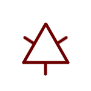](/wiki/File:Fire_sigil.png)

The base **fire** sigil (炎の紋, _honō no mon_) works to create and manipulate flames or heat depending on the spell in question. The base fire sigil is considered one of the four primary tetrad.

**Spells Using Fire**
[Flame Shot Seal](/wiki/Flame_Shot_Seal 'Flame Shot Seal') • [Pyreball Seal](/wiki/Pyreball_Seal 'Pyreball Seal') •[Snugstone Spell](/wiki/Snugstone_Spell 'Snugstone Spell') • [Spiraling Flame](/wiki/Spiraling_Flame 'Spiraling Flame') • [Rainflinger](/wiki/Rainflinger 'Rainflinger') • [Warmth-Retention Seal](/wiki/Warmth-Retention_Seal 'Warmth-Retention Seal')

### Unburning Flames

[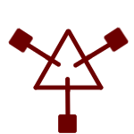](/wiki/File:Unburning_flame_sigil.png)

The **unburning flames** sigil's exact function is unclear, but it is somehow involved in the production of heatless flames as seen in the [phantasmal fireball](/wiki/Phantasmal_Fireball 'Phantasmal Fireball'). It is possible that this sigil alone is not enough to produce flames without heat and additional signs are needed, but this is currently unknown.

**Spells Using Unburning Flames**  
[Phantasmal Fireball](/wiki/Phantasmal_Fireball 'Phantasmal Fireball')

### Light

[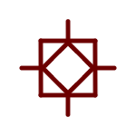](/wiki/File:Light.png)

A variant of the fire sigil, the **light** sigil (光の紋, _hikari no mon_) functions to produce magic that manifests in the form of light.

**Spells Using Light**  
[Bird of Light Beacon](/wiki/Bird_of_Light_Beacon 'Bird of Light Beacon') • [Floatglow Lamp Seal](/wiki/Floatglow_Lamp_Seal 'Floatglow Lamp Seal') • [Wall-Anchored Floatglow Lamp](/wiki/Wall-Anchored_Floatglow_Lamp 'Wall-Anchored Floatglow Lamp') • [Light Beam](/wiki/Light_Beam 'Light Beam') • [Light Tracer](/wiki/Light_Tracer 'Light Tracer') • [Flowers of Light](/wiki/Flowers_of_Light 'Flowers of Light') • [Beast Repellent](/wiki/Beast_Repellent 'Beast Repellent')

## Water

Water sigils are responsible for all things pertaining to water. There is currently one variant.

### Water

[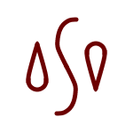](/wiki/File:Water.png)

The **water** sigil (水の紋, _mizu no mon_) works to manipulate, collect, and create water. It is worth noting that many water spells meant to be used over long periods collect water rather than create it. This suggests that creating water is more energetically costly than collecting it. The water sigil is considered one of the four primary tetrad.

**Spells Using Water**  
[Purify](/wiki/Purify 'Purify') • [Rainbringer Seal](/wiki/Rainbringer_Seal 'Rainbringer Seal') • [Rising Platform of Water](/wiki/Rising_Platform_of_Water 'Rising Platform of Water') • [Rising Wave](/wiki/Rising_Wave 'Rising Wave') • [Water Bolt](/wiki/Water_Bolt 'Water Bolt') • [Watershot Seal](/wiki/Watershot_Seal 'Watershot Seal') • [Water Horse Spell](/wiki/Water_Horse_Spell 'Water Horse Spell') • [Water Pen](/wiki/Water_Pen 'Water Pen') • [Vapor Bubble Spell](/wiki/Vapor_Bubble_Spell 'Vapor Bubble Spell') • [Qifrey's Water Dragon](/wiki/Qifrey%27s_Water_Dragon "Qifrey's Water Dragon") • [Rainflinger](/wiki/Rainflinger 'Rainflinger') • [Water Orb](/wiki/Water_Orb 'Water Orb')

## Earth

Earth sigils are responsible for all things pertaining to stone, sand, soil, and wood. There is currently one variant.

### Earth

[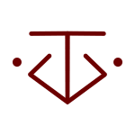](/wiki/File:Earth.png)

The **earth** sigil (地の紋, _chi no mon_) allows for the manipulation of numerous solid substances, chiefly wood, stone, sand, and soil. However, it does not allow for the creation of these solid materials, as seen when it was used in the [earth lift](/wiki/Earth_Lift?action=edit&redlink=1 'Earth Lift (page does not exist)') spell. The earth sigil is also known as the sigil of **might** (力の紋, _chikara no mon_), and is considered one of the four primary tetrad.

**Spells Using Earth**  
[Boulder Stretch Rope](/wiki/Boulder_Stretch_Rope 'Boulder Stretch Rope') • [Integration](/wiki/Integration 'Integration') • [Sand Bridge](/wiki/Sand_Bridge 'Sand Bridge') • [Sand Cage](/wiki/Sand_Cage 'Sand Cage') • [Serpent's Bed of Sand](/wiki/Serpent%27s_Bed_of_Sand "Serpent's Bed of Sand") • [Wall Bend](/wiki/Wall_Bend 'Wall Bend') • [Wall Breaker Seal](/wiki/Wall_Breaker_Seal 'Wall Breaker Seal')

## Air

Air sigils are responsible for all things relating to air, including its movement, creation, and more. There are currently four variants.

### Wind

[.png>)](</wiki/File:Wind_(redirect).png>)

The **wind** sigil (風の絞, _kaze no mon_) allows for the movement and manipulation, but not the creation, of air. The sigil of wind is also known as the sigil of **levitation** (浮遊の紋, _fuyū no mon_) and, is considered one of the four primary tetrad.

**Spells Using Wind**  
[Flying Puppet of Diversion](/wiki/Flying_Puppet_of_Diversion 'Flying Puppet of Diversion') • [Grasping Wind](/wiki/Grasping_Wind 'Grasping Wind') • [Skysoaring Seal](/wiki/Skysoaring_Seal 'Skysoaring Seal') • [Wind Wall](/wiki/Wind_Wall 'Wind Wall') • [Cloak Spell](/wiki/Cloak_Spell 'Cloak Spell') • [Floating Drops](/wiki/Floating_Drops 'Floating Drops')

### Aeriforms

[.png>)](</wiki/File:Aeriforms_(Wind).png>)

The **aeriforms** sigil (気体の紋, _kitai no mon_) allows for the creation and manipulation (but not movement) of air.

### Wind Underfoot

[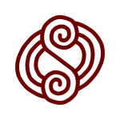](/wiki/File:Wind_Underfoot.png)

The exact function of the **wind underfoot** sigil (足場のある風の紋, _ashiba no aru kaze no mon_) is not yet clear, but it is known that it helps to somehow support solid objects when they are suspended within air,[*citation needed*] similar to an air platform. The way this functions or the specifics of the effect are not yet clear.

**Spells Using Wind Underfoot**  
[Pegasus Carriage Spell](/wiki/Pegasus_Carriage_Spell 'Pegasus Carriage Spell') • [Sylph Shoes Seal](/wiki/Sylph_Shoes_Seal 'Sylph Shoes Seal')

### Whorling Winds

[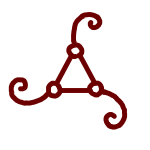](/wiki/File:Whorling_Winds.png)

**Whorling winds** helps to manipulate air through rotation. The exact way in which this functions is unknown, as is the reason for it looking so different to the other air sigils. It being three-sided could indicate a connection to the **fire** sigil, meaning it might be heating the air as we do with hot air balloons.

**Spells Using Whorling Winds**  
[Pegasus Carriage Spell](/wiki/Pegasus_Carriage_Spell 'Pegasus Carriage Spell')

## Time

Time sigils are responsible for magic which manipulates time. There are currently two known time sigils.

### Repetition

[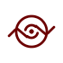](/wiki/File:Repetition.png)

**Repetition** (くりかえしの矢, _kurikaeshi no ya_) helps to prevent objects from changing by continuously resetting time for the objects it affects to the state they had when the spell first affected them. It is similar to a spring, restoring the object to its original state if that object is somehow changed. This can be used to make soft objects elastic or to prevent things from rotting.

**Spells Using Repetition**  
[Serpent's Bed of Sand](/wiki/Serpent%27s_Bed_of_Sand "Serpent's Bed of Sand") • [Capture Pennant Spell](/wiki/Capture_Pennant_Spell 'Capture Pennant Spell') • [Repetition Seal](/wiki/Repetition_Seal 'Repetition Seal') • [Cookpot Lid](/wiki/Magic_Cookpot 'Magic Cookpot')

### Stop

[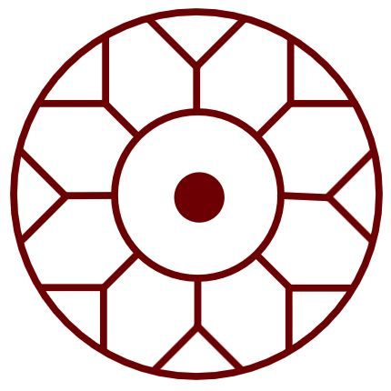](/wiki/File:Time_Stop_Redraw.jpg)

**Stop** outright halts time for the objects it effects. By pairing it with other sigils, it becomes possible to stop time for specific aspects of an object, such as changes in heat if paired with a fire sigil.[*citation needed*]

**Spells Using Stop**  
[Petrification](/wiki/Petrification 'Petrification') • [Time Stop](/wiki/Time_Stop 'Time Stop') • [Warmth-Retention Seal](/wiki/Warmth-Retention_Seal 'Warmth-Retention Seal')

## Decorative Sigils

Decorative sigils depict living things, and objects. Using these, it is possible to either make a spell affects the thing the sigil corresponds to, create magic in the shape of that thing, or cause magic to target things of the same shape as what the sigil depicts. It is commonly said that these sigils have no practical utility, so their general use is in decline, now mostly used as decoration or by hobbyists. Decorative sigils used to be classified as signs, but similar to repetition, this was later retconned and they were reclassified as sigils.

### Bird A

**Bird A** is a decorative sigil that creates a bird-like projection made from the seal's magic which will fly around for a while. It's only been seen once within the [bird of light beacon](/wiki/Bird_of_Light_Beacon 'Bird of Light Beacon') spell, The front portion of the spell may or may not be a separate sigil entirely. The design was changed in [chapter 28](/wiki/Chapter_28 'Chapter 28'). Ideally, the spell's sigil should be placed in the center of this sigil.

**Spells Using Bird A**  
[Bird of Light Beacon](/wiki/Bird_of_Light_Beacon 'Bird of Light Beacon')

### Bird B

[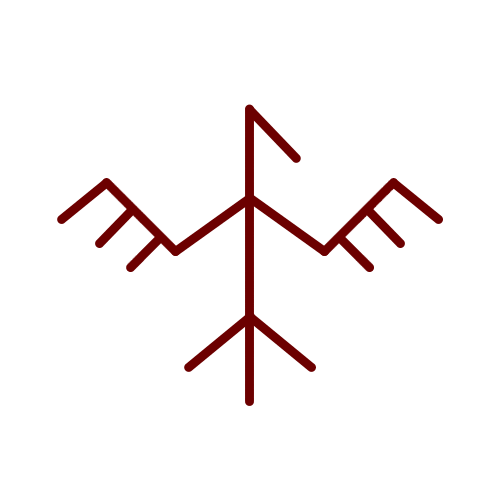](/wiki/File:Bird_B_Sign.png)

**Bird B** causes magic to manifest in the shape of a bird, similar to bird A. However, the bird produced by this decorative sigil is noticeably more duck-like compared to bird A.

### Dragon

[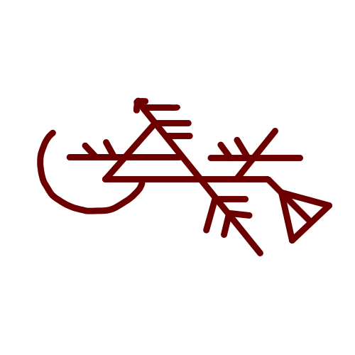](/wiki/File:Dragon_Sign.png)

**Dragon** (巨鱗竜の紋, _doragon no mon_) causes magic to manifest in the shape of a [dragon](/wiki/Dragon 'Dragon'). The exact dragon species that this decorative sigil imitates is unknown, although the illustration accompanying it appears to be a [Dragonpass Isles](/wiki/Dragonpass_Isles 'Dragonpass Isles') Wyrm.

**Spells Using Dragon**  
[Qifrey's Water Dragon](/wiki/Qifrey%27s_Water_Dragon "Qifrey's Water Dragon")

### Flower

[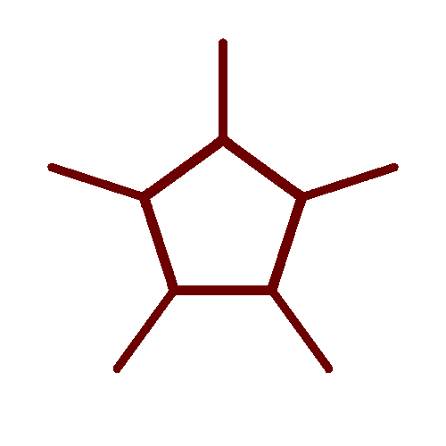](/wiki/File:Flower_Sigil.png)

**Flower** causes magic to manifest in the shape of various flowers. The type of flower (and possibly the amount) is determined by five, small, identical signs that surround the sigil, acting as modifiers.

**Spells Using Flower**  
[Qifrey's Water Dragon](/wiki/Qifrey%27s_Water_Dragon "Qifrey's Water Dragon") • [Flowers of Light](/wiki/Flowers_of_Light 'Flowers of Light')

### Horse

[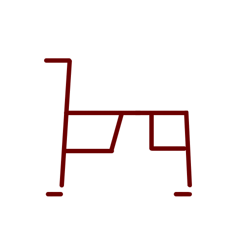](/wiki/File:Horse_Sign.png)

**Horse** causes magic to manifest in the shape of a horse, as seen in the [water horse spell](/wiki/Water_Horse_Spell 'Water Horse Spell'). With the water horse spell, it is possible to pull loads via the water horse, suggesting that this decorative sigil (and perhaps others as well) has the potential for practical usage.

**Spells Using Horse**  
[Water Horse](/wiki/Water_Horse 'Water Horse')

### Owlcat

[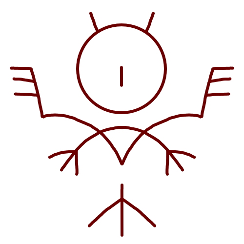](/wiki/File:Owlcat_Sigil_Full.png)

Based on its design, this sigil is likely for forming a full **Owlcat** (猫梟の紋, _neko fukurō no mon_) as opposed to just the head of an [owlcat](/wiki/Owlcat 'Owlcat'), as is the case with the confirmed **owlcat head sigil**. However, this is yet to be confirmed, and more information is needed.

### Owlcat Head

[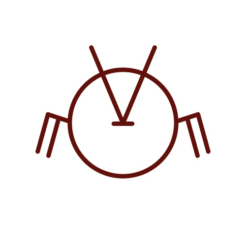](/wiki/File:Owlcat_Sign.png)

**Owlcat** (猫梟の紋, _neko fukurō no mon_) **Head** causes magic to manifest in the shape of the head of an [Owlcat](/wiki/Owlcat 'Owlcat') with winter plumage, which is almost spherical in shape. This sigil is identical to the normal **owlcat sigil**, except it is missing the section corresponding to an owlcat's body. This implies that decorative signs can be split into smaller portions which will form the individual body parts corresponding to that section of the decorative sigil.

### Scalewolf

[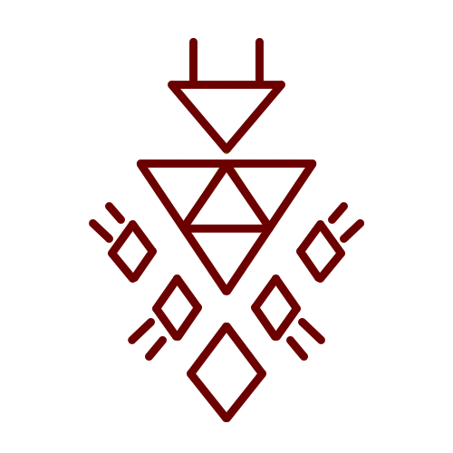](/wiki/File:Scalewolf_Sign.png)

**Scalewolf** (鱗狼の矢, _uroko ōkami no mon_) causes magic to manifest in the shape of a [scalewolf](/wiki/Scalewolf 'Scalewolf').

### Torchstag

[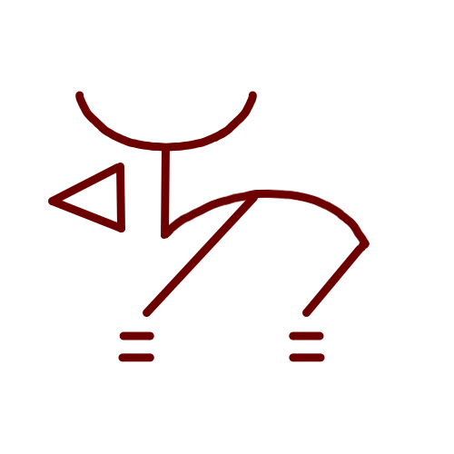](/wiki/File:Torchstag_Sign.png)

**Torchstag** (松明鹿の紋, _taimatsu shika no mon_) causes magic to manifest in the shape of a [torchstag](/wiki/Torchstag?action=edit&redlink=1 'Torchstag (page does not exist)').

### Liongoat

[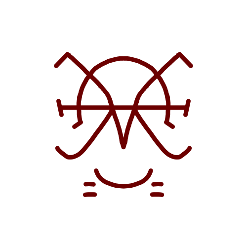](/wiki/File:Liongoat_Sigil_Redraw.png)

**Liongoat** (松明鹿の矢, _shishi yagi no mon_) causes magic to manifest in the shape of a [liongoat](/wiki/Liongoat 'Liongoat').

### Valance Leech

[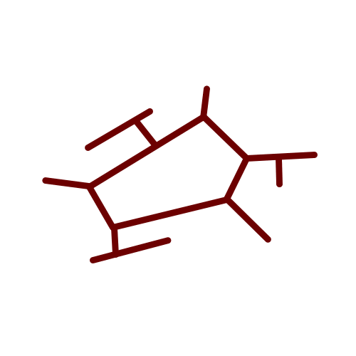](/wiki/File:Valance_Leech_Sign.png)

**Valance leech** (帳蛭の紋, _tobari hiru no mon_) causes magic to manifest in the shape of a [valance leech](</wiki/Valance_Leech_(Species)> 'Valance Leech (Species)').

**Spells Using Valence Leech**  
[Valance Leech Counterclock](/wiki/Valance_Leech_Counterclock 'Valance Leech Counterclock')

### Frillram

[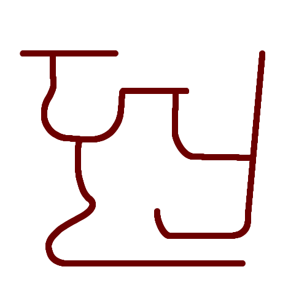](/wiki/File:Frillram_Sigil.png)

**Frillram** (襟巻羊, _Erimakihitsuji_) causes magic to manifest in the shape of a [Frillram](/wiki/Frillram 'Frillram').

### Sword

[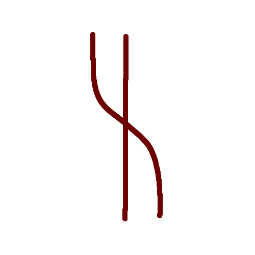](/wiki/File:Sword_Sigil.png)

**Sword** (剣の紋) causes magic to manifest in the shape of a sword, or target sword(s). It is featured in the [Raincleaver Spell](/wiki/Raincleaver_Spell 'Raincleaver Spell') and is the very first object-based decorative sigil we've come across.

**Spells Using Sword**  
[Raincleaver Spell](/wiki/Raincleaver_Spell 'Raincleaver Spell')

## Misc

### Crystalize

[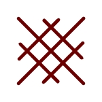](/wiki/File:Ice_Sigil.jpg)

**Crystalize** causes things around such as air or water, or otherwise specified by the seal, to crystalize. This can form crystal , or even ice. It is unknown what dictates whether the sigil turns things to ice or crystal, and may be up to user intent

**Spells Using Crystalize**  
[Crystal Ribbon](/wiki/Crystal_Ribbon 'Crystal Ribbon') • [Crystal Shard](/wiki/Crystal_Shard 'Crystal Shard') • [Icey Road](/wiki/Icey_Road?action=edit&redlink=1 'Icey Road (page does not exist)')

### Smoke

[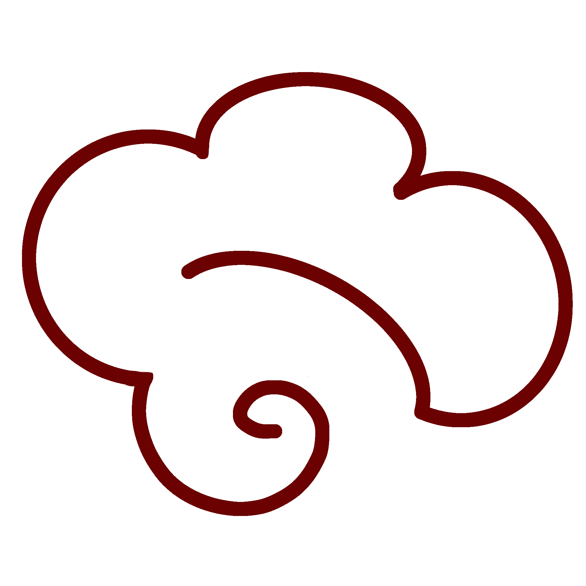](/wiki/File:Smoke_Sigil.png)

Smoke, (煙, **kemuri**) works to create and generate smoke. It has not been seen whether or not the sigil is also capable of manipulating smoke

**Spells Using Smoke**  
[Smoke Cloud](/wiki/Smoke_Cloud?action=edit&redlink=1 'Smoke Cloud (page does not exist)')

### Guidance

**Guidance** (誘導の紋, _yūdō no mon_) functions to attract objects to its location that match parameters set by the other signs and sigils within a spell. For example, a guidance based spell that contains a [Pouch of Calling spell](/wiki/Pouch_of_Calling 'Pouch of Calling') will attract all nearby Pouches of Calling.

**Spells Using Guidance**  
[Fish Guidance](/wiki/Fish_Guidance 'Fish Guidance')

### Calling

**Calling** (呼び声の紋, _tobigoe no mon_) echoes back a recorded phrase. So far, it has only been seen in the [Pouch of Calling](/wiki/Pouch_of_Calling 'Pouch of Calling').

## References

1. Witch Hat Atelier Manga: Chapter 5 , Page 1
2. Witch Hat Atelier Manga: Chapter 3 , Page 10
3. Witch Hat Atelier Manga: Chapter 36 , Page 17
4. Witch Hat Atelier Manga: Chapter 30 , Page 24
5. Witch Hat Atelier Manga: Chapter 58 , Page 19
6. Witch Hat Atelier Manga: Chapter 58 , Page 18
7. Witch Hat Atelier Manga: Chapter 78 , Page 19
8. Witch Hat Atelier Manga: Chapter 11 , Page 8
9. Witch Hat Atelier Manga: Chapter 28 , Page 10
10. Witch Hat Atelier Anime: Episode 5
11. Witch Hat Atelier Manga: Chapter 58 , Page 20
12. Witch Hat Atelier Manga: Chapter 46 , Page 7
13. Witch Hat Atelier Manga: Chapter 83 , Page 1
14. https://x.com/shirahamakamome/status/1783445489708601563
15. Witch Hat Atelier Manga: Chapter 58 , Page 24
16. Witch Hat Atelier Manga: Chapter 78 , Page 20
17. Archives of Witch Hat Atelier
18. Witch Hat Atelier Anime: Episode 13 , Timestamp 5:20
19. Witch Hat Atelier Anime: Episode 11 , Timestamp 5:40
20. Witch Hat Atelier Manga: Chapter 18 , Page 8
21. Witch Hat Atelier Anime: Episode 13 , Timestamp 5:37
22. Witch Hat Atelier Anime: Episode 13 , Timestamp 6:25
23. Witch Hat Atelier Kitchen Spinoff: Chapter 18 , Page 8
24. Witch Hat Atelier Manga: Chapter 64 , Page 2
25. Witch Hat Atelier Manga: Chapter 34 , Page 23
26. Witch Hat Atelier Manga: Chapter 81 , Page 7
