# Signs Explained

_Source: [https://witchhatatelier.telepedia.net/wiki/Signs_Explained](https://witchhatatelier.telepedia.net/wiki/Signs_Explained)_

[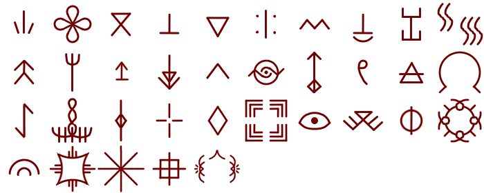](/wiki/File:Sign_Compilation.png)

Signs are a component of seals, special shapes drawn with [conjuring ink](/wiki/Conjuring_Ink 'Conjuring Ink') through which [magic](/wiki/Magic 'Magic') can be harnessed in the form of [spells](/wiki/Spells 'Spells'). Signs control what form a spell will take. They serve as modifiers, allowing the effect of a spell to be altered. Each sign has a unique effect with it can contribute to a spell, with 44 being deciphered so far.

## Sign Categories

Based on their design and behavior, signs can be broken down into four groups; directional signs, semi-directional signs, non-directional signs, and asymmetric signs. These groups are never mentioned, named, or explained within the source material. However, breaking signs into these categories is incredibly useful for understanding how different signs function, so they will be used within this article.

### Directional Signs

[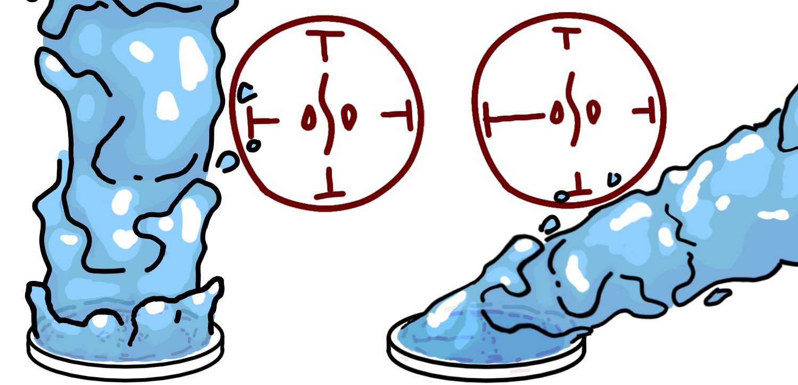](/wiki/File:Sign_Length_Demo.png)

Changing sign length to alter spell direction

Directional signs are signs which have manifest their effect in a specific direction, with some examples being [**column**](#Column) and [**pull**](#Pull). All directional signs possess bilateral symmetry but lack radial symmetry. By changing the angle, or, in some cases, size of directional signs, one can influence in which direction a spell will manifest. Spells which make use of this property include [grasping wind](/wiki/Grasping_Wind 'Grasping Wind'), the [skysoaring seal](/wiki/Skysoaring_Seal 'Skysoaring Seal'), and the [rising platform of water](/wiki/Rising_Platform_of_Water 'Rising Platform of Water').

### Semi-Directional Signs

Semi-directional signs are those which can be inverted yet lack a distinct direction for their effect. Good examples of semi-directional signs include [**crush**](#Crush) and [**strengthen**](#Strengthen). Most semi-directional signs possess bilateral symmetry but lack radial symmetry, similar to directional signs. However, some do possess radial symmetry, like [**rain**](#Rain) or [**enlarge**](#Enlarge). Changing their size will only alter the strength of their effect, not direction. The direction of the sign doesn't alter the direction of the spell, but if the sign is inverted (facing outwards), the effect of the sign will be the opposite of what it is usually. For semi-directional signs that have radial symmetry, the sign must be flipped inside-out in order for it to be inverted. A pair of spells that makes use of the inversion of semi-directional signs are [wall breaker](/wiki/Wall_Breaker_Seal 'Wall Breaker Seal') and [integration](/wiki/Integration 'Integration'), with wall breaker using **crush** signs to pulverize while integration inverts them to reform.

### Non-Directional Signs

Non-directional signs are those which lack a direction for their effect and act the same regardless of the direction they point. Examples of non-directional signs include [**float**](#Float) and [**crosshair**](#Crosshair). Lacking bilateral symmetry but possessing radial symmetry, non-directional signs lack a distinct front, back, left, or right. As a result, it isn't possible to invert these signs, as there is no way to have them point inward, as they lack front with which to point.

### Asymmetric Signs

Lacking symmetry of any kind, asymmetric signs are unpredictable and largely unknown. It is not known if inverting, mirroring, or angling them changes their behavior.

## Officially named

### Column

[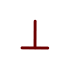](/wiki/File:Column.png)

**Column** (柱の矢, _hashira no ya_) is a directional sign that causes a spell to manifest in a column or beam above the seal. If the signs aren't balanced, the spell will manifest in the direction with the most or the largest signs. The longer line typically faces inwards, as seen in the [watershot seal](/wiki/Watershot_Seal 'Watershot Seal') and [wall breaker seal](/wiki/Wall_Breaker_Seal 'Wall Breaker Seal'). However, the sign is occasionally inverted, as seen in the [snugstone seal](/wiki/Snugstone_Spell 'Snugstone Spell') and [crystal shard seal](/wiki/Crystal_Shard 'Crystal Shard'). Inverting the sign seems to make the spell emit out in all directions, similar to **dispersion**. It is unknown what, if anything, differentiates inverted **column's** effect from that of **dispersion**.

How column emits from a spell with both balanced and unbalanced signs

**Spells Using Column**  
[Flame Burst Spell](/wiki/Flame_Burst_Spell 'Flame Burst Spell') • [Flame Shot Seal](/wiki/Flame_Shot_Seal 'Flame Shot Seal') • [Snugstone Spell](/wiki/Snugstone_Spell 'Snugstone Spell') • [Spiraling Flame](/wiki/Spiraling_Flame 'Spiraling Flame') • [Rising Platform of Water](/wiki/Rising_Platform_of_Water 'Rising Platform of Water') • [Rising Wave](/wiki/Rising_Wave 'Rising Wave') • [Watershot Seal](/wiki/Watershot_Seal 'Watershot Seal') • [Water Horse](/wiki/Water_Horse 'Water Horse') • [Water Pen](/wiki/Water_Pen 'Water Pen') • [Vapor Bubble Spell](/wiki/Vapor_Bubble_Spell 'Vapor Bubble Spell') • [Qifrey's Water Dragon](/wiki/Qifrey%27s_Water_Dragon "Qifrey's Water Dragon") • [Water Orb](/wiki/Water_Orb 'Water Orb') • [Raincleaver Spell](/wiki/Raincleaver_Spell 'Raincleaver Spell') • [Sand Cage](/wiki/Sand_Cage 'Sand Cage') • [Serpent's Bed of Sand](/wiki/Serpent%27s_Bed_of_Sand "Serpent's Bed of Sand") • [Wall Breaker Seal](/wiki/Wall_Breaker_Seal 'Wall Breaker Seal') • [Pegasus Carriage Spell](/wiki/Pegasus_Carriage_Spell 'Pegasus Carriage Spell') • [Skysoaring Seal](/wiki/Skysoaring_Seal 'Skysoaring Seal') • [Wind Wall](/wiki/Wind_Wall 'Wind Wall') • [Floatglow Lamp Seal](/wiki/Floatglow_Lamp_Seal 'Floatglow Lamp Seal') • [Wind Wall](/wiki/Wind_Wall 'Wind Wall') • [River Ferry Spell](/wiki/River_Ferry_Spell?action=edit&redlink=1 'River Ferry Spell (page does not exist)') • [Wall-Anchored Floatglow Lamp](/wiki/Wall-Anchored_Floatglow_Lamp 'Wall-Anchored Floatglow Lamp') • [Light Beam](/wiki/Light_Beam 'Light Beam') • [Crystal Shard](/wiki/Crystal_Shard 'Crystal Shard') • [Icey Road](/wiki/Icey_Road?action=edit&redlink=1 'Icey Road (page does not exist)') • [Repetition Seal](/wiki/Repetition_Seal 'Repetition Seal') • [Beast Repellent](/wiki/Beast_Repellent 'Beast Repellent') • [Floating Drops](/wiki/Floating_Drops 'Floating Drops') • [Fish Guidance](/wiki/Fish_Guidance 'Fish Guidance') • [Floating Expansion](/wiki/Floating_Expansion 'Floating Expansion') • [Sand Bridge](/wiki/Sand_Bridge 'Sand Bridge') • [Smokesculpting Seal](/wiki/Smokesculpting_Seal 'Smokesculpting Seal') • [Smoke Cloud](/wiki/Smoke_Cloud?action=edit&redlink=1 'Smoke Cloud (page does not exist)') • [Beldaruit's illusion cloak spell](/wiki/Beldaruit%27s_illusion_cloak_spell?action=edit&redlink=1 "Beldaruit's illusion cloak spell (page does not exist)") • [Advanced Beastwarding Spell](/wiki/Advanced_Beastwarding_Spell?action=edit&redlink=1 'Advanced Beastwarding Spell (page does not exist)') • [Amplification Scroll](/wiki/Amplification_Scroll?action=edit&redlink=1 'Amplification Scroll (page does not exist)') • [Beldaruit's Smoke Sculpture](/wiki/Beldaruit%27s_Smoke_Sculpture "Beldaruit's Smoke Sculpture") • [Forbidden Flames](/wiki/Forbidden_Flames 'Forbidden Flames') • [Forbidden Glow](/wiki/Forbidden_Glow 'Forbidden Glow') • [Illusory Labyrinth](/wiki/Illusory_Labyrinth 'Illusory Labyrinth') • [Petrification](/wiki/Petrification 'Petrification')

### Dispersion

[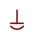](/wiki/File:Dispersion.png)

**Dispersion** (拡散の矢, _kakusan no ya_) causes the magic of its seal to pour or "disperse" outwards. It isn't known if this sign is directional or semi-directional. It has many similarities to **column**, with it essentially being a column that leaks its magic outwards rather than shooting or beaming it in a certain direction. Both its normal and inverted variations have been seen, with the difference in their effects being unclear. Interestingly, the effect of inverted **column** very closely matches that of dispersion, as seen in the [snugstone seal](/wiki/Snugstone_Spell 'Snugstone Spell'). What differentiates the two is currently unknown.

[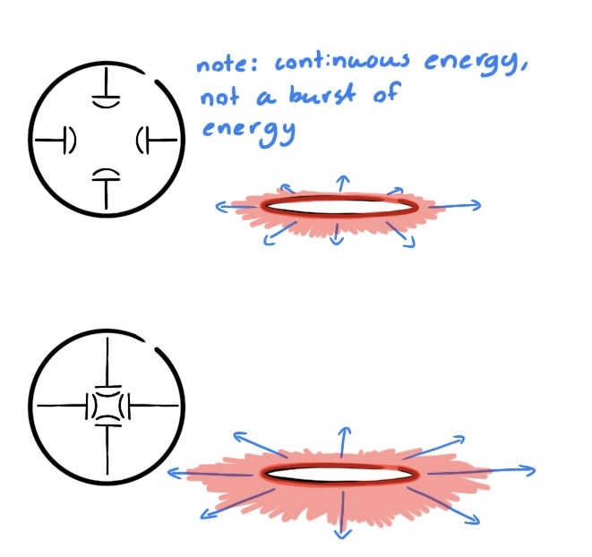](/wiki/File:Disp_Diagram.png)

**Spells Using Dispersion**  
[Ring of Fire](/wiki/Ring_of_Fire 'Ring of Fire') • [Water Pen](/wiki/Water_Pen 'Water Pen') • [Bird of Light Beacon](/wiki/Bird_of_Light_Beacon 'Bird of Light Beacon') • [Glowstone Path Seal](/wiki/Glowstone_Path_Seal 'Glowstone Path Seal') • [Petrification](/wiki/Petrification 'Petrification')

### Levitation

**Levitation** (浮遊の矢, _fuyū no ya_) is a directional sign that has two apparent functions, these depending on the sigil which is paired with the sign. The reason for this is unknown. The arrow-like side of the sign typically faces inwards.

For water, fire, and light spells, **levitation** causes the spell's effect, as well as objects held overtop the seal, to levitate in the air. This can primarily be seen in the [pyreball seal](/wiki/Pyreball_Seal 'Pyreball Seal') and the [wall-mounted floatglow lamp seal](/wiki/Floatglow_Lamp_Seal 'Floatglow Lamp Seal').. The size of the **levitation** signs dictate the weight of the objects which can be held aloft, while the size of the seal's sigil determines how powerful the floating magic generated effect will be.

For air and wind spells, **levitation** will cause the object on which the spell is drawn to move through the air. The direction of this movement depends on which way the signs point, but due to a drawing error where the direction of the [skysoaring seal](/wiki/Skysoaring_Seal 'Skysoaring Seal') was reversed between two panels, it was unclear in which direction this movement occurs. This changed with the release of the anime, which confirmed that movement is in the direction of the arrow.

[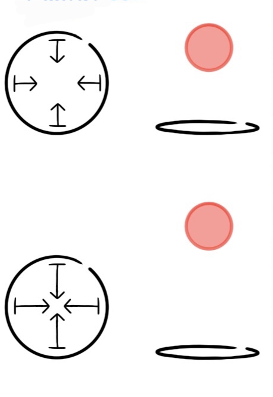](/wiki/File:Lev_Diagram.png)

**Spells Using Levitation**  
[Pyreball Seal](/wiki/Pyreball_Seal 'Pyreball Seal') • [Rising Platform of Water](/wiki/Rising_Platform_of_Water 'Rising Platform of Water') • [Pegasus Carriage Spell](/wiki/Pegasus_Carriage_Spell 'Pegasus Carriage Spell') • [Sylph Shoes Seal](/wiki/Sylph_Shoes_Seal 'Sylph Shoes Seal') • [River Ferry Spell](/wiki/River_Ferry_Spell?action=edit&redlink=1 'River Ferry Spell (page does not exist)') • [Wall-Anchored Floatglow Lamp](/wiki/Wall-Anchored_Floatglow_Lamp 'Wall-Anchored Floatglow Lamp') • [Glowstone Path Seal](/wiki/Glowstone_Path_Seal 'Glowstone Path Seal') • [Beldaruit's Smoke Sculpture](/wiki/Beldaruit%27s_Smoke_Sculpture "Beldaruit's Smoke Sculpture")

### Pull

**Pull** (引き寄せの矢, _hikiyose no ya_) is a directional sign that causes anything matching its seal's sigil (water, air, fire, etc) to be pulled towards the seal when the arrow portion of the sign is pointing inwards. It is likely that, if inverted, the sign will instead push things away. When pointed inwards at an angle, the spell will have both a pulling and twisting effect, and it's likely that if rotated a full 90 degrees, the spell will just twist without pulling.

[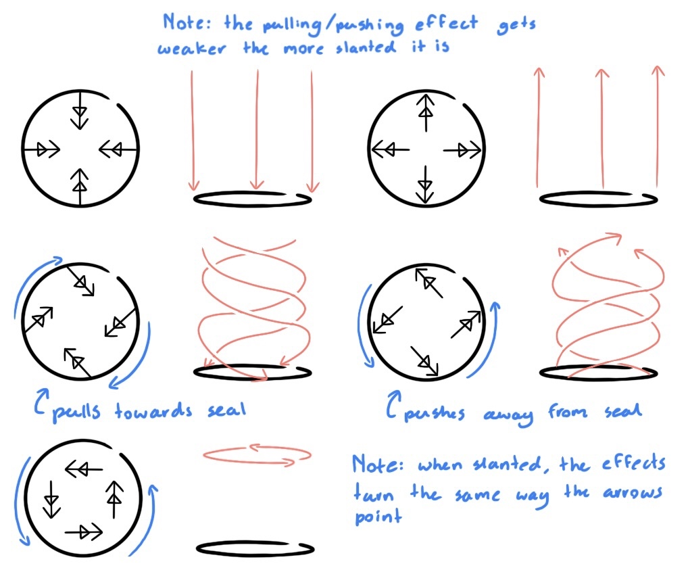](/wiki/File:Pull_Diagram.png)

**Spells Using Pull**  
[Flame Burst Spell](/wiki/Flame_Burst_Spell 'Flame Burst Spell') • [Water Cage](/wiki/Water_Cage 'Water Cage') • [Wall Bend](/wiki/Wall_Bend 'Wall Bend') • [Grasping Wind](/wiki/Grasping_Wind 'Grasping Wind')

### Crush

**Crush** (破砕の矢, _hasai no ya_) is a semi-directional sign that breaks things apart. When paired with an earth sigil, **crush** will cause objects to [disintegrate](/wiki/Wall_Breaker_Seal 'Wall Breaker Seal'), breaking them into tiny pieces until they reach a sand-like or powdered state. If the sign is inverted and the spell is used on a powdered substance, the powder will [reform into its original shape](/wiki/Integration 'Integration'). However, as soon as the spell wears off or the spell is removed, the powder will return to simply being a pile of dust.

As **crush** has only ever been seen paired with an earth sigil in the manga, it is unclear how it would behave if used with other seals. In episode 7 of the anime adaptation, however, it is pointed out that Coco's [wall breaker spell](/wiki/Wall_Breaker_Seal 'Wall Breaker Seal') was also "crushing the water" into mist. It has also been proposed that, if paired with a crystal sigil, it may behave in the same manner as when paired with earth, just limited to only affecting crystalline objects. However, this theory is currently unproven and, for now, remains conjecture.

[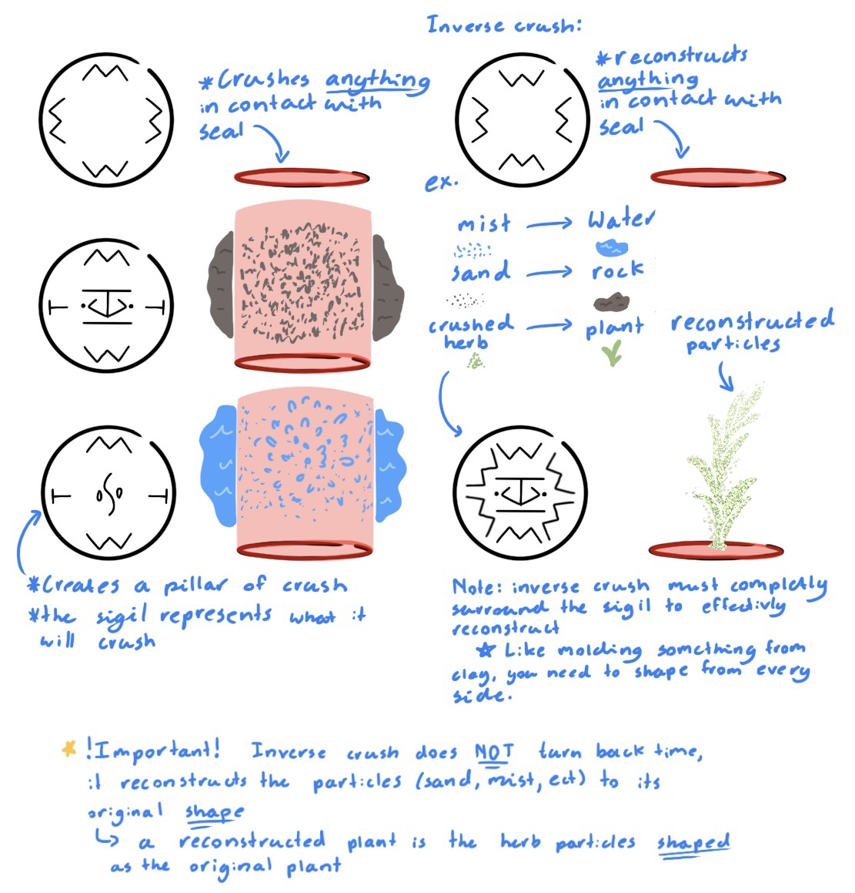](/wiki/File:Crush_Diagram.png)

**Spells Using Crush**  
[Integration](/wiki/Integration 'Integration') (Inverted) • [Sand Cage](/wiki/Sand_Cage 'Sand Cage') (Inverted) • [Serpent's Bed of Sand](/wiki/Serpent%27s_Bed_of_Sand "Serpent's Bed of Sand") • [Wall Breaker Seal](/wiki/Wall_Breaker_Seal 'Wall Breaker Seal') • [Smokesculpting Seal](/wiki/Smokesculpting_Seal 'Smokesculpting Seal') (Inverted)

### Puppet

**Puppet** (踊る人形の矢, _odoru ningyō no ya_) is highly unusual, appearing to be the only sign (aside from **sights set**) that allows one to control a spell with their mind. More specifically, **puppet** seems to allow a "user" (possibly either the person who drew or last touched the spell) to control the movement of the object it is drawn on. The nature of this movement seems to be dependent on the sigil of the spell. For example, wind-based puppet spells, such as the [flying puppet of diversion](/wiki/Flying_Puppet_of_Diversion 'Flying Puppet of Diversion') and [cloak spell](/wiki/Cloak_Spell 'Cloak Spell'), only seem to be capable of arial movement. While it is never stated, directly or otherwise, that puppet spells move in accordance with the user's mind, there is strong circumstantial evidence to support the idea. For example, [Sasaran](/wiki/Sasaran 'Sasaran') was able to maneuver his cloak with incredible accuracy and precision during his fight with [Qifrey](/wiki/Qifrey 'Qifrey').[*citation needed*] With his cloak lacking any visible controls through which this could be explained, it is reasonable to assume that he piloted it using his mind. Interestingly, the [sealchair](/wiki/Sealchair 'Sealchair'), which is similar to Sasaran's cloak in that it lacks visible controls yet can still be operated with clear precision and intent, features a number of signs on its underside which closely resemble **puppet**. It is possible that these are variants. It is possible that puppet can be turned inside out to reverse its effect,in which case it would be considered semi-directional. However, this is currently unknown.

**Spells Using Puppet**  
[Flying Puppet of Diversion](/wiki/Flying_Puppet_of_Diversion 'Flying Puppet of Diversion') • [Cloak Spell](/wiki/Cloak_Spell 'Cloak Spell')

### Float

**Float** is a non-directional sign that will make things float in midair, seemingly letting them ignore gravity.

In most cases, **float** only levitates the object on which the seal is drawn. However, there have been five instances where this has not been the case. Of these instances, two have since been retconned - these are the [pyreball seal](/wiki/Pyreball_Seal 'Pyreball Seal') and an unnamed spell from [chapter 3](/wiki/Chapter_3 'Chapter 3'), the spells having their **float** signs replaced with **levitation** signs in [chapter 8](/wiki/Chapter_8 'Chapter 8') and the English release of [volume 1](/wiki/Volume_1 'Volume 1') respectively. This, combined with the third instance, the [fish guidance spell](/wiki/Fish_Guidance_Spell?action=edit&redlink=1 'Fish Guidance Spell (page does not exist)'), requiring **float** to be paired with **crosshair** in order to levitate the spell's target, suggest that **float** can't levitate things on which it isn't drawn unless given explicit instructions to do so. If this is to be believed, it would suggest that the design of the fourth instance, the [floatglow lamp seal](/wiki/Floatglow_Lamp_Seal 'Floatglow Lamp Seal'), is flawed, as not only does this spell (which contains **column** signs) produce a ball of light rather than a light beam, the magic of the spell also floats. However, the final instance, the [earth lift](/wiki/Earth_Lift?action=edit&redlink=1 'Earth Lift (page does not exist)') spell, makes use of column and float to levitate the ground beneath the spell, further confusing the matter in which float is meant to function.

[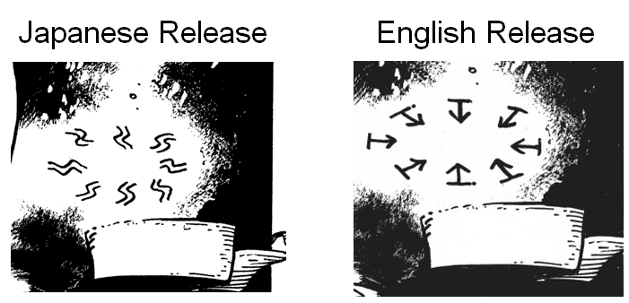](/wiki/File:Float_Keystone_Retcon.png)

Comparison of the float signs between the Japanese release and English release of volume 1

**Spells Using Float**  
[Snowfending](/wiki/Snowfending 'Snowfending') • [Floatglow Lamp Seal](/wiki/Floatglow_Lamp_Seal 'Floatglow Lamp Seal') • [Glowstone Path Seal](/wiki/Glowstone_Path_Seal 'Glowstone Path Seal') • [Fish Guidance](/wiki/Fish_Guidance 'Fish Guidance') • [Floating Expansion](/wiki/Floating_Expansion 'Floating Expansion')

### Region

**Region** (領域の矢, _ryōiki no ya_) is a directional sign that determines where magic will manifest in relation to a seal. For instance, if the **region** signs within a seal point all to the same side of the spell, [the magic will shoot in that direction](/wiki/Water_Bolt 'Water Bolt'). Similarly, if all of the **region** signs within a spell point inwards, the magic will only manifest within the ring of the seal, and if they all point outwards, the magic will manifest outside the ring while not taking effect at all within the bounds of the seal. Interestingly, if **region** signs are arranged so that they are pointing towards one another, both towards the center and exterior of the seal in opposition to one another, the magic will only manifest directly on the ring of the seal, as can be seen in [floating drops](/wiki/Floating_Drops 'Floating Drops') spell.

[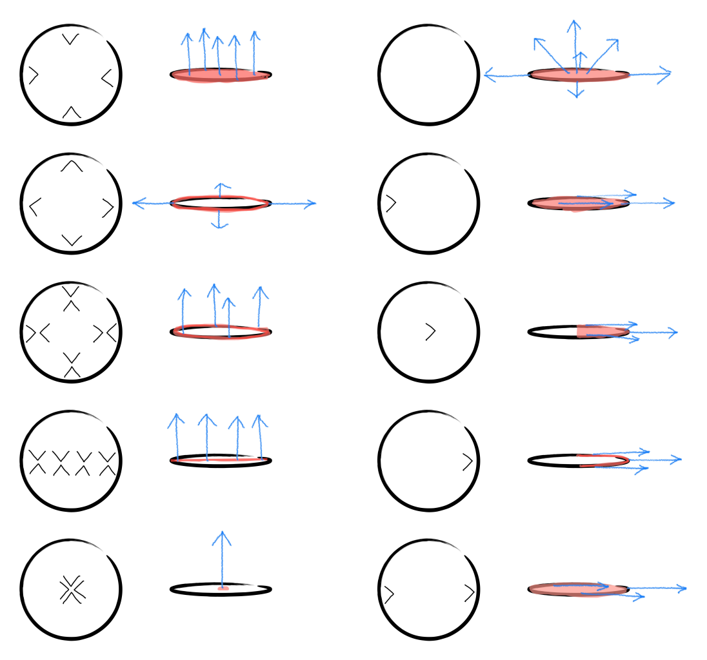](/wiki/File:Region_Sign_Demo.webp)

How configurations of region signs manifest, with the spell emitting from the red regions and the arrows showing its direction.

**Spells Using Region**  
[Flame Shot Seal](/wiki/Flame_Shot_Seal 'Flame Shot Seal') • [Rising Wave](/wiki/Rising_Wave 'Rising Wave') • [Water Bolt](/wiki/Water_Bolt 'Water Bolt') • [Water Horse Spell](/wiki/Water_Horse_Spell 'Water Horse Spell') • [Water Cage](/wiki/Water_Cage 'Water Cage') • [River Ferry Spell](/wiki/River_Ferry_Spell?action=edit&redlink=1 'River Ferry Spell (page does not exist)') • [Makeover Mask Spell](/wiki/Makeover_Mask_Spell 'Makeover Mask Spell') • [Enchanted Doorknob Seal](/wiki/Enchanted_Doorknob_Seal?action=edit&redlink=1 'Enchanted Doorknob Seal (page does not exist)') • [Illusory Labyrinth](/wiki/Illusory_Labyrinth 'Illusory Labyrinth')

### Convergence

**Convergence** (収束の矢, _shūsoku no ya_) causes the magic of its spell to "converge," centering down to single point. The sign could be semi-directional based on its behavior in the [wall of wind](/wiki/Wall_of_Wind 'Wall of Wind') spell. It is unclear exactly how **convergence** focuses magic, but the effect of spells such as [wall of wind](/wiki/Wall_of_Wind 'Wall of Wind') and the [wall anchored floatglow lamp](/wiki/Floatglow_Lamp_Seal 'Floatglow Lamp Seal') suggest that it might make the magic manifest about or from a single point. The sign can also make loose particles pack tightly together and become somewhat rigid, as explained by the disciples of [Qifrey's Atelier](/wiki/Qifrey%27s_Atelier "Qifrey's Atelier") when they were designing the [serpent's bed of sand](/wiki/Serpent%27s_Bed_of_Sand "Serpent's Bed of Sand"). One of the triangle's points is typically seen pointing inwards.

**Spells Using Convergence**  
[Qifrey's Water Dragon](/wiki/Qifrey%27s_Water_Dragon "Qifrey's Water Dragon") • [Raincleaver Spell](/wiki/Raincleaver_Spell 'Raincleaver Spell') • [Serpent's Bed of Sand](/wiki/Serpent%27s_Bed_of_Sand "Serpent's Bed of Sand") • [Sylph Shoes Seal](/wiki/Sylph_Shoes_Seal 'Sylph Shoes Seal') • [Wind Wall](/wiki/Wind_Wall 'Wind Wall') • [Wall-Anchored Floatglow Lamp](/wiki/Wall-Anchored_Floatglow_Lamp 'Wall-Anchored Floatglow Lamp') • [Repetition Seal](/wiki/Repetition_Seal 'Repetition Seal') • [Light-Reducing Spell](/wiki/Light-Reducing_Spell 'Light-Reducing Spell') • [Cookpot Lid](/wiki/Cookpot_Lid?action=edit&redlink=1 'Cookpot Lid (page does not exist)') • [Pouch of Calling](/wiki/Pouch_of_Calling 'Pouch of Calling')

### Collection

**Collection** will [collect material](/wiki/Serpent%27s_Bed_of_Sand "Serpent's Bed of Sand") located above and around the seal, allowing it to be used by a spell. It is either directional or semi-directional and has never been seen inverted. The open side is typically seen facing inwards.

**Spells Using Collection**  
[Purify](/wiki/Purify 'Purify') • [Billow Cluster](/wiki/Billow_Cluster 'Billow Cluster')

### Billow

**Billow** (もくもくの矢, _mokumoku no ya_) is a non-directional sign that allows a spell to produce a fluffy cloud that is said to be extremely comfortable to sit on. **Collection** or supposedly is needed to collect and convert certain materials into clouds, but there seem to be some materials that cannot be converted. Similar to **repetition**, **billowing** can take the place of a sigil within a spell. Its only appearance has been within the Serpent’s Bed of Sand, so the exact details of how it works aren't quite clear.

**Spells Using Billow**  
[Serpent's Bed of Sand](/wiki/Serpent%27s_Bed_of_Sand "Serpent's Bed of Sand") • [Billow Cluster](/wiki/Billow_Cluster 'Billow Cluster')

### Repetition

**Repetition** (くりかえしの矢, _kurikaeshi no ya_) As of the bonus from [Volume 12](/wiki/Volume_12 'Volume 12'), the status of repetition has been retconned from that of a sign to a sigil see it's entry [Here](/wiki/Sigils_Explained#Repetition 'Sigils Explained')

### Stretch

The **Stretch** sign (also known as **Weave**) can turn solid objects affected by the spell into long, flexible ribbons upon contact with the seal. It is most likely non-directional, but has never been seen inverted. It was used by [Richeh](/wiki/Richeh 'Richeh') in her [ribbon spells](/wiki/Boulder_Stretch_Rope 'Boulder Stretch Rope'). This sign is supposed to surround the central sigil.

**Spells Using Weave**  
[Boulder Stretch Rope](/wiki/Boulder_Stretch_Rope 'Boulder Stretch Rope') • [Light Tracer](/wiki/Light_Tracer 'Light Tracer') • [Crystal Ribbon](/wiki/Crystal_Ribbon 'Crystal Ribbon')

### Coil

[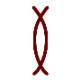](/wiki/File:Coil_Sign.png)

**Coil** causes physical matter to manifest in a spring or coil like shape. The sign is likely non-directional and cannot be inverted. Note: coil can only affect physical matter and will have no effect on liquids or gasses.

### Cool

**Cool** (冷やす矢, _hiyasu ya_) is a non-directional sign that presumably cools things down. First introduced in the [volume 12](/wiki/Volume_12 'Volume 12') bonus, it is featured in the [vapor bubble](/wiki/Vapor_Bubble 'Vapor Bubble') spell, presumably to either make the water cooler to drink or to help it condense from the air for the contraption to gather.

**Spells Using Cool**  
[Vapor Bubble Spell](/wiki/Vapor_Bubble_Spell 'Vapor Bubble Spell')

### Empower (Strengthen)

[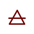](/wiki/File:Strengthen.png)

**Strengthen** (強化の矢, _kyōka no ya_) presumably makes objects stronger and more durable. It is most likely semi-directional, but has never been seen inverted. Introduced in the [volume 12](/wiki/Volume_12 'Volume 12') bonus, it is a component of the [capture pennant spell](/wiki/Capture_Pennant_Spell 'Capture Pennant Spell'), helping to make the banner of a [Knight’s](/wiki/Knights_Moralis 'Knights Moralis') [capture pennant](/wiki/Silver-White_Capture_Pennant 'Silver-White Capture Pennant') more durable.

**Spells Using Strengthen**  
[Raincleaver Spell](/wiki/Raincleaver_Spell 'Raincleaver Spell') • [Capture Pennant Spell](/wiki/Capture_Pennant_Spell 'Capture Pennant Spell') • [Sand Bridge](/wiki/Sand_Bridge 'Sand Bridge')

### Focus (Sights Set)

**Sights set** (照準の矢, _shōjun no ya_) is most likely a directional or semi-directional sign and has never been seen inverted. First seen in the [capture pennant spell](/wiki/Capture_Pennant_Spell 'Capture Pennant Spell'), it is highly peculiar. Aside from the **puppet sign**, it appears to be the only sign that allows a spell to be controlled via one’s mind. Specifically, it seems to serve the function of aiming a spell at some point or target. For example, it’s inclusion on the aforementioned capture pennant spell is likely allows a [knight](/wiki/Knights_Moralis 'Knights Moralis') to target a specific object or person for their [capture pennants](/wiki/Silver-White_Capture_Pennant 'Silver-White Capture Pennant') to wrap around.

**Spells Using Sights Set**  
[Spiraling Flame](/wiki/Spiraling_Flame 'Spiraling Flame') • [Capture Pennant Spell](/wiki/Capture_Pennant_Spell 'Capture Pennant Spell')

### Entwine

**Entwine** (巻きつきの矢, _maki-tsuki no ya_), first seen in the [capture pennant spell](/wiki/Capture_Pennant_Spell 'Capture Pennant Spell'), functions to somehow make an object it is drawn on (such as a ribbon) wrap or “entwine” itself around other objects. The mechanism through which this is achieved is unknown. It is most likely a semi-directional sign and has never been seen inverted.

**Spells Using Entwine**  
[Capture Pennant Spell](/wiki/Capture_Pennant_Spell 'Capture Pennant Spell')

### Sign of Wind

[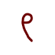](/wiki/File:Sign_of_Wind.png)

The **sign of wind** (風の矢, _kaze no ya_) is an asymmetrical sign with a strange history. Prior to the [volume 12](/wiki/Volume_12 'Volume 12') bonus, it had only ever made an appearance in [chapter 1](/wiki/Chapter_1 'Chapter 1'). In this chapter, the sign seemed to serve the same purpose as the wind sigil, serving as a sigil for both the [sylph shoes seal](/wiki/Sylph_Shoes_Seal 'Sylph Shoes Seal') and the [pegasus carriage spell](/wiki/Pegasus_Carriage_Spell 'Pegasus Carriage Spell'). However, with the sign not appearing in any subsequent chapters and even being replaced within the sylph shoes, fans believed the sign to have been a retconned version of a wind sigil. However, with its inclusion in the pegasus carriage spell reaffirmed as of the volume 12 bonus, it is now clear that the sign is still canon. Its function, beyond its relation to wind, is unclear.

**Spells Using Wind**  
[Spiraling Flame](/wiki/Spiraling_Flame 'Spiraling Flame') • [Pegasus Carriage Spell](/wiki/Pegasus_Carriage_Spell 'Pegasus Carriage Spell')

### Aeriforms Defined

**Aeriforms defined** (気体の示す矢, _kitai o shimesu ya_) are somewhat confusing thanks to the conflicting nature of its name and design. There are two basic variants of the base wind sigil: wind and aeriforms. The wind sigil makes a spell move air, while aeriforms causes a spell to create air. Confusingly, **aeriforms defined** has the same design as the modifiers on the wind sigil, yet shares a name with the aeriforms sigil. This conflicting information makes it difficult to determine the function of the sign, though it is known that it can serve as a modifier to the wind underfoot sigil, as seen in the [pegasus carriage spell](/wiki/Pegasus_Carriage_Spell 'Pegasus Carriage Spell'). The sign is most likely semi-directional and has never been seen inverted.

**Spells Using Ariforms Defined**  
[Pegasus Carriage Spell](/wiki/Pegasus_Carriage_Spell 'Pegasus Carriage Spell')

### Gather

[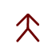](/wiki/File:Gather.png)

**Gather** (集める矢, _atsumeru ya_) seems to serve a very similar function and design to **collection**, letting a spell use material from its surroundings to construct its effect. How it differs is unclear, but gather may be less passive than collection and actively draw material in rather than just collect things nearby. This, however, is unconfirmed. The sign is seen in the [vapor bubble spell](/wiki/Vapor_Bubble_Spell 'Vapor Bubble Spell'). The sign is either directional or semi-directional and has never been seen inverted.

**Spells Using Gather**  
[Vapor Bubble Spell](/wiki/Vapor_Bubble_Spell 'Vapor Bubble Spell')

### Glaives

[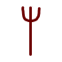](/wiki/File:Glaives.png)

**Glaives** function to determine how deeply magic will embed itself into the flesh. They are most likely semi-directional and have never been seen inverted. They likely date back to before the [Day of the Pact](/wiki/Day_of_the_Pact 'Day of the Pact'), and have only ever been seen in the [memory erasure](/wiki/Memory_Erasure 'Memory Erasure') spell variants and the [slime rendering seal](/wiki/Slime_Rendering_Seal?action=edit&redlink=1 'Slime Rendering Seal (page does not exist)') drawn by [Engendale](/wiki/Engendale 'Engendale'). Interestingly, it is possible that **glaives** aren't classified as signs based on Engendale's comments regarding them, but how exactly this is the case is left unclear.

**Spells Using Glaives**  
[Memory Erasure](/wiki/Memory_Erasure 'Memory Erasure') • [Slime Rendering Seal](/wiki/Slime_Rendering_Seal?action=edit&redlink=1 'Slime Rendering Seal (page does not exist)')

### Solidify

[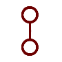](/wiki/File:Solidify.png)

**Solidify** (凝固の矢) likely causes magic drawn within/connecting to it to become more solid. It appears that this sign can be written both on its own and with signs/sigils/seals written within one of its circles and warrant the same effect. A rule of thumb to discern it from linked seals: If the lines are straight, and it is linked to an empty seal, it's solidify!

**Spells Using Solidify**  
[Raincleaver Spell](/wiki/Raincleaver_Spell 'Raincleaver Spell') • [Sand Bridge](/wiki/Sand_Bridge 'Sand Bridge') • [Slime Rendering](/wiki/Slime_Rendering?action=edit&redlink=1 'Slime Rendering (page does not exist)')(could be low detail)

### Bind

[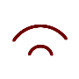](/wiki/File:Binding.png 'Left') based on the name and it's use in [Raincleaver](/wiki/Raincleaver 'Raincleaver'), **Bind** (留める矢) may be used to halt movement of material and bind it together, causing it to act and be moved as a single unit.

**Spells Using Bind**  
[Raincleaver Spell](/wiki/Raincleaver_Spell 'Raincleaver Spell') • [Sand Bridge](/wiki/Sand_Bridge 'Sand Bridge')

### Envelop

**Envelop** (衣まといの矢) likely causes a magic effect to envelop/surround what it is targeting. In [Raincleaver](/wiki/Raincleaver 'Raincleaver') it is likely what is causing the water to wrap around the entire sword rather than just manifesting out of the seals, and has a similar effect in [Gathering Shadows](/wiki/Gathering_Shadows 'Gathering Shadows')

**Spells Using Envelop**  
[Raincleaver Spell](/wiki/Raincleaver_Spell 'Raincleaver Spell') • [Gathering Shadows](/wiki/Gathering_Shadows 'Gathering Shadows') • [Mirror Cloak Spell](/wiki/Mirror_Cloak_Spell 'Mirror Cloak Spell') • [Cloak Spell](/wiki/Cloak_Spell 'Cloak Spell') • [Beldaruit's illusion cloak spell](/wiki/Beldaruit%27s_illusion_cloak_spell?action=edit&redlink=1 "Beldaruit's illusion cloak spell (page does not exist)") • [Petrification](/wiki/Petrification 'Petrification')

### Conceal

**Conceal** hides or “conceals” whatever it is targeting, granting perceived invisibility, and forming a shadowy form leaving room for another image to be put in its place.

**Spells Using Conceal**  
[Gathering Shadows](/wiki/Gathering_Shadows 'Gathering Shadows') • [Makeover Mask Spell](/wiki/Makeover_Mask_Spell 'Makeover Mask Spell') • [Mirror Cloak Spell](/wiki/Mirror_Cloak_Spell 'Mirror Cloak Spell') • [Cloak Spell](/wiki/Cloak_Spell 'Cloak Spell')

### Reflect

[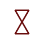](/wiki/File:Sign_of_reflection_redraw.png)

**Reflection** likely functions to target a reflected image on whatever it is drawn on to be used within an illusion spell. It's known that what image reflection targets can be specified based on its explanation in [Mirror Cloak of Borrowshade](/wiki/Mirror_Cloak_of_Borrowshade 'Mirror Cloak of Borrowshade')

**Spells Using Reflect**  
[Mirror Cloak Spell](/wiki/Mirror_Cloak_Spell 'Mirror Cloak Spell') • [Mirror Spell](/wiki/Mirror_Spell 'Mirror Spell')

## Unofficially Named

### Diamond

[.png>)](</wiki/File:Diamond_(what_does_it_do).png>)

**Diamond** can be found within the [spell of reduction](/wiki/Spell_of_Reduction 'Spell of Reduction') used on the [period piece](/wiki/Period_Pieces 'Period Pieces') contraption, which uses an inverted **enlarge** sign to make nearby objects shrink. The sign is non-directional. By comparing this spell to the [floating expansion spell](/wiki/Floating_Expansion 'Floating Expansion'), which also contains an **enlarge** sign, it is possible to isolate **diamond's** effect. Most likely, **diamond** will cause a spell to only affect nearby objects while not affecting the object the spell is drawn on.

**Spells Using Diamond**  
[Spell of Reduction](/wiki/Spell_of_Reduction 'Spell of Reduction')

### Window

**Window** (窓の矢, _mado no ya_) can be found at the center of the [floating expansion](/wiki/Floating_Expansion 'Floating Expansion') spell, which makes use of an **enlarge** sign to make the object it is drawn on grow in size. The sign is non-directional. By comparing this spell to the [spell of reduction](/wiki/Spell_of_Reduction 'Spell of Reduction'), which also contains an (albeit inverted) **enlarge** sign, it is possible to isolate **window's** effect. Most likely, **window** will cause a spell to only affect the object it is drawn on.

**Spells Using Window**  
[Floating Expansion](/wiki/Floating_Expansion 'Floating Expansion')

### Enlarge

**Enlarge** is a semi-directional sign that will cause objects to grow in size (or shrink if inverted). Whether it causes a change in size to just the object it is drawn on or just to objects nearby is seemingly controlled by the presence of either a **window** or **diamond** sign respectively. It causes objects to either [grow](/wiki/Floating_Expansion 'Floating Expansion') (corners point outwards) or [shrink](/wiki/Spell_of_Reduction 'Spell of Reduction') (corners point inwards). A sign may or may not be needed, but it would have to be placed in the center regardless.

**Spells Using Enlarge**  
[Qifrey's Water Dragon](/wiki/Qifrey%27s_Water_Dragon "Qifrey's Water Dragon") • [Spell of Reduction](/wiki/Spell_of_Reduction 'Spell of Reduction') (Inverted) • [Floating Expansion](/wiki/Floating_Expansion 'Floating Expansion')

### Crosshair

[.png>)](</wiki/File:Crosshair_(idk).png>)

**Crosshair** is a component of the [rainflinger](/wiki/Rainflinger 'Rainflinger') seal. The sign is non-directional. Likely it functions to cause magic to only target things with a corresponding magic aspect as it with the magical effects in the spell

[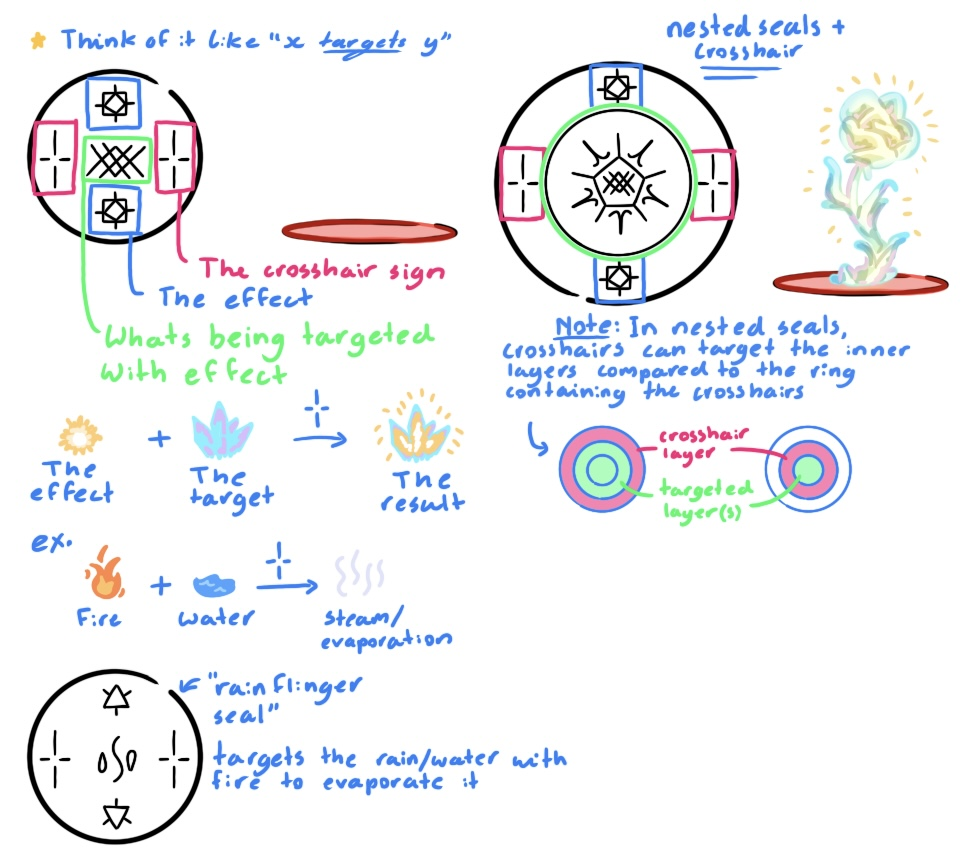](/wiki/File:Crosshair_Diagram.png)

**Spells Using Crosshair**  
[Rainflinger](/wiki/Rainflinger 'Rainflinger') • [Fish Guidance](/wiki/Fish_Guidance 'Fish Guidance')

### Radial

**Radial** is a component of the [snugstone spell](/wiki/Snugstone_Spell 'Snugstone Spell'). While it's exact function is unclear, it likely serves to decrease the power of the spells it is used in, such as converting fire into heat.

**Spells Using Radial**  
[Snugstone Spell](/wiki/Snugstone_Spell 'Snugstone Spell')

### Bolt

[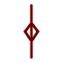](/wiki/File:Bolt.png)

**Bolt** is a component of the [water bolt](/wiki/Water_Bolt 'Water Bolt') spell. It is a non-directional sign. **Bolt** causes the magic of its spell to manifest in the form of bolts-like projectiles. When paired with a **region** sign, which controls the spell's direction, the projectiles will be shot with dangerous speed.

**Spells Using Bolt**  
[Water Bolt](/wiki/Water_Bolt 'Water Bolt')

### Rain

**Rain** cause's its spell to produce an effect very similar to rainfall down into its immediate area. It may be limited to only water spells, but it would likely work with other sigils such as fire or light to create firework-like effects, or possibly even generating a lava rain with a pairing of fire and earth. This sign is meant to surround the central sigil, which is placed in the empty space at its center. As rain can be turned inside out to reverse its effect, it is considered semi-directional.

**Spells Using Rain**  
[Rainbringer Seal](/wiki/Rainbringer_Seal 'Rainbringer Seal')

### Orb

**Orb**, a non-directional sign, has the affect of creating a spherical space above a seal within which the material the spell controls will collect. Material will only collect in this area if it is added in directly. Material will fill this space bottom to top, collecting at the bottom of the spherical region, still affected by gravity. When more material is added, it will gradually fill the space higher and higher in the same way you would see in a bucket or a cup. It is seen one time in a spell [Qifrey](/wiki/Qifrey 'Qifrey') uses to create a sphere of water, achieving this by pouring it into the spherical region of the spell directly.

[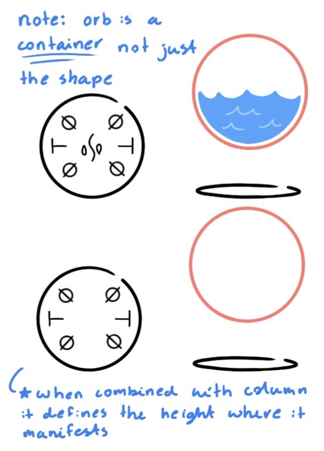](/wiki/File:Orb_Diagram.png)

**Spells Using Orb**  
[Water Orb](/wiki/Water_Orb 'Water Orb')

### Purify

[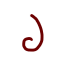](/wiki/File:Purify_Sign.png)

**Purify** is an asymmetric sign found in both the [Purify](/wiki/Purify 'Purify') spell and the [sewer grate purifier](/wiki/Sewer_Grate_Purifier?action=edit&redlink=1 'Sewer Grate Purifier (page does not exist)'). It functions to separate out any impurities from the magic of its sigil. For example, it will separate out particulates and contaminants from water or dust from air.

**Spells Using Purify**  
[Purify](/wiki/Purify 'Purify')

### Link

The exact effects of **Link** are unknown, but it is confirmed that this sign functions to somehow link magic between the object it is drawn on and all other objects that were broken off, removed from, or made out of the same original object. For example, the [split-shard bangles](/wiki/Split-Shard_Bangles 'Split-Shard Bangles') are rings all carved from fragments of the same original crystal. Constructed from a **light** sigil, a **weave** sign, and a **link** sign, the spell on the rings will create a ribbon of light between the ring it is drawn on and all other rings constructed from that crystal. What a link spell would be like paired with a sign other than weave, however, is unknown. Link is most likely a semi-directional sign and has never been seen inverted.

**Spells Using Link**  
[Light Tracer](/wiki/Light_Tracer 'Light Tracer')

### Stillness

[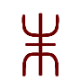](/wiki/File:Stasis_Sign.png)

based on its use in the [Snowfending](/wiki/Snowfending 'Snowfending') spell, and the translation of [Episode 11](/wiki/Episode_11 'Episode 11') textbooks, **Stillness** [*unofficial name*]is used to hold magic in place, likely having a magical effect remain static in a single location. This is likely used to hold heat over/on Coco's house in the [Snowfending](/wiki/Snowfending 'Snowfending') spell

**Spells Using Stillness**  
[Snowfending](/wiki/Snowfending 'Snowfending')

### Project

[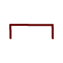](/wiki/File:Sign_of_projection_redraw.png)

**Project** is likely used to project an effect outwards. It is likely project is only capable of projecting images specified by the spell

**Spells Using Project**  
[Mirror Cloak Spell](/wiki/Mirror_Cloak_Spell 'Mirror Cloak Spell') • [Mirror Spell](/wiki/Mirror_Spell 'Mirror Spell')

## References

1. Witch Hat Atelier Manga: Chapter 3 , Page 16
2. Witch Hat Atelier Manga: Chapter 8 , Page 10
3. Volume 12 Extra
4. Witch Hat Atelier Manga: Chapter 4 , Page 20
5. Witch Hat Atelier Manga: Chapter 4 , Page 24
6. Witch Hat Atelier Anime: Episode 7, 21:30
7. Witch Hat Atelier Manga: Chapter 43 , Page 1
8. Witch Hat Atelier Manga: Chapter 7 , Page 14
9. Witch Hat Atelier Manga: Chapter 3 , Page 8
10. Witch Hat Atelier Manga: Chapter 36 , Page 17
11. Witch Hat Atelier Manga: Chapter 7 , Page 13
12. Witch Hat Atelier Manga: Chapter 6 , Page 23
13. Writing/Translated Texts#Primer Book 6
14. Witch Hat Atelier Manga: Chapter 63 , Page 3
15. Archives of Witch Hat Atelier
16. Witch Hat Atelier Manga: Chapter 37 , Page 28
17. Witch Hat Atelier Manga: Chapter 24 , Page 9
18. Witch Hat Atelier Manga: Chapter 82 , Page 2
19. Witch Hat Atelier Manga: Chapter 53 , Page 19
20. Witch Hat Atelier Manga: Chapter 46 , Page 19
21. Witch Hat Atelier Manga: Chapter 94 , Page 14
