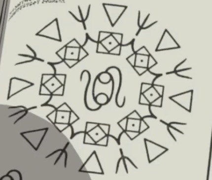

# Ancient Light Beacon

_Source: [https://witchhatatelier.telepedia.net/wiki/Ancient_Light_Beacon](https://witchhatatelier.telepedia.net/wiki/Ancient_Light_Beacon)_
_Category: Ancient Spells_
_Status: Non-Forbidden_

| Field       | Value               |
| ----------- | ------------------- |
| Type        | Spell , Light Spell |
| User(s)     | Witches             |
| Anime Debut | Episode 11          |

**Ancient Light Beacon** is a light-type [spell](/wiki/Spells 'Spells') that presumably creates a column of light.

## Description

Ancient Light Beacon is, as the name entails, ancient, and most likely used before the [Day of the Pact](/wiki/Day_of_the_Pact 'Day of the Pact'). Pretty much all of the signs and sigils, except the [signs of convergence](/wiki/Signs_Explained#Convergence 'Signs Explained') on the edges, are unknown. Alongside the signs of convergence are signs that look similar to [signs of stillness](/wiki/Signs_Explained#Stillness 'Signs Explained') or [glaives](/wiki/Signs_Explained#Glaives 'Signs Explained'). The inner ring is composed of what appear to be variations of [light sigils](/wiki/Sigils_Explained#Light 'Sigils Explained') connected by more unknown signs. The sigil in the center is completely unknown.

## Usage

This spell is, as the textbook puts it, “from the ancient era”. This means it was most likely used as a light beacon before the [Day of the Pact](/wiki/Day_of_the_Pact 'Day of the Pact'). However, the book says that “nowadays there is a simplified version”, referring to the more commonly used [light sigil](/wiki/Sigils_Explained#Light 'Sigils Explained').

## References

1. Witch Hat Atelier Anime: Episode 11
2. Writing/Translated Texts#Primer Book 5
