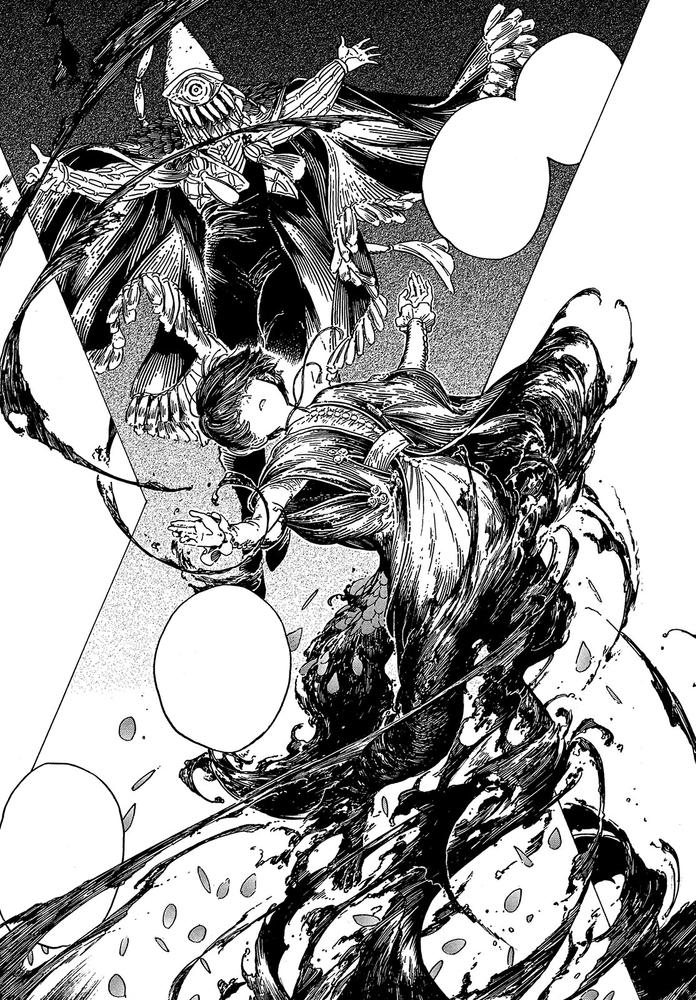

# Anti Scalewolf Curse

_Source: [https://witchhatatelier.telepedia.net/wiki/Anti_Scalewolf_Curse](https://witchhatatelier.telepedia.net/wiki/Anti_Scalewolf_Curse)_
_Category: Ancient Spells_
_Status: Forbidden_

| Field       | Value                |
| ----------- | -------------------- |
| Type        | Forbidden Spell      |
| User(s)     | Brimmed Caps , Iguin |
| Manga Debut | Chapter 29           |

**Anti Scalewolf Curse** is a forbidden spell that nullifies the effects of the [Scalewolf Curse](/wiki/Scalewolf_Curse 'Scalewolf Curse') spell.

## Description

Unlike the [Inverted Scalewolf Curse](/wiki/Inverted_Scalewolf_Curse 'Inverted Scalewolf Curse'), the Anti Scalewolf Curse is a completely different spell from its [counterpart](/wiki/Scalewolf_Curse 'Scalewolf Curse'). When used on someone affected by the [Scalewolf Curse](/wiki/Scalewolf_Curse 'Scalewolf Curse'), the afflicted individual will revert to a human completely.

## Usage

At first, [Qifrey's apprentices](/wiki/Qifrey%27s_Atelier "Qifrey's Atelier") try to use an [inverted drawing of the Scalewolf Curse](/wiki/Inverted_Scalewolf_Curse 'Inverted Scalewolf Curse') to cure Euini from the spell, but this only helps to bring back his humanity/mental state, and does not affect his physical transformation. [Iguin](/wiki/Iguin 'Iguin') tells [Coco](/wiki/Coco 'Coco') that the spell can only be reversed with forbidden magic. To prove their point, Iguin makes a collar with this spell and demonstrates its ability to cure Euini entirely, only to then remove it, causing Euini to revert back to a [scalewolf](/wiki/Scalewolf 'Scalewolf'). Iguin then tries to coerce the apprentices into drawing forbidden magic, telling them that in order to get the spell and save Euini, they must draw it themselves. However, Coco steals the collar from him with a [Grasping Wind](/wiki/Grasping_Wind 'Grasping Wind') spell, thwarting Iguin's plan.

Euini would use the collar to transform into a human or a scalewolf at will.

## References

1. Witch Hat Atelier Manga: Chapter 28 , Page 29
2. Witch Hat Atelier Manga: Chapter 29 , Page 9
3. Witch Hat Atelier Manga: Chapter 29 , Page 28
4. Witch Hat Atelier Manga: Chapter 68.5 , Page 9
