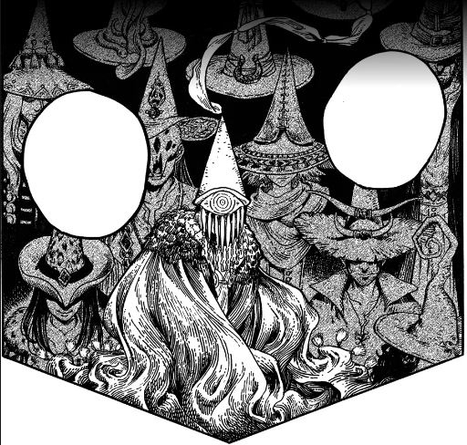
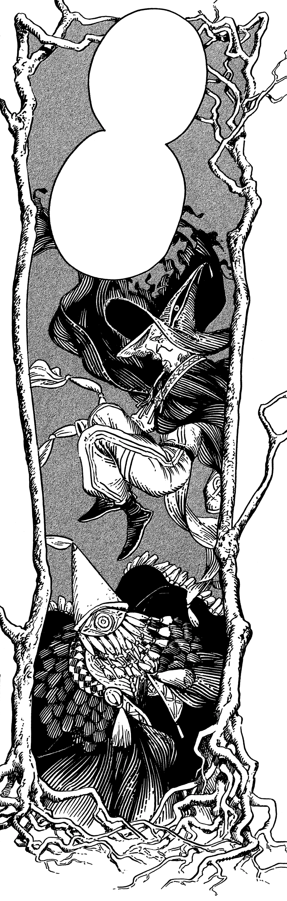

# Brimmed Caps

_Source: [https://witchhatatelier.telepedia.net/wiki/Brimmed_Caps](https://witchhatatelier.telepedia.net/wiki/Brimmed_Caps)_
_Category: Ancient Spells_
_Status: Forbidden_

| Field     | Value                                                                        |
| --------- | ---------------------------------------------------------------------------- |
| Kanji     | つばあり帽子                                                                 |
| German    | Krempenhüte                                                                  |
| Alias     | Brims Brimcaps/Brimhats (By the fandom)                                      |
| Status    | Active                                                                       |
| Relations | Pointed Cap Witches (Negative) Knights Moralis (Negative) Outsider (Unknown) |
| Manga     | Chapter 3                                                                    |
| Anime     | Episode 3                                                                    |

The **Brimmed Caps** are [witches](/wiki/Witches 'Witches') who reject the rules set by the [Day of the Pact](/wiki/Day_of_the_Pact 'Day of the Pact') and continue to use [Forbidden Magic](/wiki/Forbidden_Magic 'Forbidden Magic'), such as spells to harm others or directly affect or transform the body, along with the forbidden act of making spell tattoos on their own bodies or those of others. Their name comes from the style of their hats, that have brims or other ornaments to obscure their faces as opposed to the [Pointed Cap Witches](/wiki/Pointed_Cap_Witches 'Pointed Cap Witches'), whose caps may have no brim.

Some of the Brimmed Caps, like [Iguin](/wiki/Iguin 'Iguin') and [Sasaran](/wiki/Sasaran 'Sasaran'), express an interest in having [Coco](/wiki/Coco 'Coco') become a user of forbidden magic: claiming that she is the "child of hope." By having her use forbidden magic in a proper way for proper reasons and therefore validating its use, they see Coco as the key to unlocking the infinite possibilities and freedoms that was outlawed by the Day of the Pact. When Coco was a young child, Iguin was responsible for selling her a picture book filled with spells normal and forbidden, along with a pen and bottle of ink. Years later, after witnessing the secret to how magic was cast, Coco began drawing the spells from that picture book and unintentionally turned her mother to stone. Becoming [Qifrey's](/wiki/Qifrey 'Qifrey') apprentice in the aftermath, Iguin and Sasaran continue to target Coco and her friends in their attempt to move her into using forbidden magic.

Later on, other Brimmed Caps like [Restys](/wiki/Restys 'Restys') and [Ininia](/wiki/Ininia 'Ininia') are introduced, who are more interested in using forbidden magic to [heal](/wiki/Healingcraft 'Healingcraft'), even sharing their spells with [Outsiders](/wiki/Outsiders 'Outsiders') who need help. In this way, they recruit [Custas](/wiki/Custas 'Custas') as an ally when his not-father [Dagda](/wiki/Dagda 'Dagda') is gravely injured, as well as granting Custas the ability to walk again through forbidden magic. Ininia expresses anger and disgust at how any negative actions or spells get blamed on the Brimmed Caps as a whole, whether or not they were truly involved, as is the case for the [monstrous Valance Leech](</wiki/Valance_Leech_(Monster)> 'Valance Leech (Monster)')’s creation. Restys and Ininia planned to "gift" a bottle of [parasitic silverwood seeds](/wiki/Silverwood_Tree 'Silverwood Tree') to [Deanreldy Ezrest](/wiki/Deanreldy_Ezrest 'Deanreldy Ezrest'), King of [Zozah Peninsula](/wiki/Zozah_Peninsula 'Zozah Peninsula') and a renowned healer, but later rescind their plan when it turns out that their gift had a major flaw.

The exact social structure of the Brimmed Caps is unknown, though they seem to have meetings where they discuss their future plans while hiding their faces behind brims. The true extent of the alliance between members has yet to be revealed.

## Known Brimmed Caps

- [Iguin](/wiki/Iguin 'Iguin')
- [Sasaran](/wiki/Sasaran 'Sasaran')
- [Ininia](/wiki/Ininia 'Ininia')
- [Restys](/wiki/Restys 'Restys')
- [Custas](/wiki/Custas 'Custas') ([Chapter 50](/wiki/Chapter_50 'Chapter 50') onwards)
- [Patchwork Brim](/wiki/Background_Characters 'Background Characters')
- [Skull Brim](/wiki/Background_Characters 'Background Characters')
- [Veiled Brim](/wiki/Background_Characters 'Background Characters')

## Gallery

- 

  Iguin and Sasaran

## References

1. Witch Hat Atelier Manga: Chapter 6 , Page 19
2. Witch Hat Atelier Manga: Chapter 27 , Page 29
3. Witch Hat Atelier Manga: Chapter 27 , Page 30
4. Witch Hat Atelier Manga: Chapter 1 , Page 20
5. Witch Hat Atelier Manga: Chapter 1 , Page 56
6. Witch Hat Atelier Manga: Chapter 7 , Page 29
7. Witch Hat Atelier Manga: Chapter 29 , Page 2
8. Witch Hat Atelier Manga: Chapter 45 , Page 28
9. Witch Hat Atelier Manga: Chapter 45 , Page 31
10. Witch Hat Atelier Manga: Chapter 51 , Page 2
11. Witch Hat Atelier Manga: Chapter 65 , Page 21
12. Witch Hat Atelier Manga: Chapter 68 , Page 16
13. Witch Hat Atelier Manga: Chapter 65 , Page 22
14. Witch Hat Atelier Manga: Chapter 87
15. Witch Hat Atelier Manga: Chapter 27
16. Witch Hat Atelier Manga: Chapter 88
