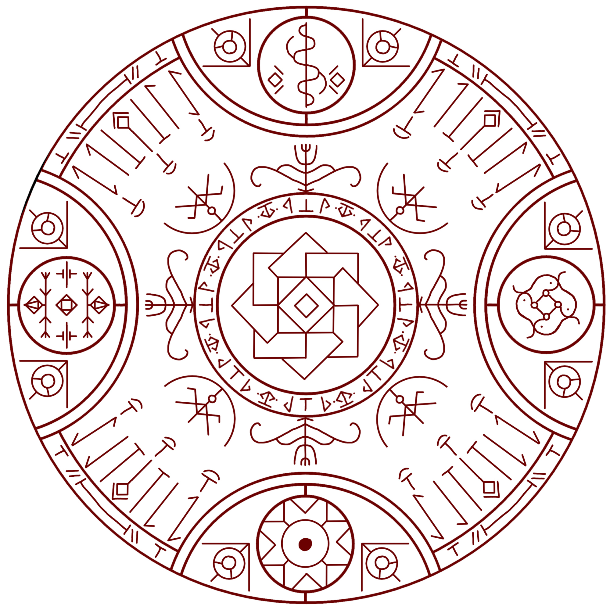
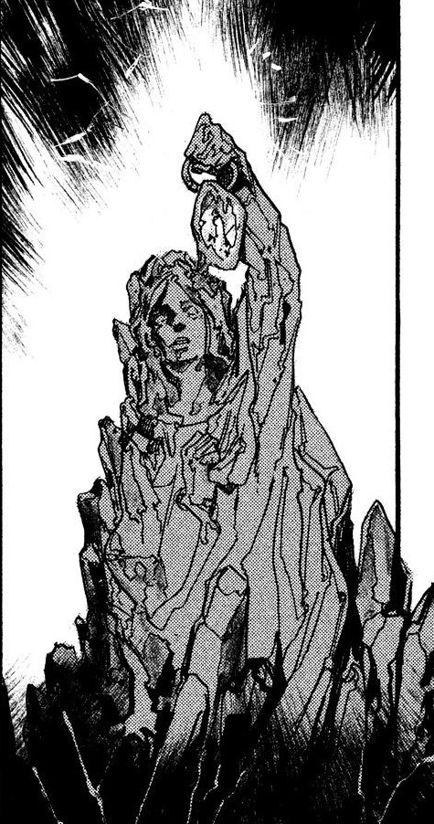

# Petrification

_Source: [https://witchhatatelier.telepedia.net/wiki/Petrification](https://witchhatatelier.telepedia.net/wiki/Petrification)_
_Category: Ancient Spells_
_Status: Forbidden_

| Field       | Value               |
| ----------- | ------------------- |
| Type        | Forbidden Magic     |
| User(s)     | Brimmed Caps , Coco |
| Manga Debut | Chapter 1           |

**Petrification** is a forbidden [spell](/wiki/Spells 'Spells') that turns everything nearby, alive or inanimate, into a rock-like unknown material.

## Description

The seal consists of a large number of both known and unknown elements. Column, bend, dispersion, and region signs, as well as an earth sigil and a [time stop spell.](/wiki/Time_Stop 'Time Stop') However, the other aspects of its design remain a mystery. While the inclusion of earth signs indicate that the spell is indeed somehow turning things to stone, how this is achieved is unclear. The inclusion of the time stop spell suggests that time is frozen for whatever the spell petrifies. It is unclear why it is included.

## Usage

After discovering that [magic](/wiki/Magic 'Magic') is drawn rather than spoken, [Coco](/wiki/Coco 'Coco') copied several spells from the [magic picture book](/wiki/Magic_Book 'Magic Book') sold to her by [Iguin](/wiki/Iguin 'Iguin') when she was a little girl. The last spell she drew was the petrification spell and, just as she finished drawing it, [Qifrey](/wiki/Qifrey 'Qifrey') snatched her up and whisked her out of her house, just before it and [her mother](/wiki/Coco%27s_Mother "Coco's Mother") were turned to stone.

Coco's mother after being turned to stone

## References

1. Witch Hat Atelier Anime Trailer, seconds 1:03 to 1:04 https://www.youtube.com/watch?v=hMmBSCQs1H4&ab_channel=Crunchyroll
2. Witch Hat Atelier Manga: Chapter 1 , Page 50-56
