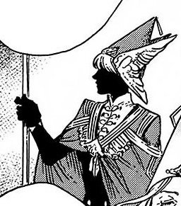

# Pointed Cap Witches

_Source: [https://witchhatatelier.telepedia.net/wiki/Pointed_Cap_Witches](https://witchhatatelier.telepedia.net/wiki/Pointed_Cap_Witches)_
_Category: Ancient Spells_
_Status: Forbidden_

| Field     | Value                                                                            |
| --------- | -------------------------------------------------------------------------------- |
| Kanji     | とんがり帽子                                                                     |
| Status    | Active                                                                           |
| Relations | Brimmed Caps (Negative) Outsider (Mainly Positive) Five Rulers (Mainly Positive) |
| Manga     | Chapter 1 Chapter 3 (Explanation)                                                |

_This page refers to the faction of witches formed after the [Day of the Pact](/wiki/Day_of_the_Pact 'Day of the Pact'), in opposition to the [Brimmed Caps](/wiki/Brimmed_Caps 'Brimmed Caps')._

**Pointed Cap witches**, or normally referred to as witches, are all those who use magic in accordance to the laws established on the Day of the Pact. They belong to no nation, pay no rent, or kingdom tax. They instead are paid by the magic tax taken from the [Outsiders](/wiki/Outsiders 'Outsiders') of [Zozah](/wiki/Zozah_Peninsula 'Zozah Peninsula'), in exchange for providing magical assistance to the people through seasonal services. Only those born to witches are legally permitted to become one, with the Pointed Caps purging the memories of anyone who discovers the secret of how magic is cast, something they have done since the Day of the Pact. Their society is led by the [Three Wise](/wiki/Three_Wise 'Three Wise'), and their laws are enforced by the [Knights Moralis](/wiki/Knights_Moralis 'Knights Moralis').

Due to the secrecy surrounding magic, witches are forced to live separate from [Outsiders](/wiki/Outsiders 'Outsiders'). The majority choose to live within the [Great Hall](/wiki/Great_Hall 'Great Hall'), a fortified underwater city with a magical barrier to hold back the ocean and create breathable air. Smaller witch communities do exist outside the Great Hall, like the island city of [Kalhn](/wiki/Kalhn 'Kalhn') in the [Marshwoods](/wiki/Marshwoods 'Marshwoods'), and [Ghodrey](/wiki/Ghodrey 'Ghodrey') in the far north. More rarely, some witches like [Qifrey](/wiki/Qifrey 'Qifrey') prefer a solitary life in an [Atelier](/wiki/Atelier 'Atelier') far away from the Great Hall, or are nomadic and travel across the peninsula year-round.

## History

Before the [Day of the Pact](/wiki/Day_of_the_Pact 'Day of the Pact'), magic was available for all to use, with no limit or regulation placed on who used it or how. It was common for kings and other nobles to have a witch at their service. The great acts of these witches are described in many of Zozah's [myths and legends](/wiki/Mythology 'Mythology'). This freedom of magic was used for good, such as in [Healingcraft](/wiki/Healingcraft 'Healingcraft'), but also led to horrors such as being used for weapons of war, to create [Monsters](/wiki/Monster 'Monster'), and other [atrocities](/wiki/The_Ancients_of_Romonon 'The Ancients of Romonon')... many of which still scar the landscape and today are known as [Mystical Ruins](/wiki/Mystical_Ruin 'Mystical Ruin').

On the Day of the Pact, a small faction of witches—the precursors to the modern Pointed Caps—decided to put an end to the many atrocities caused by the unrestricted use of magic. They [wiped all memories of magic](/wiki/Memory_Erasure 'Memory Erasure') from the populace, only leaving a small number of trusted apprentices upon whom to pass their knowledge. The laws they put in place forbade witches from learning medicine and banned any magic deemed to be too dangerous for use, including attack magic and magic which permanently scarred/altered the environment. Above all other things, however, all spells cast directly on the human body were banned, which made illegal both magic used to transform and harm people as well as all forms of healing magic. These laws are still in place today.

The witches who opposed this new order and wished to bring back the magic of yore became known as the [Brimmed Caps](/wiki/Brimmed_Caps 'Brimmed Caps').

## Training

Before becoming apprentices, witches go to school to receive a general education. Witches start their apprenticeship around the ages of 7 to 10, at which they enter the atelier of the master they chose (the student picks their master and not otherwise). Master witches from the bloodlines of the few original Pointed Caps of the Day of the Pact are particularly revered. [Five tests](/wiki/The_Pentagram_Test 'The Pentagram Test') are taken during a witch's education. Completing the first test allows a student to become an apprentice to a witch master; the second test is to be allowed to cast magic in public among [Outsiders](/wiki/Outsiders 'Outsiders'); the third test allows witches to take on the Librarian's Trial and if passed enter the [Tower of Tomes](/wiki/Tower_of_Tomes 'Tower of Tomes'); passing the fourth test means a witch is ready to graduate from their master; and passing the fifth test allows them to take on apprentices of their own. Once a witch is considered fully-fledged, they must perform at least three tasks of public service per season; though once apprentices pass their second test, they can travel with their master to assist in this.

## Uniform

The uniform of Pointed Cap witches consists of a pointed, brimless cap and a robe and/or cape of some kind. The cap is a symbol of their faction and marks them as a witch, and shall not have a brim or anything that can conceal their face. Apprentices wear a pointed cap that is part of the uniform design of their atelier and will keep this cap until their graduation, upon which they may design their own. A witch's cloak must be long enough to conceal their hands, enabling magic to be drawn secretly in the presence of Outsiders. Atelier uniforms also have their own cloak design. Some cloaks have specific uses, such as those worn by craftsmen, typically short and light to allow for ease of movement.

## Magic laws

They regulate the use of magic and the existence of the Pointed Caps.

- Magic that is cast directly on the body and/or is able to alter the body and/or mind of human beings is banned (including healing magic), with memory erasure serving as the sole exception.
- Outsiders are forbidden to know the secret of magic. If one learns the secret of magic, their memory will be wiped.
- A witch should never be seen drawing spells by an Outsider.
- Seals on contraptions should be hidden or camouflaged in such a way that an Outsiders wouldn't be able to discover the secret of magic.
- It is forbidden to use magic in ways that cause others harm.
- Witches are forbidden from studying medicine.
- Witches are forbidden from intervening in any disaster that isn't natural in origins, like wars.
- Witches are not to swear any political allegiance.
- The cap of a witch must never conceal their face.
- Each atelier built far away from large cities must be under surveillance of a [Watchful Eye](/wiki/Watchful_Eye 'Watchful Eye'), who has to report any abuse or issue to the [Knights Moralis](/wiki/Knights_Moralis 'Knights Moralis').
- If a witch uses forbidden magic, the Knights Moralis will remove their memories of magic.
- It is illegal to have any magic tattooed or drawn onto your skin, regardless of how it got there.

## Acts of Service

Fully-fledged witches are required to perform acts of service to the outside world; a minimum of three per season. These may be direct requests from the Great Hall, simple acts of assistance to those in need, or daring rescues during natural calamities. Some witches take pride in this and travel the land year-round, completing 20 or even 30 distinct acts of service per season.

## Members

### [Qifrey's Atelier](/wiki/Qifrey%27s_Atelier "Qifrey's Atelier")

- [Qifrey](/wiki/Qifrey 'Qifrey')
- [Olruggio](/wiki/Olruggio 'Olruggio')
- [Coco](/wiki/Coco 'Coco')
- [Agott](/wiki/Agott 'Agott')
- [Richeh](/wiki/Richeh 'Richeh')
- [Tetia](/wiki/Tetia 'Tetia')

### Pointed Cap Masters and Apprentices

- [Alaira](/wiki/Alaira 'Alaira')
  - [Euini](/wiki/Euini 'Euini')
- [Kukrow](/wiki/Kukrow 'Kukrow')
  - (Formally Euini)
- [Hiehart](/wiki/Hiehart 'Hiehart')
  - [Jujy](/wiki/Jujy 'Jujy')

### Other Pointed Caps

- [Mr. Nolnoa](/wiki/Mr._Nolnoa 'Mr. Nolnoa')
- [Tartah](/wiki/Tartah 'Tartah')
- [Atwert](/wiki/Atwert 'Atwert')

### [Knights Moralis](/wiki/Knights_Moralis 'Knights Moralis')

- [Vinanna](/wiki/Vinanna 'Vinanna')
- [Easthies](/wiki/Easthies 'Easthies')
- [Luluci](/wiki/Luluci 'Luluci')
- [Galga](/wiki/Galga 'Galga')
- [Utowin](/wiki/Utowin 'Utowin')
- [Ekoh](/wiki/Ekoh 'Ekoh')
- [Etlan](/wiki/Etlan 'Etlan')

### The [Three Wise](/wiki/Three_Wise 'Three Wise')

- [Beldaruit](/wiki/Beldaruit 'Beldaruit')
- [Vinanna](/wiki/Vinanna 'Vinanna')
- [Lagrah](/wiki/Lagrah 'Lagrah')

## References

1. Witch Hat Atelier Manga: Chapter 48 , Page 11
2. Witch Hat Atelier Manga: Chapter 1 , Page 57
3. Witch Hat Atelier Manga: Chapter 46 , Page 10
4. Witch Hat Atelier Manga: Chapter 5
5. Witch Hat Atelier Manga: Chapter 32 , Page 5
6. Witch Hat Atelier Manga: Chapter 46 , Page 9
7. Witch Hat Atelier Volume 5 : Extra Page: "The Hats of Witch Hat Atelier"
8. Witch Hat Atelier Volume 8 : Extra Page: "The Cloaks of Witch Hat Atelier"
9. Witch Hat Atelier Manga: Chapter 2 , Page 18-19
10. Witch Hat Atelier Manga: Chapter 30 , Page 19
11. Witch Hat Atelier Manga: Chapter 12 , Page 20
12. Witch Hat Atelier Manga: Chapter 11 , Page 3
13. Witch Hat Atelier Manga: Chapter 45 , Page 12
14. Witch Hat Atelier Manga: Chapter 68 , Page 13
15. Witch Hat Atelier Manga: Chapter 48 , Page 12
16. Witch Hat Atelier Manga: Chapter 48 , Page 10
17. Witch Hat Atelier Volume 2 : Extra Page: "How To Design Your Own Pointed Cap"
18. Witch Hat Atelier Manga: Chapter 9 , Page 6-7
19. Witch Hat Atelier Manga: Chapter 12 , Page 23
20. Witch Hat Atelier Manga: Chapter 29 , Page 20
21. Witch Hat Atelier Manga: Chapter 9 , Page 29
