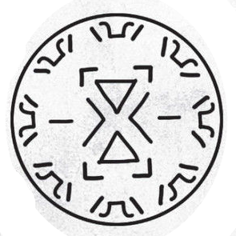
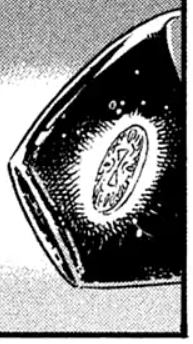

# Twinned Bottles' Spell

_Source: [https://witchhatatelier.telepedia.net/wiki/Twinned_Bottles%27_Spell](https://witchhatatelier.telepedia.net/wiki/Twinned_Bottles%27_Spell)_
_Category: Ancient Spells_
_Status: Non-Forbidden_

| Field       | Value                                            |
| ----------- | ------------------------------------------------ |
| Type        | Forbidden Spell                                  |
| Creator     | Healing Witches of Old                           |
| User(s)     | Brimmed Caps , Healing Witches of Old (Formerly) |
| Manga Debut | Chapter 12                                       |

The **twined bottles' seal** is a forbidden space-type [spell](/wiki/Spells 'Spells') able to teleport fluids from one place to another.

## Description

The twined bottles' seal is a forbidden spell that is largely undeciphered. At the core of the spell are two convergence signs and two region signs that point towards the center of the spell. All other signs are unfamiliar. How the spell functions is unknown.

An image of one of a pair of twinned bottles

## History

Before the [Day of the Pact](/wiki/Day_of_the_Pact 'Day of the Pact'), twinned bottles were commonly used by those who practice [Healingcraft](/wiki/Healingcraft 'Healingcraft') to share their potions. The spell, drawn on a small piece of material placed inside each bottle, would keep the contents evenly split regardless of distance to ensure that no one would be without an essential tonic when needed.

## Usage

The spell was used by [Iguin](/wiki/Iguin 'Iguin'), who placed it on two tiny pieces of glass which were placed in ink bottles, one of which he possessed, and the other secretly given to [Coco](/wiki/Coco 'Coco'). Iguin used the spell to give Coco a forbidden, more powerful ink from a remote location without her knowledge, the ink shown to contain their own [blood](/wiki/Blood 'Blood').

## References

1. Witch Hat Atelier Manga: Chapter 15 , Page 2
2. Witch Hat Atelier Manga: Chapter 12 , Page 30
