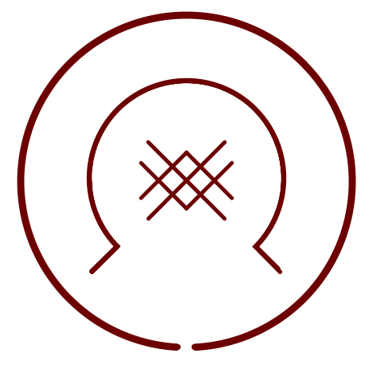

# Crystal Ribbon

_Source: [https://witchhatatelier.telepedia.net/wiki/Crystal_Ribbon](https://witchhatatelier.telepedia.net/wiki/Crystal_Ribbon)_
_Category: Crystalize Spells_

| Field       | Value            |
| ----------- | ---------------- |
| Type        | Spell            |
| Creator     | Richeh           |
| User(s)     | Witches , Richeh |
| Manga Debut | Chapter 18       |

**WARNING: The actual design of this seal is never shown, with the image here being the theoretical design of the seal, and should in no way be considered cannon. The image is intended to act as an aid to understanding the spell's effect rather than as an actual representation of the spell itself.**

**Crystal ribbon** is a niche-type spell that creates a crystal ribbon.

## Description

The seal for crystal ribbon is never actually shown in the manga, but it's effects are nearly identical to that of the [boulder stretch rope](/wiki/Boulder_Stretch_Rope 'Boulder Stretch Rope'), another spell made by [Richeh](/wiki/Richeh 'Richeh'). It creates a soft, flexible ribbon of crystal, and is a favorite spell of Richeh.

As the only difference between the effects of the two spells is the material of the ribbon produced, the earth sigil in the image provided has been replaced with a crystal one. While this is not the canon spell design, as the actual seal construction is not shown, crystal is used in the image to help aid in comprehension of the spell's effect, and should not be considered cannon.

## Usage

The spell was used by Richeh on multiple occasions, but a notable use was when she used it to get the [myrphons](/wiki/Myrphon 'Myrphon') to follow her through the [Serpentback Cave](/wiki/Serpentback_Cave 'Serpentback Cave').

## References

1. Witch Hat Atelier Manga: Chapter 20
