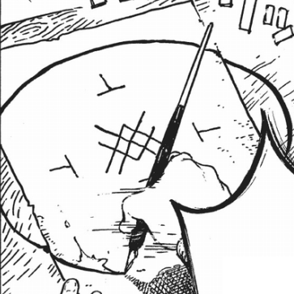

# Crystal Shard

_Source: [https://witchhatatelier.telepedia.net/wiki/Crystal_Shard](https://witchhatatelier.telepedia.net/wiki/Crystal_Shard)_
_Category: Crystalize Spells_

| Field       | Value            |
| ----------- | ---------------- |
| Type        | Spell            |
| User(s)     | Richeh , Witches |
| Manga Debut | Chapter 18       |

**Crystal Shard**[*unofficial name*] is a crystalize [spell](/wiki/Spells 'Spells') that creates several crystal shards.

## Description

Crystal shard contains a central crystalize sigil surrounded by inverted column signs. It causes causes several large, shard-like crystals to suddenly erupt from the seal.

## Usage

[Richeh](/wiki/Richeh 'Richeh') once used the spell during the height of an emotional outburst which occurred as a result of [Qifrey](/wiki/Qifrey 'Qifrey') suggesting she study magic other than her own.

## References

1. Witch Hat Atelier Manga: Chapter 18 , Page 12
