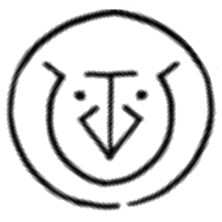

# Boulder Stretch Rope

_Source: [https://witchhatatelier.telepedia.net/wiki/Boulder_Stretch_Rope](https://witchhatatelier.telepedia.net/wiki/Boulder_Stretch_Rope)_
_Category: Earth Spells_

| Field       | Value              |
| ----------- | ------------------ |
| Japanese    | 岩伸ばしの縄       |
| Rōmaji      | iwanobashi no nawa |
| Type        | Spell              |
| Creator     | Richeh             |
| User(s)     | Richeh , Witches   |
| Manga Debut | Chapter 21         |

**Boulder Stretch Rope** is a earth-type [spell](/wiki/Spells 'Spells') that shapes stone into a flexible ribbon.

## Description

Boulder stretch contains a central earth sigil with a single weave keystone wrapped around it. This spell turns stone into a flexible ribbon that can be used for many purposes.

## Usage

This spell was created and used by Richeh to cross a gap in the road of the [serpent-back cave](/wiki/Serpentback_Cave 'Serpentback Cave').

It was also used by [Agott](/wiki/Agott 'Agott'), [Coco](/wiki/Coco 'Coco') and [Tetia](/wiki/Tetia 'Tetia') to capture [Wolf Euini](/wiki/Euini 'Euini').

## References

1. Witch Hat Atelier Manga: Chapter 21 , Page 94
