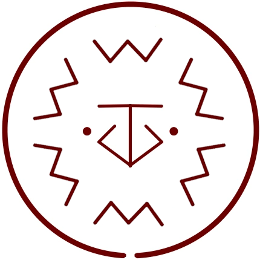

# Integration

_Source: [https://witchhatatelier.telepedia.net/wiki/Integration](https://witchhatatelier.telepedia.net/wiki/Integration)_
_Category: Earth Spells_

| Field       | Value            |
| ----------- | ---------------- |
| Type        | Spell            |
| Creator     | Coco , Tartah    |
| User(s)     | Tartah , Witches |
| Manga Debut | Chapter 17       |

**Integration**[*unofficial name*] is an earth-type [spell](/wiki/Spells 'Spells') that puts powder back together into its source's original form.

## Description

Integration contains a central earth sigil surrounded by several inverted (backwards) crushing keystones. It can take the particles (powdered or smashed) of an object and temporarily rearrange them to mimic the shape of the object the particles originally came from, allowing for easy identification of an unknown powder.

Because the crush keystones are inverted, the effect is the inverse of what it [typically would be](/wiki/Wall_Breaker_Seal 'Wall Breaker Seal'). The integration spell will take any solid particles (powdered or smashed) within it's range and temporarily rearrange them to mimic the shape of their original object.

## Usage

Integration was first used by [Tartah](/wiki/Tartah 'Tartah') to identify powdered medical herbs when [Coco](/wiki/Coco 'Coco') was sick. The herbs were in unlabeled vials, and as Tartah had [silverwash](/wiki/Silverwash 'Silverwash') (a form of complete color blindness), he was unable to identify them by traditional means. He and Coco then worked together to create the spell, which allowed Tartah to correctly identify the correct herb to treat Coco's fever.

## References

1. Witch Hat Atelier Manga: Chapter 17
2. Witch Hat Atelier Manga: Chapter 17 , Page 9
