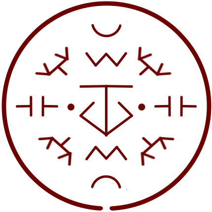

# Sand Cage

_Source: [https://witchhatatelier.telepedia.net/wiki/Sand_Cage](https://witchhatatelier.telepedia.net/wiki/Sand_Cage)_
_Category: Earth Spells_

| Field       | Value      |
| ----------- | ---------- |
| Type        | Spell      |
| User(s)     | Witches    |
| Manga Debut | Chapter 28 |

**Sand cage** is a earth-type [spell](/wiki/Spells 'Spells') that creates a cage of sand.

## Description

Sand cage contains a central earth sigil with a pair of column signs at the eastern and western points, the two components of each pair pointing towards one another (one inverted and one normal). Unknown half circle signs are at the seal's northern and southern points. Inverted crush signs are located along the north-south axis, sandwiched into the spaces between the half-circle signs and the central earth sigil. Lastly, signs which appear to be a fusion of one column and two directional signs, are located at each of the intercardinal (north-western, north-eastern, south-eastern, and south-western) points.

The spell creates a structure which can function as cage out of sand.

## Usage

Sand cage was used by [Tetia](/wiki/Tetia 'Tetia') to trap [Scaled Wolf Euini](/wiki/Euini 'Euini') so the other members of the [atelier](/wiki/Qifrey%27s_Atelier "Qifrey's Atelier") could attempt to turn him back to normal using the [inverted scalewolf curse](/wiki/Inverted_Scalewolf_Curse 'Inverted Scalewolf Curse').

## References

1. Witch Hat Atelier Manga: Chapter 28 , Page 21
