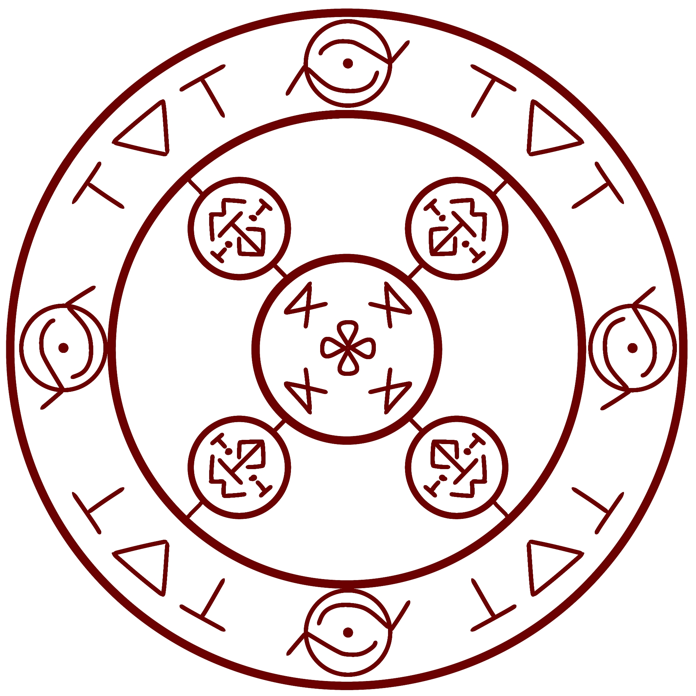
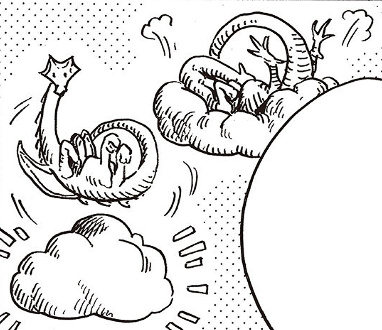
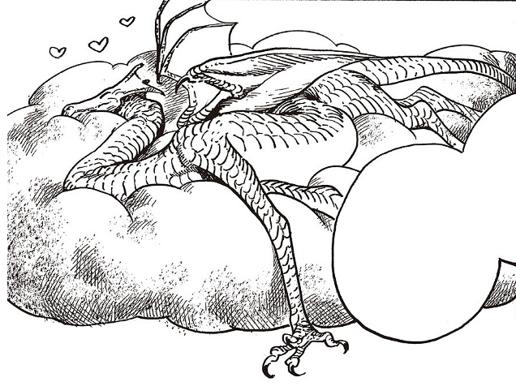
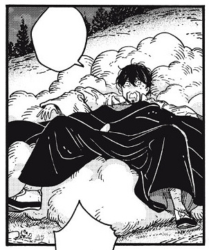
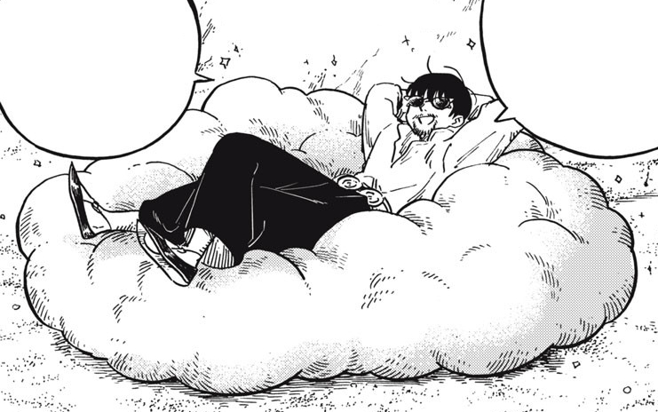

# Serpent's Bed of Sand

_Source: [https://witchhatatelier.telepedia.net/wiki/Serpent%27s_Bed_of_Sand](https://witchhatatelier.telepedia.net/wiki/Serpent%27s_Bed_of_Sand)_
_Category: Earth Spells_

| Field       | Value                         |
| ----------- | ----------------------------- |
| Japanese    | 竜の砂床                      |
| Rōmaji      | ryū no sunadoko               |
| Type        | Spell                         |
| Creator     | Agott , Coco , Richeh , Tetia |
| User(s)     | Tetia , Witches               |
| Manga Debut | Chapter 7                     |

The **Serpent's Bed of Sand** is a mixed earth-time spell created by the four apprentices of [Qifrey's Atelier](/wiki/Qifrey%27s_Atelier "Qifrey's Atelier") that creates a fluffy cloud made of sand.

## Description

The serpent's bed of sand is an amalgamation of several spells. At its center is a [billow cluster](/wiki/Billow_Cluster 'Billow Cluster') spell, which contains a central billowing sign surrounded by collection signs. (This gathers up surrounding material and turns it into a cloud.) Arranged around that are several [wall breaker seals](/wiki/Wall_Breaker_Seal 'Wall Breaker Seal'), the seals containing an earth sigil paired with crush and column signs; which crushes the ground into fine soft sand, which then gets pulled into the billow cluster spell. This is all wrapped up in a [repetition seal](/wiki/Repetition_Seal 'Repetition Seal') which contains repetition sigils, convergence signs, and column signs, so that no matter what happens to the spell's cloud, it will always return to its original consistency. This all results in a large, fluffy cloud made out of sand, that is strong enough to hold up even a [dragon](/wiki/Dragon 'Dragon') and regain its shape once the weight is removed.

## Usage

The spell was created by the four apprentices of Qifrey's Atelier: [Tetia](/wiki/Tetia 'Tetia'), [Richeh](/wiki/Richeh 'Richeh'), [Coco](/wiki/Coco 'Coco'), and [Agott](/wiki/Agott 'Agott'), after much thought and working together. Once perfected, it was then used to make the dragon guarding the [Illusory Labyrinth](/wiki/Illusory_Labyrinth 'Illusory Labyrinth') so comfortable it fell asleep, allowing the girls to climb the center tower without being chased.

Much later, the Serpent's Bed of Sand was used twice as a temporary bed for [Olruggio](/wiki/Olruggio 'Olruggio'); in [Chapter 81](/wiki/Chapter_81 'Chapter 81') after he had fainted, and in [Chapter 53 (Witch Hat Atelier Kitchen)](</wiki/Chapter_53_(Witch_Hat_Atelier_Kitchen)> 'Chapter 53 (Witch Hat Atelier Kitchen)') as a fun way to relax at the beach.

## History

This spell was originally [Tetia's](/wiki/Tetia%27s "Tetia's") creation. As a young child, she dreamed of napping on a cloud in the sky, and had spent years trying to make it happen, though it remained unperfected. When Coco experienced this latest form of Tetia's spell, she remarked on how warm and comforting the cloud was —(it's unknown if the Serpent's Bed of Sand version of this spell retains this warmth factor) and came up with the idea to use it on the dragon. Part of the original spell's issue was that it needed to be soft and pliable to be comfortable and fluffy, but solid and tactile enough so that the user wouldn't fall through the cloud. After deliberating on different types of materials, it was decided fine sand would be best, which made use of Richeh's skill in drawing small wall breaker seals. The final hurdle was binding the cloud together so that it wouldn't fall apart in use, which Agott solved by using the repetition sigils, inspired by Coco's work ethic.

This spell in particular is important to Tetia because it also represents the first spell of hers that brought someone else joy.

## Image Gallery

- [![Another view of the spell with the different signs and sigils used[1]](../../images/Serpent's_Bed_of_Sand2.jpg)](/wiki/File:Serpent%27s_Bed_of_Sand2.jpg 'Another view of the spell with the different signs and sigils used[1]')

  Another view of the spell with the different signs and sigils used

- [![Agott's discarded attempt at the spell before the final version was figured out.[9]](../../images/Agott_Discarded_Spell_07.jpg)](/wiki/File:Agott_Discarded_Spell_07.jpg "Agott's discarded attempt at the spell before the final version was figured out.[9]")

  Agott's discarded attempt at the spell before the final version was figured out.

- 

  An example of how the cloud will regain its shape even after a dragon sits on it

- 

  The illusory labyrinth dragon really enjoying the Serpent's Bed of Sand in [Chapter 7](/wiki/Chapter_7 'Chapter 7')

- 

  Olruggio waking up on the Serpent's Bed of Sand in [Chapter 81](/wiki/Chapter_81 'Chapter 81')

- ")

  Olruggio relaxing on the Serpent's Bed of Sand in [Chapter 53 (Witch Hat Atelier Kitchen)](</wiki/Chapter_53_(Witch_Hat_Atelier_Kitchen)> 'Chapter 53 (Witch Hat Atelier Kitchen)')

## Notes

- [Chapter 81](/wiki/Chapter_81 'Chapter 81') and [Chapter 53 (Witch Hat Atelier Kitchen)](</wiki/Chapter_53_(Witch_Hat_Atelier_Kitchen)> 'Chapter 53 (Witch Hat Atelier Kitchen)') where Olruggio rests on the Serpent's Bed of Sand released during the same month coincidentally, and was a surprise to both [Kamome Shirahama](/wiki/Kamome_Shirahama 'Kamome Shirahama') and [Hiromi Sato](/wiki/Hiromi_Sato 'Hiromi Sato'). Additionally, Shirahama joked on Twitter that maybe the spell should be renamed to Master Olruggio's appreciation cushion.

## References

1. Witch Hat Atelier Manga: Chapter 7 , Page 17
2. Witch Hat Atelier Manga: Chapter 7 , Page 18
3. Witch Hat Atelier Manga: Chapter 81 , Page 2
4. Witch Hat Atelier Kitchen Spinoff: Chapter 53 , Page 3
5. Witch Hat Atelier Manga: Chapter 6 , Page 23
6. Witch Hat Atelier Manga: Chapter 7 , Page 7
7. Witch Hat Atelier Manga: Chapter 7 , Page 8
8. Witch Hat Atelier Manga: Chapter 7 , Page 20
9. Witch Hat Atelier Manga: Chapter 7 , Page 11
10. Hiromi Sato commenting on the Olruggio sand bed coincidence: https://x.com/satohiromi2010/status/1839282231409521014
11. Kamome Shirahama confirming the coincidence: https://x.com/shirahamakamome/status/1839304866247880926
12. Kamome Shirahama on Twitter joking about renaming the spell: https://x.com/shirahamakamome/status/1839312498643828775
