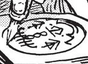

# Wall Bend

_Source: [https://witchhatatelier.telepedia.net/wiki/Wall_Bend](https://witchhatatelier.telepedia.net/wiki/Wall_Bend)_
_Category: Earth Spells_

| Field       | Value               |
| ----------- | ------------------- |
| Type        | Spell , Earth Spell |
| User(s)     | Qifrey , Olruggio   |
| Manga Debut | Chapter 14          |
| Anime Debut | Episode 9           |

**Wall Bend**[*unofficial name*] is an earth-type [spell](/wiki/Spells 'Spells') that allows the manipulation of earthen materials such as stone, soil and brickwork.

## Description

Wall Bend contains an earth sigil in the lower half of the seal and two downwards-facing pull signs next to it. This allows for the spell to target nearby earth-related materials and pull them in a certain direction in relation to the casting seal. The signs above and below the sigil are currently unknown. It is possible that they contribute to the spell’s ability to duplicate or spread its targeted material.

## Usage

Wall Bend is seen being used for defensive purposes on multiple occasions, drawing out the ground beneath the user and hardening it into a rough, stone barrier that they can duck behind to evade damage or deflect an attack. [Qifrey](/wiki/Qifrey 'Qifrey') defends against [Sasaran’s](/wiki/Sasaran 'Sasaran') [Spike](/wiki/Spike 'Spike') using this spell. Both [Olruggio](/wiki/Olruggio 'Olruggio') and Qifrey (accompanied by [Coco](/wiki/Coco 'Coco')) use it to defend themselves from the [The Guardian of the Tower of Tomes](/wiki/The_Guardian_of_the_Tower_of_Tomes 'The Guardian of the Tower of Tomes').

Qifrey uses this spell to manipulate brick walls in the [atelier](/wiki/Qifrey%27s_Atelier "Qifrey's Atelier"), isolating himself and concealing his investigation into the [Brimmed Caps](/wiki/Brimmed_Hat_Group 'Brimmed Hat Group'). He does this by first touching the sheet of paper with the seal drawn on the part of the wall he plans to extend and then dragging it off the wall and in the empty space he wants to close off. New brickwork generates instantly in relation to the seal. When his efforts lead to him being discovered by Iguin and attacked by a lightning spell, he attempts to shield himself with the same spell.

Qifrey once again uses this spell to give himself and Coco privacy while she confides in him within the streets of [Ezrest](/wiki/Ezrest 'Ezrest').

Qifrey using Wall Bend to defend against Sasaran

## References

1. Witch Hat Atelier Manga: Chapter 27 , Page 16
2. Witch Hat Atelier Manga: Chapter 37 , Page 25
3. Witch Hat Atelier Manga: Chapter 37 , Page 27
4. Witch Hat Atelier Manga: Chapter 14 , Page 29
5. Witch Hat Atelier Anime: Episode 9 , Timestamp 10:30
6. Witch Hat Atelier Anime: Episode 9 , Timestamp 12:14
7. Witch Hat Atelier Manga: Chapter 15 , Page 5
8. Witch Hat Atelier Manga: Chapter 65 , Page 16
