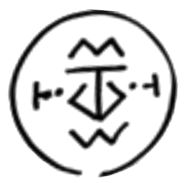

# Wall Breaker Seal

_Source: [https://witchhatatelier.telepedia.net/wiki/Wall_Breaker_Seal](https://witchhatatelier.telepedia.net/wiki/Wall_Breaker_Seal)_
_Category: Earth Spells_

| Field       | Value       |
| ----------- | ----------- |
| Japanese    | 壁崩し      |
| Rōmaji      | kabekuzushi |
| Type        | Spell       |
| User(s)     | Witches     |
| Manga Debut | Chapter 6   |
| Anime Debut | Episode 4   |

**Wall Breaker Seal** is an earth-type [spell](/wiki/Spells 'Spells') used for destroying solid materials.

## Description

Wall Breaker contains a central earth sigil, two column signs to the sides of the earth sigil, and crushing signs at 90 degree angles from the column signs. This spell breaks through objects it is drawn on, reducing the material to dust.

## Usage

Wall Breaker was first used by [Agott](/wiki/Agott 'Agott') while she and the other apprentices of [the atelier](/wiki/Qifrey%27s_Atelier "Qifrey's Atelier") broke through a wall to escape a [dragon](/wiki/Dragon 'Dragon') in the artificial city created by the [illusory labyrinth](/wiki/Illusory_Labyrinth 'Illusory Labyrinth') spell. It in part helped to inspire the [serpent's bed of sand](/wiki/Serpent%27s_Bed_of_Sand "Serpent's Bed of Sand") spell, and was later used by [Coco](/wiki/Coco 'Coco') to help rescue [Custas](/wiki/Custas 'Custas') after he became trapped under a boulder.

Wall Breaker served as the inspiration behind [Coco's spell for Tartah](/wiki/Integration 'Integration'), making use of the inversion of the crush signs.

Tetia often uses this spell as a base for her sand spells, such as in the seal for [Sand Cage](/wiki/Sand_Cage 'Sand Cage') and possibly in her [Flowers of Sand](/wiki/Flowers_of_Sand?action=edit&redlink=1 'Flowers of Sand (page does not exist)') as well.

## Trivia

- The wall breaker seal is the spell that has gone through the most revisions, with three in total.

## References

1. Witch Hat Atelier Manga: Chapter 6 , Page 12
2. Witch Hat Atelier Manga: Chapter 11 , Page 17
3. Witch Hat Atelier Manga: Chapter 28 , Page 20
4. Witch Hat Atelier Manga: Chapter 24 , Page 14
5. Witch Hat Atelier Manga: Chapter 28 , Page 10
