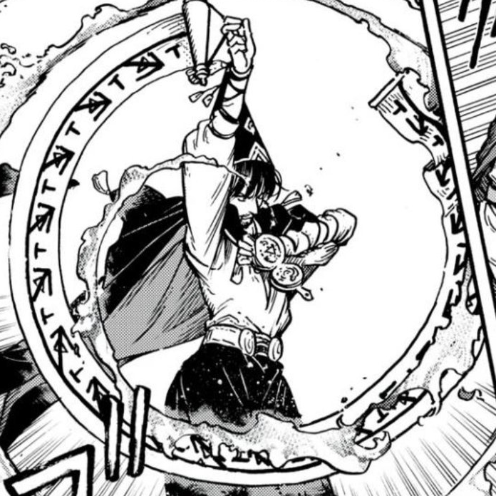

# Flame Burst Spell

_Source: [https://witchhatatelier.telepedia.net/wiki/Flame_Burst_Spell](https://witchhatatelier.telepedia.net/wiki/Flame_Burst_Spell)_
_Category: Fire Spells_

| Field       | Value      |
| ----------- | ---------- |
| Type        | Spell      |
| Creator     | Olruggio   |
| User(s)     | Olruggio   |
| Manga Debut | Chapter 65 |

The Flame Burst Spell[*unofficial name*] is a fire-type spell used by [Olruggio](/wiki/Olruggio 'Olruggio') that produces a ring of fire, and subsequently a larger explosion.

## Description

Flame Burst, in Olruggio's usage, made use of two separate paper components: one being a [Palm Quire](/wiki/Palm_Quire 'Palm Quire') and the other being a conic roll of paper that created a circle when unfurled. On the conic roll, the spell alternates pull and column signs. It is assumed that the pull signs' function here is to pull air from the surrounding air as fuel for the fire. The column signs' purpose is also possibly to make the larger fire 'boom' manifest as a sort of beam attack. The palm quire is less clear in its composition, but a fire sigil can be clearly seen on it.

## Usage

Olruggio used this spell against the valance leech while fighting midair.

## References

1. Witch Hat Atelier Manga: Chapter 65 , Page 4
