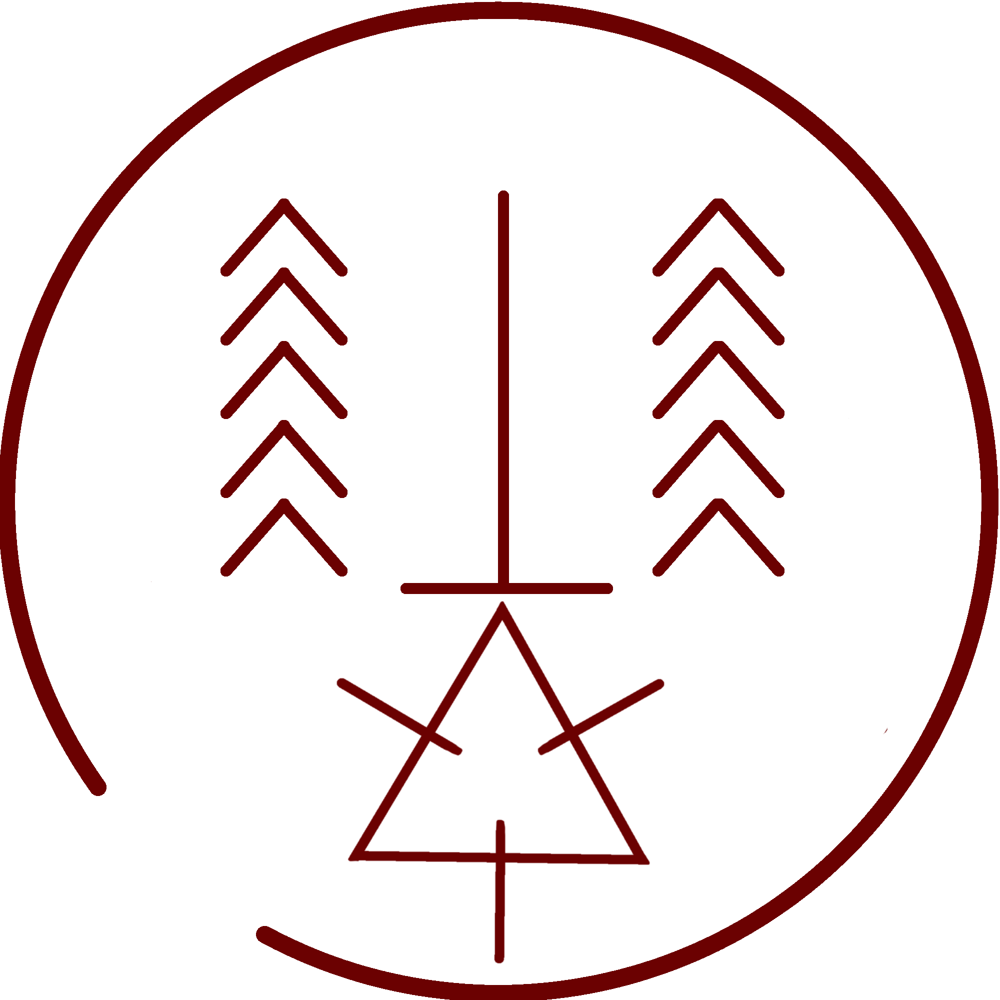

# Flame Shot Seal

_Source: [https://witchhatatelier.telepedia.net/wiki/Flame_Shot_Seal](https://witchhatatelier.telepedia.net/wiki/Flame_Shot_Seal)_
_Category: Fire Spells_

| Field       | Value      |
| ----------- | ---------- |
| Type        | Spell      |
| Creator     | Coco       |
| User(s)     | Coco       |
| Manga Debut | Chapter 63 |

The **flame shot seal** is a fire-type spell used by [Coco](/wiki/Coco 'Coco') that produces a directional flame resembling a mix of a beam of flame and a fireball.

## Description

Flame shot contains a fire sigil at the bottom of the seal with a column sign extending up form it, reaching all the way to the other side of the spell. This makes a column of flame shooting forward from the spell in the direction of the point of the column spell. From there, groups of five region signs on the left and right sides of the spell impart additional directionality to the spell and confine the area of the magic to the space in front of it, helping it to extend farther.

## Usage

[Coco](/wiki/Coco 'Coco') used this spell while being carried by Qifrey to shoot at the [valance leech](/wiki/Valance_Leech 'Valance Leech'), causing the leech to target the flame rather than the people nearby on account of it using heat as its primary way of locating people to feed on. While shooting at the leech was intentional, Coco did not know that the leech was drawn to heat at the time. That discovery was made later.

## References

1. Witch Hat Atelier Manga: Chapter 63 , Page 21-22
