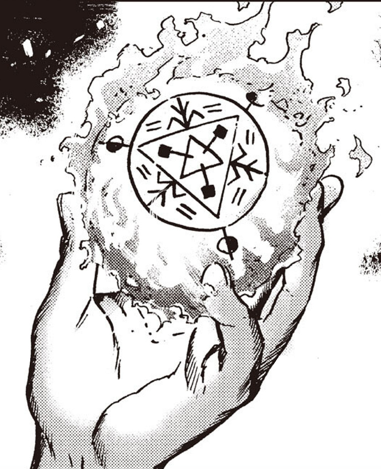
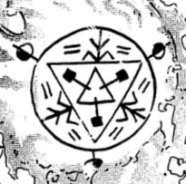

# Phantasmal Fireball

_Source: [https://witchhatatelier.telepedia.net/wiki/Phantasmal_Fireball](https://witchhatatelier.telepedia.net/wiki/Phantasmal_Fireball)_
_Category: Fire Spells_

| Field       | Value               |
| ----------- | ------------------- |
| Japanese    | 幻炎玉              |
| Rōmaji      | gen'engyoku         |
| Type        | Spell , Contraption |
| Creator     | Olruggio            |
| User(s)     | Olruggio            |
| Manga Debut | Chapter 43          |

The **phantasmal fireball spell** is a fire-type spell invented by [Olruggio](/wiki/Olruggio 'Olruggio') that forms an artificial flame which doesn't produce heat, but looks and acts like a real flame.

## Description (Spell)

Phantasmal Fireball spell

The spell consists of a fire sigil variant, [Unburning Flames](/wiki/Sigils_Explained#Unburning_Flames 'Sigils Explained') and several never before seen keystones. It produces a flame that generates no heat but still produces light and can be touched without any risk of injury, making it useful for the light it produces and it's ability to scare of beasts without the risk of injury.

## Description (Contraption)

The contraption is incredibly simple, consisting of only an orb with the spell of the same name drawn upon it. The contraption is fully engulfed in the phantasmal fire of the spell, allowing for it to look real but be held and carried as a convenient light source. However, because Olruggio felt it could possibly diminish society's healthy fear of fire, he chose to nix it.

## Usage and History

Olruggio created this contraption to have the benefits of real fire—to light the way and scare off beasts—but without any of the risks like getting burned, or the fire spreading. And without needing fuel, the phantasmal fire will never go out. However because it looks real but is otherwise harmless, he worried that children growing up with this fake fire might think that all fire was equally harmless, and mistakenly put themselves in danger. And where contradictory understandings of fire exist, there's no way to assure that all kids will grow up understanding the danger of fire. Therefore, he felt it was too irresponsible to sell, and considered it a failed contraption.

Olruggio would later go on to create an updated contraption where the phantasmal flame is trapped inside crystal, so it has the benefit of the fake flames, but preserves the idea that fire is too dangerous to touch.

## Trivia

- Due to the spell being irresponsible to sell, it can be argued that Olruggio, the one who invented the spell, is the only actual user of unburning flame.

## References

1. Witch Hat Atelier Manga: Chapter 43 , Page 9
2. Witch Hat Atelier Manga: Chapter 43 , Page 8
3. Witch Hat Atelier Manga: Chapter 43 , Page 12
4. Witch Hat Atelier Manga: Chapter 43 , Page 11-12
5. Witch Hat Atelier Manga: Chapter 61 , Page 5-6
