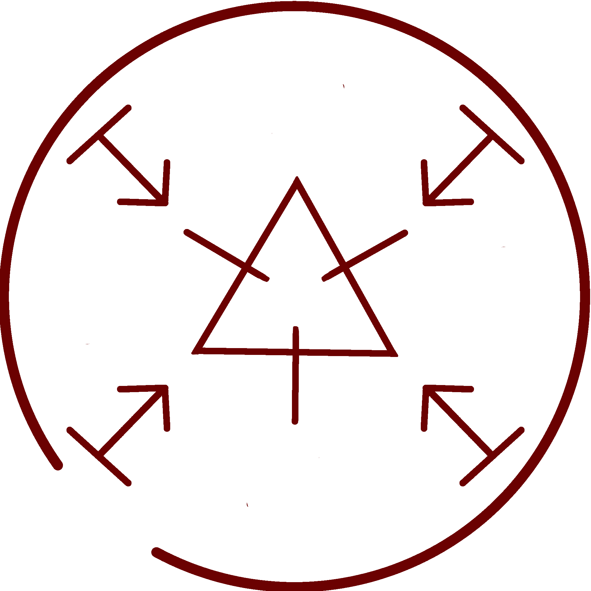
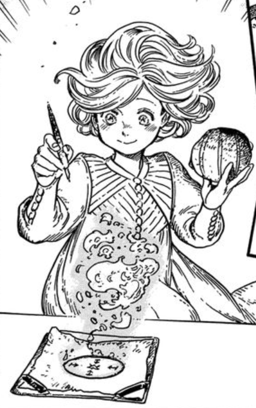

# Pyreball Seal

_Source: [https://witchhatatelier.telepedia.net/wiki/Pyreball_Seal](https://witchhatatelier.telepedia.net/wiki/Pyreball_Seal)_
_Category: Fire Spells_

| Field       | Value      |
| ----------- | ---------- |
| Japanese    | 焚火球     |
| Rōmaji      | takibidama |
| Type        | Spell      |
| User(s)     | Witches    |
| Manga Debut | Chapter 8  |

**Pyreball seal** is a fire-type spell used to create a levitating ball of flame.

## Description

Pyreball seal is a spell that contains a central fire sigil with [levitation](/wiki/Signs_Explained#Levitation 'Signs Explained') signs arranged around it. This spell produces a ball of fire that will levitate both itself and any object that isn't too heavy directly above the seal.

## Usage

This spell was used during [chapter 8](/wiki/Chapter_8 'Chapter 8') by [Coco](/wiki/Coco 'Coco') under the instruction of [Qifrey](/wiki/Qifrey 'Qifrey') to cook [carapace yams](/wiki/Carapace_Yam 'Carapace Yam') for a picnic.

- 

  The first time we see the pyreball spell being used.

## References

1. Witch Hat Atelier Manga: Chapter 8 , Page 10
2. Witch Hat Atelier Manga: Chapter 8 , Page 16
