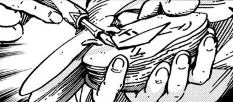
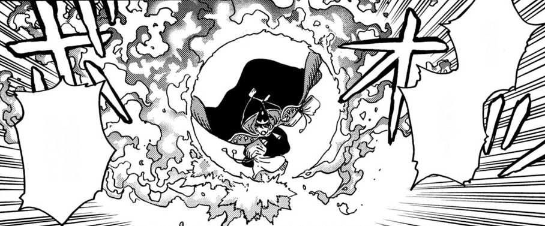

# Ring of Fire

_Source: [https://witchhatatelier.telepedia.net/wiki/Ring_of_Fire](https://witchhatatelier.telepedia.net/wiki/Ring_of_Fire)_
_Category: Fire Spells_

| Field       | Value              |
| ----------- | ------------------ |
| Type        | Spell , Fire Spell |
| User(s)     | Olruggio           |
| Manga Debut | Chapter 82         |

**Ring of Fire**[*unofficial name*] is a fire-type [spell](/wiki/Spells 'Spells') that produces fire in the shape of a ring.

## Description

Ring of Fire contains a fire sigil surrounded by three dispersion signs. It's unclear if the signs being off-center is intentional, given that the spell would likely have the same effect otherwise.

## Usage

Ring of Fire Effect

[Olruggio](/wiki/Olruggio 'Olruggio') uses this spell during the [Valance Leech Arc](/wiki/Valance_Leech_Arc 'Valance Leech Arc') after [Coco](/wiki/Coco 'Coco') and [Agott](/wiki/Agott 'Agott') fly into the fray without warning. Unsure of their safety, Olruggio casts this spell with the resolve to burn down the forest and the offending Valance Leech.

He later merges this spell with [Qifrey's](/wiki/Qifrey 'Qifrey') [water dragon](/wiki/Qifrey%27s_Water_Dragon "Qifrey's Water Dragon"), drastically increasing the water's temperature and resulting in the creation of [Boilfire Dragon](/wiki/Boilfire_Dragon?action=edit&redlink=1 'Boilfire Dragon (page does not exist)').

## References

1. Signs_Explained#Dispersion
2. Witch Hat Atelier Manga: Chapter 82 , Page 8
3. Witch Hat Atelier Manga: Chapter 82 , Page 9-10
