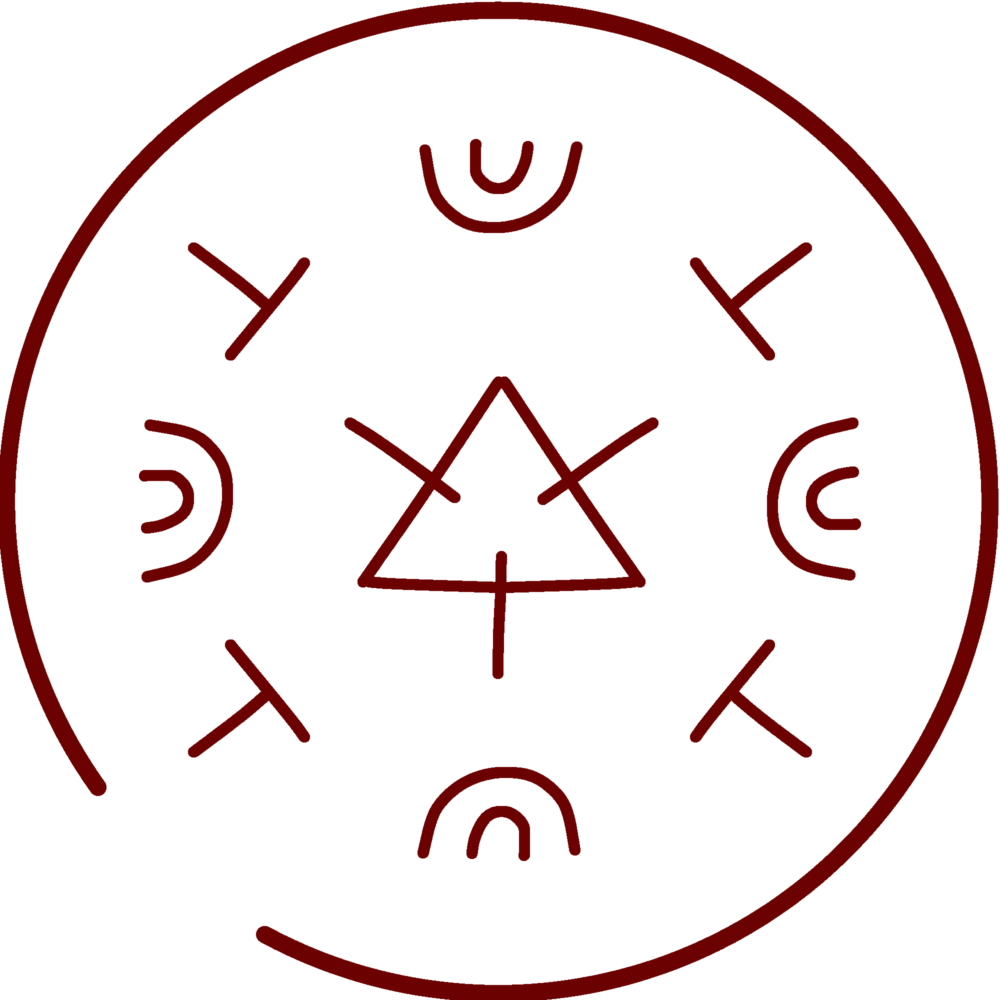
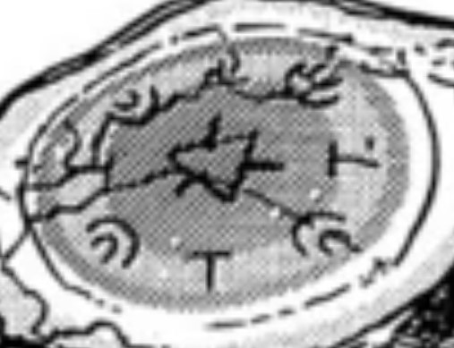

# Snugstone Spell

_Source: [https://witchhatatelier.telepedia.net/wiki/Snugstone_Spell](https://witchhatatelier.telepedia.net/wiki/Snugstone_Spell)_
_Category: Fire Spells_

| Field       | Value      |
| ----------- | ---------- |
| Japanese    | ほっか石   |
| Rōmaji      | hokkaishi  |
| Type        | Spell      |
| Creator     | Olruggio   |
| User(s)     | Witches    |
| Manga Debut | Chapter 18 |
| Anime Debut | Episode 11 |

The **snugstone spell**[*unofficial name*] is a fire-type spell invented by [Olruggio](/wiki/Olruggio 'Olruggio') which radiates warmth.

## Description

The spell consists of a [fire sigil](/wiki/Sigils_Explained#Fire 'Sigils Explained'), backwards [column](/wiki/Signs_Explained#Column 'Signs Explained') signs, and [radial](/wiki/Signs_Explained#Radial 'Signs Explained') signs. It radiates warmth outward without the need for a flame and is used on the [snugstone](/wiki/Snugstone 'Snugstone'), an item used to keep you warm while you sleep. The spell is precisely balanced to the size of the seal so that it is warm to the touch but not hot enough to burn.

## Usage

This spell was first seen drawn on the snugstones that Olruggio gave to [Qifrey](/wiki/Qifrey 'Qifrey') and his apprentices so they could sleep better.

During the [events at Serpentback Cave](/wiki/Serpentback_Cave_Arc 'Serpentback Cave Arc'), [Coco](/wiki/Coco 'Coco') gave her snugstone to the leader of the [Ancients of Romonon](/wiki/The_Ancients_of_Romonon 'The Ancients of Romonon'), who placed it inside an [Arcane Lens of Amplification](/wiki/Arcane_Lens_of_Amplification 'Arcane Lens of Amplification'). However the amplification unbalanced the spell and the heat became so great that it melted the golden ancients of Romonon.

## References

1. Witch Hat Atelier Manga: Chapter 18 , Page 20
2. Witch Hat Atelier Manga: Chapter 24 , Page 24
3. Witch Hat Atelier Manga: Chapter 24 , Page 27
4. Witch Hat Atelier Manga: Chapter 18 , Page 21
5. Witch Hat Atelier Manga: Chapter 24 , Page 25
6. Witch Hat Atelier Manga: Chapter 24 , Page 26
