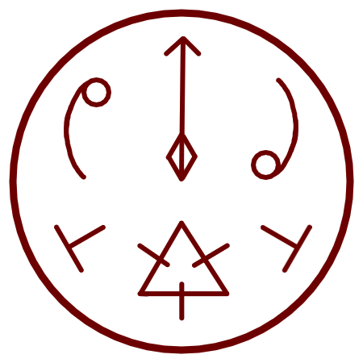

# Spiraling Flame

_Source: [https://witchhatatelier.telepedia.net/wiki/Spiraling_Flame](https://witchhatatelier.telepedia.net/wiki/Spiraling_Flame)_
_Category: Fire Spells_

| Field       | Value                             |
| ----------- | --------------------------------- |
| Type        | Spell                             |
| Creator     | Agott                             |
| User(s)     | Agott                             |
| Manga Debut | Chapter 6 manga , Episode 4 anime |

**Spiraling flame** is a fire-type spell used by [Agott](/wiki/Agott 'Agott') that produces a aimable spiraling column of flame.

## Description

Spiraling flame contains a fire sigil paired with column and the sign of spiraling winds, which produces a column of spinning flame. A sights set sign allows the spell's effect to be aimed in a direction determined mentally by the caster. The exact way this occurs is unknown, but it is also seen in other spells featuring sights set, such as the [Capture Pennant Spell](/wiki/Capture_Pennant_Spell 'Capture Pennant Spell').

## Usage

The spell is used by Agott to shoot at the [dragon](/wiki/Dragon 'Dragon') chasing them in the [Illusory Labyrinth](/wiki/Illusory_Labyrinth 'Illusory Labyrinth'). It was able to stall the dragon long enough for them to escape.

## References

1. Witch Hat Atelier Anime: Episode 5 , Timestamp 16:38
2. Witch Hat Atelier Anime: Episode 5 , Timestamp 16:17
3. Witch Hat Atelier Manga: Chapter 6 , Page 4
4. Witch Hat Atelier Manga: Chapter 6 , Page 11
