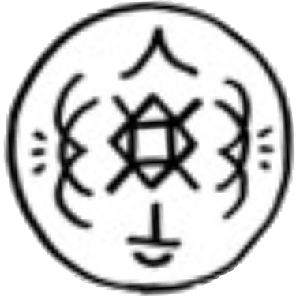

# Bird of Light Beacon

_Source: [https://witchhatatelier.telepedia.net/wiki/Bird_of_Light_Beacon](https://witchhatatelier.telepedia.net/wiki/Bird_of_Light_Beacon)_
_Category: Light Spells_

| Field       | Value                  |
| ----------- | ---------------------- |
| Japanese    | 光の鳥狼煙             |
| Rōmaji      | hikari no tori noroshi |
| Type        | Spell                  |
| User(s)     | Agott , Witches        |
| Manga Debut | Chapter 11             |

**Bird of light beacon** is a light-type spell used to create a flying bird of light.

## Description

Bird of light beacon contains a central light sigil with a dispersion keystone on one side, and a bird keystone on the other three. The spell produces a bird made from light that will fly around for some time, and can be used to either entertain, call for help, or distract.

## Usage

During the rescue at the river, [Agott](/wiki/Agott 'Agott') used this spell to distract the [outsider](/wiki/Outsider 'Outsider') in the area so [Coco](/wiki/Coco 'Coco') could perform magic to save [Custas](/wiki/Custas 'Custas') without being seen, as well as to call for help.

## References

1. Witch Hat Atelier Manga: Chapter 11
