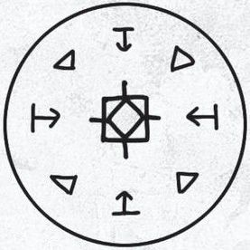
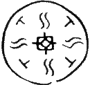

# Floatglow Lamp Seal

_Source: [https://witchhatatelier.telepedia.net/wiki/Floatglow_Lamp_Seal](https://witchhatatelier.telepedia.net/wiki/Floatglow_Lamp_Seal)_
_Category: Light Spells_

| Field       | Value                                                                 |
| ----------- | --------------------------------------------------------------------- |
| Japanese    | ランプの浮き灯り                                                      |
| Rōmaji      | ranpu no ukiakari                                                     |
| Type        | Spell                                                                 |
| User(s)     | Witches                                                               |
| Manga Debut | Chapter 2 (As a Wall-Anchored Floatglow Lamp) Chapter 28 (Seal shown) |

_This article is a [stub](/wiki/Category:Article_stubs 'Category:Article stubs'). You can help Independent Witch Hat Atelier Wiki by [expanding it](https://witchhatatelier.telepedia.net/wiki/Floatglow_Lamp_Seal?action=edit)._

The **floatglow lamp spells** are light-type spells that create floating balls of light. There are two kinds, one used in the [floatglow lamp](/wiki/Floatglow_Lamp?action=edit&redlink=1 'Floatglow Lamp (page does not exist)') and the other in the [wall-anchored floatglow lamp](/wiki/Wall-Anchored_Floatglow_Lamp 'Wall-Anchored Floatglow Lamp').

## Versions

### Free Floating

The free-floating version of the seal consists of a central light sigil surrounded by alternating float and column signs. Based on its design, it should produce a beam of light that emits out from the spell as seen in the [light beam spell](/wiki/Light_Beam 'Light Beam') while also allowing the object it is drawn on to float in midair, ignoring the effects of gravity. However, this is not the effect that is seen.

While this spell makes the object it is drawn on float in midair, as expected, it does not produce a beam of light. Instead, it creates a floating ball of light, much like its wall-anchored counterpart, despite the two not sharing a single sign in common. Currently, the only explanation for this discrepancy is that this spell uses float as it was used in the [pyreball seal](/wiki/Pyreball_Seal 'Pyreball Seal') in [chapter 7](/wiki/Chapter_7 'Chapter 7') before it was retconned the next chapter to use levitation instead. Both the pyreball seal, a fire spell, of which light is a variant, and the wall-anchored floatglow lamp make use of levitation to create a floating orb of their magic, so it is unclear why this spell does not do the same.

### Wall-Anchored

The wall-anchored floatglow lamp seal consists of a central light sigil surrounded by alternating convergence and levitation signs. Levitation makes the light float above the spell as well as levitates the top portion of the floatglow lamp above the seal, but it has yet to be determined what convergence does in this spell. It is used in the [wall-anchored floatglow lamp](/wiki/Wall-Anchored_Floatglow_Lamp 'Wall-Anchored Floatglow Lamp'). Rather than floating freely in the air like a normal floatglow lamp, the wall-anchored floatglow lamp is intended to be mounted to a surface.

## Usage

The floatglow lamp spell is primarily used in the [floatglow lamp](/wiki/Floatglow_Lamp?action=edit&redlink=1 'Floatglow Lamp (page does not exist)').

It was one of the spells shown during the [second test](/wiki/The_Sincerity_of_the_Shield 'The Sincerity of the Shield').

## References

1. Witch Hat Atelier Manga: Chapter 28 , Page 11
2. Witch Hat Atelier Manga: Chapter 7 , Page 14
3. Witch Hat Atelier Manga: Chapter 8 , Page 10
