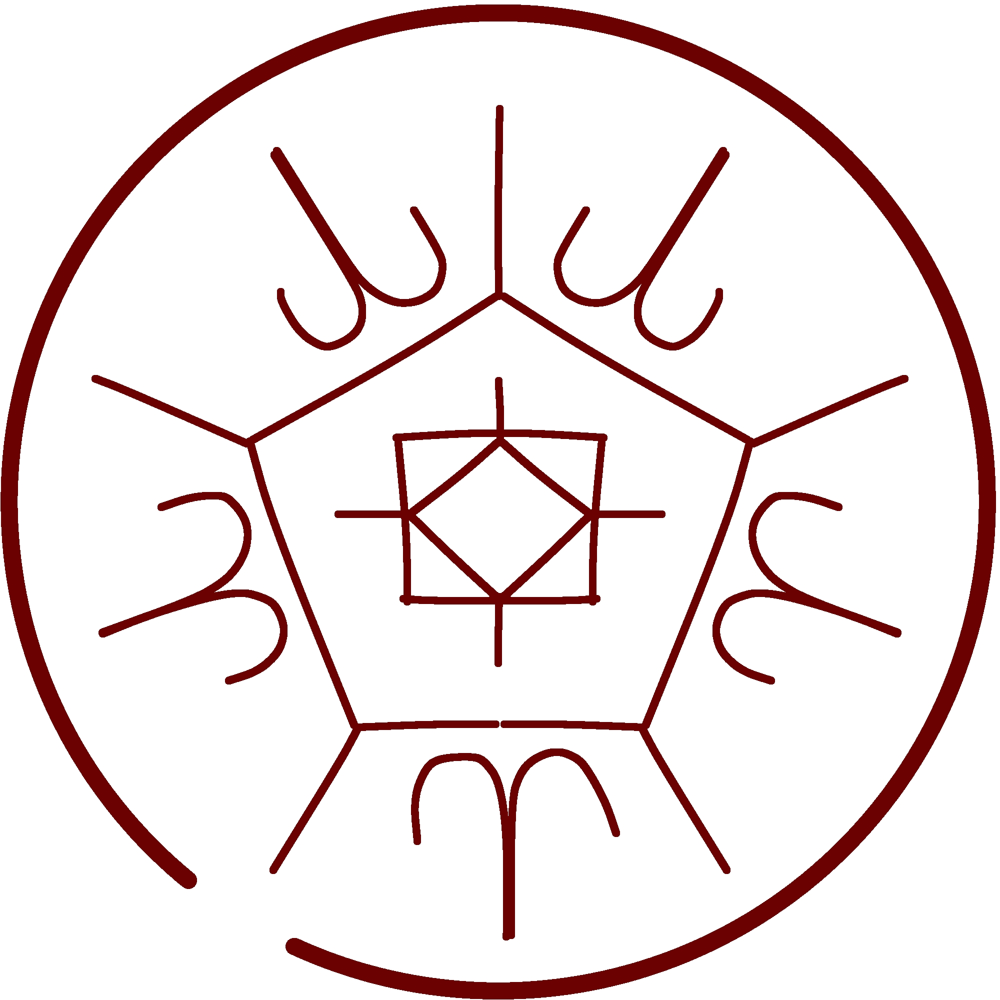

# Flowers of Light

_Source: [https://witchhatatelier.telepedia.net/wiki/Flowers_of_Light](https://witchhatatelier.telepedia.net/wiki/Flowers_of_Light)_
_Category: Light Spells_

| Field       | Value      |
| ----------- | ---------- |
| Type        | Spell      |
| User(s)     | Agott      |
| Manga Debut | Chapter 58 |

**Flowers of Light** is a light-type spell used to create glowing flowers.

## Description

This spell contains the decorative sigil for flowers, surrounded by unknown signs and a pentagon formation that also separates the sigils from each other.

## Usage

Agott showed this spell to Coco while explaining decorative sigils. Coco mentioned its similarity to Qifrey's own flower of water that he made when she first came to the atelier.

## References

1. Witch Hat Atelier Manga: Chapter 58 , Page 22-23
