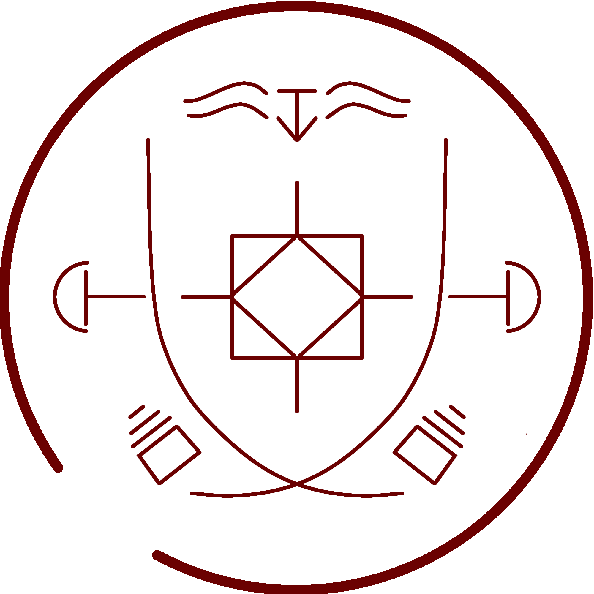

# Glowstone Path Seal

_Source: [https://witchhatatelier.telepedia.net/wiki/Glowstone_Path_Seal](https://witchhatatelier.telepedia.net/wiki/Glowstone_Path_Seal)_
_Category: Light Spells_

| Field       | Value              |
| ----------- | ------------------ |
| Type        | Spell              |
| Creator     | Olruggio           |
| User(s)     | Olruggio , Witches |
| Manga Debut | Chapter 1          |

**Glowstone Path Seal** is a light-type spell that causes a stone to emit light when stepped on.

## Description

The Glowstone Path spell contains a light sigil in the middle, with dispersion signs on the left and right. The spell additionally contains an elongated X-shape, with unknown signs near the intersection point. Above the light sigil, there is a lone levitation sigil flanked by unknown sigils, which is presumably the reason the stones can be pressed down in the first place.

## History

As a child, Coco became enamored with this spell at a castle festival, claiming that she must be a witch because the ground lit up underneath her. However, they also convinced her that she must not be a witch, as on the walk home she realized that it wasn't happening anymore.

## Usage

This spell appears to be broadly used in society, or at least used for special occasions, as they have been seen at festivals. Olruggio also has several in his room at Qifrey's atelier, and is best known for this specific contraption.

## References

1. Witch Hat Atelier Manga: Chapter 1 , Page 25
2. Witch Hat Atelier Manga: Chapter 9 , Page 20
