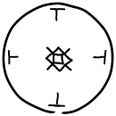

# Light Beam

_Source: [https://witchhatatelier.telepedia.net/wiki/Light_Beam](https://witchhatatelier.telepedia.net/wiki/Light_Beam)_
_Category: Light Spells_

| Field   | Value           |
| ------- | --------------- |
| Type    | Spell           |
| User(s) | Agott , Witches |

**Light Beam** is a light-type spell that creates a beam of light.

## Description

Light beam contains a central light sigil surrounded by column signs. The spell generates a beam of light pointing up from the seal. The more precisely the seal is drawn, the more steady the beam will be.

## Usage

Light beam was seen being used by [Agott](/wiki/Agott 'Agott') during her magic drawing practice.
