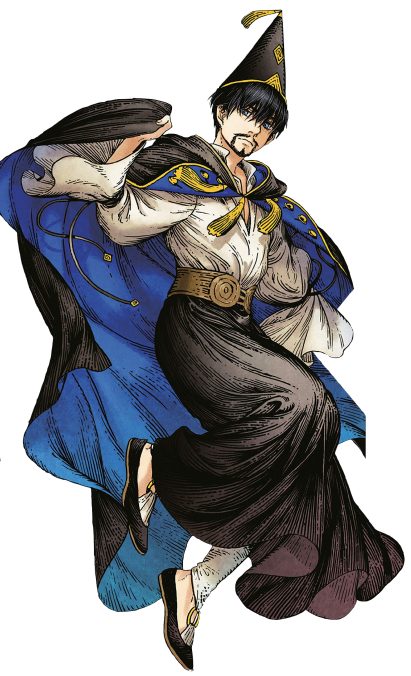
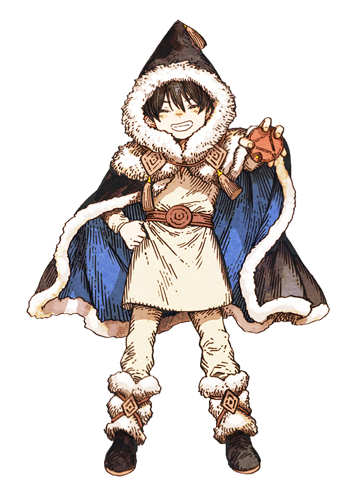
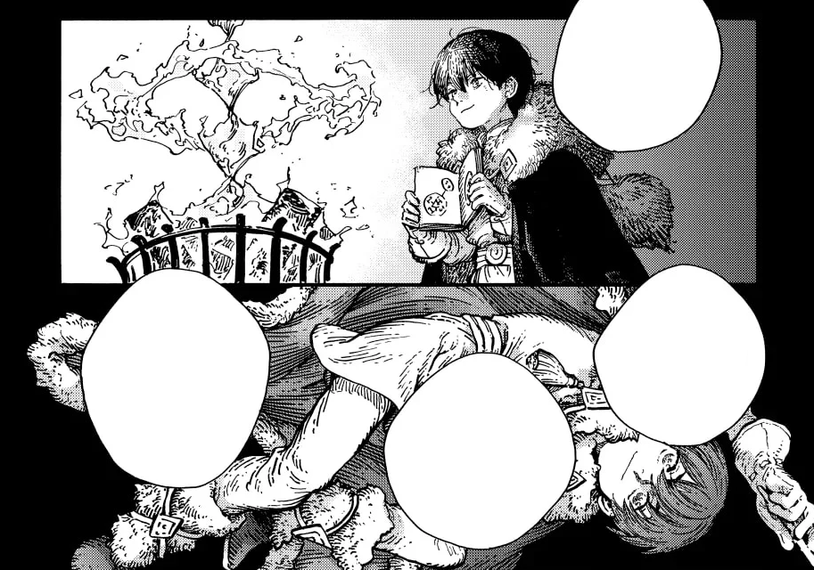
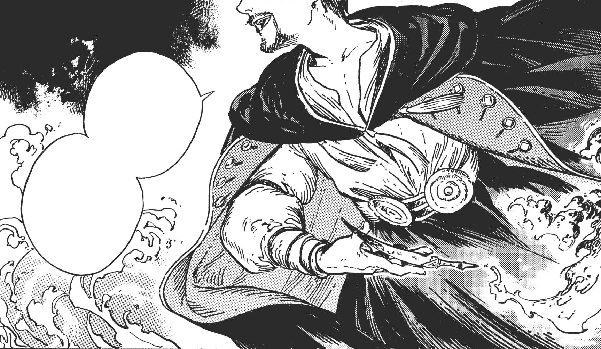

# Olruggio

_Source: [https://witchhatatelier.telepedia.net/wiki/Olruggio](https://witchhatatelier.telepedia.net/wiki/Olruggio)_
_Category: Light Spells_

| Field       | Value                                                                   |
| ----------- | ----------------------------------------------------------------------- |
| Japanese    | オルーギオ                                                              |
| Romaji      | Orūgio                                                                  |
| Chinese     | 奧爾戈                                                                  |
| French      | Olugio                                                                  |
| Spanish     | Orugio                                                                  |
| German      | Orugio                                                                  |
| Alias       | Master Olly Olruggio of the Torch Predis Olruggio Star of Ghodrey [ 1 ] |
| Gender      | Male                                                                    |
| Birthday    | September 20th [ 2 ]                                                    |
| Hair        | Black                                                                   |
| Eyes        | Dark Blue                                                               |
| Status      | Alive                                                                   |
| Occupation  | Watchful Eye                                                            |
| Specialty   | Fire Magic                                                              |
| Affiliation | Qifrey (Best friend) Pointed Cap Witches                                |
| Residence   | Qifrey's Atelier Ghodrey (Previously)                                   |
| Manga Debut | Chapter 8                                                               |
| Anime Debut | Episode 6                                                               |
| Japanese VA | Yuichi Nakamura                                                         |
| English VA  | Reagan Murdock                                                          |

|          |
| -------- |
| Overview |

|                                                                        |
| ---------------------------------------------------------------------- |
| [Image Gallery](/wiki/Olruggio/Image_Gallery 'Olruggio/Image Gallery') |

**Olruggio** (オルーギオ, _Orūgio_) is the Watchful Eye for [Qifrey's atelier](/wiki/Qifrey%27s_Atelier "Qifrey's Atelier"). He has a gruff way of speaking, but his magic is often described as "warm."

He has created a lot of contraptions, such as the [Glowstone Path](/wiki/Glowstone_Path 'Glowstone Path'), the [Snugstone](/wiki/Snugstone 'Snugstone') and the [Searneedle Wand,](/wiki/Searneedle_Wand 'Searneedle Wand') and is well known among his fellow witches for his inventions. His specialty is fire and light-based magic.

## Appearance

Olruggio is a tall, thin white man with short black hair, blue eyes and a somewhat unkempt beard. His expressions typically range between somewhat grouchy and sly.

He wears a white tunic with long, wide sleeves, a black skirt, and a brown belt. The outside of his cloak is black while the inside is blue, and the front of it features blue and gold designs. Three golden tassels hang from the front of the hood, which is large and pointed and can be worn over his cap. The fabric of the cloak is heavy, causing him to slouch.

His cap is made of a black body with a golden rim at the bottom. Two diamonds feature on the front of the cap, one half-diamond at the bottom and one at the middle. His tassel is simple and golden, and was originally Qifrey’s. The two witches traded their ornaments around the time of their [Third Test](/wiki/The_Pentagram_Test 'The Pentagram Test').

- ')

  Olruggio as a child (pre-witch apprentice)

## Personality

While he initially comes off as blunt and harsh, Olruggio is a genuinely kind and caring person. He looks after [Qifrey](/wiki/Qifrey 'Qifrey') and the students of the atelier, coming up with magical items to help them sleep and helping the students with their magic.

This kindness doesn’t just apply to people Olruggio knows— he helps out local villagers so frequently that the nobility of said villages and cities take note and seem almost jealous. Olruggio’s kindness towards others forces him to begin to question the laws of witch society, specifically laws against witches practicing medicine and introducing non-witches to magic. Whenever someone brings up Olruggio’s warm actions, he tries to brush it off as something anyone would do or simply part of his work as a Watchful Eye.

Olruggio holds a strong feeling of responsibility to protect people and guilt over his failures. He sometimes has nightmares of how he failed to save people in Nauz.

Olruggio is notoriously bad with deadlines and overworks himself, staying up late at night to finish commissions. He is often tired and sometimes shows a haggard face with dark circles. Due to these bad habits, he sometimes sleeps on the couch of the Atelier, oversleeps, or even misses events. Despite this, he insists on the importance of sleep to Qifrey's apprentices.

He is easily flustered and will lie about not liking praise. While at first he loudly opposed the girls calling him their master, he stops complaining about it during the story, only occasionally telling other people they are not his pupils.

## Inventions

Olruggio has invented numerous artifacts, including:

- [Glowstone Path](/wiki/Glowstone_Path 'Glowstone Path')
- [Snugstone](/wiki/Snugstone 'Snugstone')
- [Searneedle Wand](/wiki/Searneedle_Wand 'Searneedle Wand')
- [Link Rings](/wiki/Link_Rings 'Link Rings')
- [Phantasmal Fireball](/wiki/Phantasmal_Fireball 'Phantasmal Fireball') Sphere
- [Crystal Torch](/wiki/Crystal_Torch 'Crystal Torch')[*unofficial name*]
- [Magic Floating Dish](/wiki/Magic_Floating_Dish 'Magic Floating Dish')[*unofficial name*]

## Plot

### History

Olruggio as a child.

As a child, Olruggio was recognized as a prodigy witch from the northern town of [Ghodrey](/wiki/Ghodrey 'Ghodrey'), renowned enough that people from outside the town would travel there to meet him, including master witches from the Great Hall. Before becoming an apprentice, Olruggio won an award at the Children's Casting Exhibition, and had been begun traveling along with other witches for their [acts of service](/wiki/Pointed_Cap_Witches#Acts_of_Service 'Pointed Cap Witches'). During one such trip to the village of [Nauz](/wiki/Nauz 'Nauz'), a blizzard left the village isolated and suffered an attack by wild beasts that killed numerous people. Olruggio managed to save two, but was greatly upset and traumatized by his inability to help anyone else.

During his time in the [Great Hall](/wiki/Great_Hall 'Great Hall') as an apprentice, Olruggio met Qifrey after he saved Qifrey from almost drowning. Despite Qifrey's initially frigid attitude towards him Olruggio continued to follow him around, leading to them becoming friends.

**SPOILER WARNING**  
_This section contains spoilers for [Chapter 93](/wiki/Chapter_93 'Chapter 93')_

Unfortunately their close friendship would lead to the growth of the [Silverwood Tree](/wiki/Silverwood_Tree 'Silverwood Tree') inside of Qifrey as Olruggio made Qifrey feel safe. After he returned from challenging the [Tower of Tomes](/wiki/Tower_of_Tomes 'Tower of Tomes') and Olruggio comforted Qifrey causing the tree to irrupt and almost consume him. In an effort to save Qifrey, Olruggio challenged the library himself and found a spell to erase his own memories. By doing so he was able to save Qifrey using the guilt Qifrey would feel towards him to keep the tree from growing. He exchanged the tassels on their caps as a symbol of their deal. Multiple times Olruggio discovered Qifrey's secret again and would comfort Qifrey and forgive him for lying to him. The relief Qifrey felt would cause the tree to grow again and Olruggio would need to have his memories erased once more.

**End of spoilers.**

Eventually, the two of them moved out of the Great Hall and into Qifrey's Atelier. Olruggio helped Qifrey find his apprentices, and is present during their first encounter with [Richeh](/wiki/Richeh 'Richeh').

### [Watchful Eye Arc](/wiki/Watchful_Eye_Arc 'Watchful Eye Arc')

Olruggio returns to the Atelier after a business trip and meets Coco, whose existence as Qifrey's new apprentice he had not been made aware of. He tries to turn her over to the [Knights Moralis](/wiki/Knights_Moralis 'Knights Moralis') when he learns she's a victim of the Brimmed Caps. After Qifrey's intense response to stop him, Olruggio listens to Coco's story and reluctantly accepts her presence as an apprentice but warns Qifrey that if there's even a hint of further trouble he'll report it to the Great Hall as that is his duty. Later, Coco enters his room while trying to catch [Brushbuddy](</wiki/Brushbuddy_(Character)> 'Brushbuddy (Character)'), where she learns more of Olruggio's magic like the [Link Rings](/wiki/Link_Rings 'Link Rings') and reveals to have already seen the Glowstone path, as the spell inspired her passion for magic as young child. After thanking him as "Master Olruggio" he throws her out, and then ponders Qifrey's earlier mention of how wiping her memories would also erase her passion for magic.

### [River Rescue Arc](/wiki/River_Rescue_Arc 'River Rescue Arc')

Taking [Agott](/wiki/Agott 'Agott') with him on horseback, he follows [Dagda](/wiki/Dagda 'Dagda') to the site of the collapsed bridge, where he instructs her to help dry the victims while he and Qifrey rescue those still stuck in the sinking carriages. Once the rescue is complete, he and Richeh head upstream to check for potential damage, leaving Agott and Coco to care for the victims. He comes back to their rescue after the Knights Moralis arrive on site and capture them and instantly goes to help the members of the caravan, caught in the sands of Coco's spell. He interrupts Qifrey's confrontation with the Knights to ask all of them for help, as a witch's duty should lie in helping the people.

After the incident, he tells Qifrey he might be too lax with his students, referring to Agott's careless unsupervised behaviour, which they both worry about.

### [Second Pentagram Test Arc](/wiki/Second_Pentagram_Test_Arc 'Second Pentagram Test Arc')

After Richeh storms out of the living room following her outburst, Olruggio, who had been sleeping on the couch in the same room, notes that her current outlook on her studies will prevent her from improving any further. When Coco leaves to speak with her, Olruggio and Qifrey begin cleaning up after the two girls. When Qifrey admits to not knowing how to approach Richeh, Olruggio notes that people aren’t as straightforward as spells, before handing Qifrey his latest contraption; a pair of snugstones. Qifrey notices that he’s been given an extra snugstone, to which Olruggio explains that it is intended for him, telling him to use it to teach his students the importance of a good night’s rest by leading by example.

Olruggio rescuing Alaira and Qifrey.

Olruggio stays behind at the atelier while the rest accompany Agott to the Second Test. Agott complains that she was unable to study until the last minute due to having slept too soundly, thanks to the snugstone.

After the Brimmed Caps attack the Second Test, Richeh returns to the atelier seeking Olruggio’s help, returning to the test site using the windowway inside of her vase. They arrive in time to save Qifrey and [Alaira](/wiki/Alaira 'Alaira') from [Sasaran](/wiki/Sasaran 'Sasaran'), Olruggio commending Richeh on her choice to seek him out. Once the Brimmed Caps flee, Olruggio stops Qifrey from mindlessly pursuing them and reminds him of his priorities, lending him a shoulder as they begin looking for the other apprentices.

While Richeh showcases her method of creating windowways, Olruggio explains the complexities of the spell to an eagerly listening [Tetia](/wiki/Tetia 'Tetia').

### [Great Hall Arc](/wiki/Great_Hall_Arc 'Great Hall Arc')

Upon meeting [Luluci](/wiki/Luluci 'Luluci') outside of the Serpentback Cave, Olruggio insists that Qifrey needs medical attention before they’re interrogated. After Luluci agrees, he makes it clear to her that he will not let the Knights Moralis conduct another harsh interrogation. When Luluci tells him that they’ve been summoned to the Great Hall by [Beldaruit](/wiki/Beldaruit 'Beldaruit') and not the Knights Moralis, Olruggio seems displeased but gives in, telling the apprentices that they don’t have a choice in the matter.

When Coco notes the strange mist which seems to be impairing her breathing, Olruggio explains to her that the mist is what allows her to breathe underwater, not the other way around. Once they bring Qifrey to the healing spire, Olruggio and the apprentices meet with Beldaruit. When they arrive, Olruggio notices the fact that the Beldaruit in the Argentgard is really a smoke sculpture and attacks it with a branch, much to the actual Beldaruit’s glee.

After meeting with Beldaruit, Olruggio is dragged away by the Knights Moralis to provide a written report on the incident at the Serpentback Cave. During the report he encounters [Kukrow](/wiki/Kukrow 'Kukrow'), who he takes unkindly to, chastising him on the treatment and abandonment of [Euini](/wiki/Euini 'Euini'). Once the report is finished and Olruggio is free to go, he remarks thankfulness at [Easthies](/wiki/Easthies 'Easthies') absence, which [Utowin](/wiki/Utowin 'Utowin') overhears. Utowin introduces himself as a former citizen of Ghodrey, before stating that he suspects Olruggio knows more about the Brimhat attack then he’s revealed. Olruggio plays dumb, and the conversation ends without scuffle. Olruggio reunites with the girls at the Great Hall’s cafeteria and helps Coco with her magic ice-pack, before they all return to the Healing Spire to be with Qifrey.

### [Silver Night Festival Prologue Arc](/wiki/Silver_Night_Festival_Prologue_Arc 'Silver Night Festival Prologue Arc')

### [Silver Eve Arc](/wiki/Silver_Eve_Arc 'Silver Eve Arc')

## Relationships

### Qifrey

[Qifrey](/wiki/Qifrey 'Qifrey') and Olruggio are childhood friends, and seem to trust each other dearly. Despite being the Atelier’s Watchful Eye and being sworn to report wrongdoings to the [Knights Moralis](/wiki/Knights_Moralis 'Knights Moralis'), Olruggio trusts Qifrey to the point where he breaks this oath multiple times— he doesn’t take [Coco](/wiki/Coco 'Coco') away after discovering she was an outsider to witch society and lies to the Knights Moralis about what happened to [Euini](/wiki/Euini 'Euini') during the Second Test.

After discovering that Qifrey’s right glasses lens is enchanted with invisible ink to help him see with a failing eye, Olruggio asks his friend to tell him the truth, and tells Qifrey that regardless of what that truth may be, Olruggio will help him. Qifrey reveals his true motive, seeking out the Brimmed Caps, and wipes Olruggio‘s memory. Qifrey sadly states that he’s sure Olruggio would end up forgiving Qifrey “again”, implying that this has happened multiple times.

In flashbacks of the characters, it can be seen that their cap ornaments are switched -- young Olruggio having the long black ribbon on his cap while young Qifrey has the golden tassel on his. It is revealed in the [Volume 5](/wiki/Volume_5 'Volume 5') Extra: The Hats of Witch Hat page that they indeed swapped cap ornaments in their youth. According to the Olrugio's memories, this swap occurred sometime before Qifrey made his attempt on the [Tower of Tomes](/wiki/Tower_of_Tomes 'Tower of Tomes').

**SPOILER WARNING**  
_This section contains spoilers for [Chapter 93](/wiki/Chapter_93 'Chapter 93')._

It is revealed that Qifrey and Olruggio swapped cap ornaments as a symbol of the pact the two made on the night they went to the Tower of Tomes, and represents Olruggio's desire for Qifrey to continue fighting to live. In order to keep the silverwood tree inside of Qifrey at bay, rather than completely wiping all of Qifrey's memories, Olruggio arrived at the solution to take Qifrey's place in the memory wipe: wiping his own memory of the secret about the Silverwood tree inside of Qifrey and the agreement they made that night which includes why they swapped cap ornaments. By doing so, Qifrey lives with the guilt of wiping Olruggio's memory and the anxiety of continuing to hide the secret about the silverwood tree and what he's done to Olruggio. In addition, it is revealed that Olruggio has figured out Qifrey's secret multiple times since then, but each time forgave Qifrey and agreed to having his memories of the secret wiped again.

Qifrey admits that he had attempted to live apart from Olruggio, but even that small comfort of no longer hurting him was enough for the Silverwood tree to be a threat to himself again.

**END OF SPOILERS**

### Coco

He was not told about her apprenticeship with Qifrey and so disapproved of it at first, particularly upon hearing of Coco's involvement with forbidden magic. After being convinced to let her stay at the Atelier, he continued to be gruff but looked out for her well-being, like using his [Link Rings](/wiki/Link_Rings 'Link Rings') to dry her off from the rain. As it turned out, his [Glowstone Path](/wiki/Glowstone_Path 'Glowstone Path') was part of what inspired Coco's love for magic, and was flustered by her genuine thanks for creating it. He recognizes her passion and appreciation for magic, and by the [Great Hall Arc](/wiki/Great_Hall_Arc 'Great Hall Arc'), has fully accepted her as part of the group—answering her questions, advising her on magic, and praising the strides she makes. He even defends her (and the other girls) from being harshly interrogated by the Knights, and questions their fear of Coco being a sign of a threat to come, calling it absurd. Despite his original objections and his role as the Watchful Eye, he did not hesitate in hiding what happened inside the [Serpentback Cave](/wiki/Serpentback_Cave 'Serpentback Cave') from the Knights.

### Agott

Aggot and Orluggio get along pretty well.

### Richeh

Olruggio and Richeh seem to get along well. She speaks and listens to him easily, perhaps even easier than to Qifrey. When the Brimmed Caps attack the Second Test, Richeh seeks him out despite her aversion to asking adults for help, showcasing trust between them. Olruggio later commends her on her choice, which she takes pride in.

### Tetia

### Hiehart

## Trivia

- Olruggio uses the rough-sounding, Japanese male pronoun 俺 _(ore)_.
- According to a sketch page by Shirahama Kamome, Olruggio enjoys strong yet sweet alcoholic drinks.
- The diamond design featured on Olruggio's cap is also worn by many other Ghodrey citizens, such as a younger [Utowin](/wiki/Utowin 'Utowin') and his father.
- Brushbuddy is fond of him. He's seen playing with the creature, who also climbs on him, and rocks around happily when he comes back in the Great Hall.
- He stars on the cover of volume 6. For this occasion, [the author drew him](https://twitter.com/shirahamakamome/status/1187290953746223104?s=20) acting bashful about this spotlight, insisting it's really not his thing to Qifrey before refusing for it to be changed... [[additional approximate english translation by blogger kirbypoyopoyo](https://kirbypoyopoyo.tumblr.com/post/667688472110350336/hi-ive-been-wondering-what-this-says-for-while)]

## References

1. Witch Hat Atelier Manga: Chapter 76 , Page 9
2. The Atelier of Witch Hat 2021 Calendar as released with Japan's Limited Edition Volume 8
3. "The Cloaks of Witch Hat" special included in Volume 8
4. Witch Hat Atelier Manga: Chapter 76 , Page 12-13
5. Witch Hat Atelier Manga: Chapter 89
6. Witch Hat Atelier Manga: Chapter 90
7. Witch Hat Atelier Manga: Chapter 8 , Page 24
8. Witch Hat Atelier Manga: Chapter 8 , Page 25-26
9. Witch Hat Atelier Manga: Chapter 9 , Page 3
10. Witch Hat Atelier Manga: Chapter 9 , Page 12
11. Witch Hat Atelier Manga: Chapter 9 , Page 14
12. Witch Hat Atelier Manga: Chapter 9 , Page 17-18
13. Witch Hat Atelier Manga: Chapter 9 , Page 20-21
14. Witch Hat Atelier Manga: Chapter 9 , Page 22
15. Witch Hat Atelier Volume 5 Extra Page: The Hats of Witch Hat
16. Witch Hat Atelier Manga: Chapter 40 , Page 14
17. Witch Hat Atelier Manga: Chapter 93 , Page 11
18. Witch Hat Atelier Manga: Chapter 8
19. Witch Hat Atelier Manga: Chapter 9
20. Witch Hat Atelier Manga: Chapter 30
21. Witch Hat Atelier Manga: Chapter 33
22. Witch Hat Atelier Manga: Chapter 34
23. Witch Hat Atelier Manga: Chapter 32
24. https://twitter.com/shirahamakamome/status/1150025969672998913?s=20
