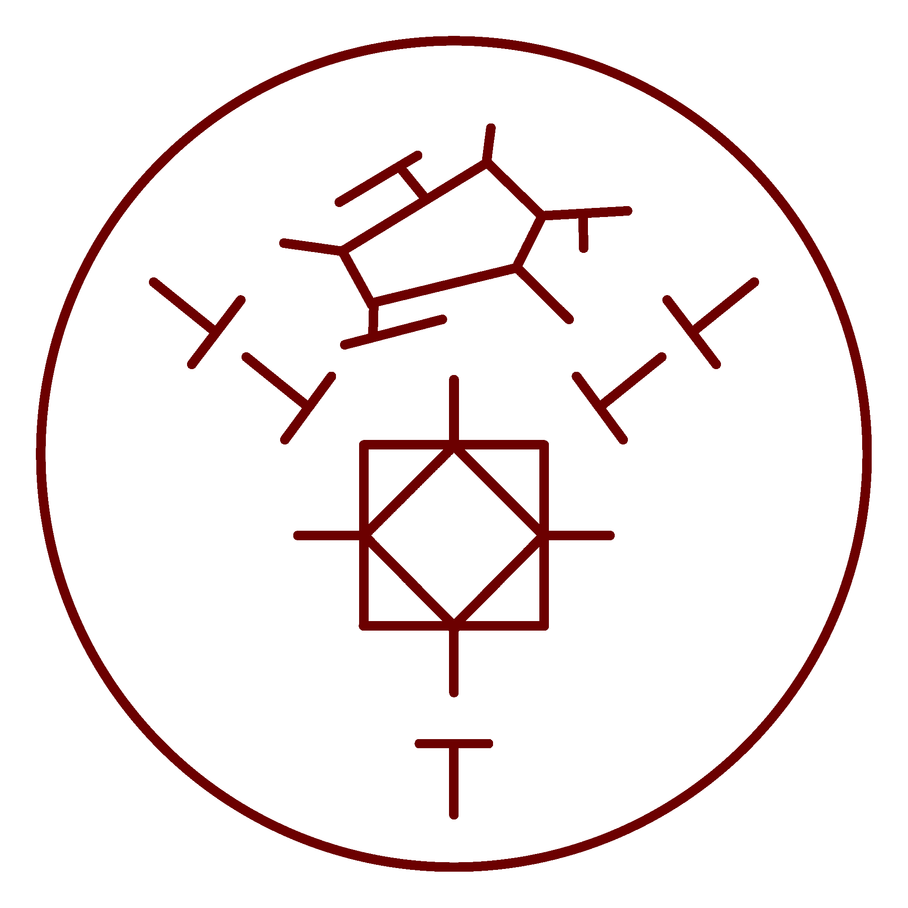

# Valance Leech of Light

_Source: [https://witchhatatelier.telepedia.net/wiki/Valance_Leech_of_Light](https://witchhatatelier.telepedia.net/wiki/Valance_Leech_of_Light)_
_Category: Light Spells_

| Field       | Value      |
| ----------- | ---------- |
| Type        | Spell      |
| Creator     | Agott      |
| User(s)     | Agott      |
| Manga Debut | Chapter 78 |

**Valance Leech of Light**[*unofficial name*] is a light-type [spell](/wiki/Spells 'Spells') that creates a light sculpture of a valance leech.

## Description

This spell is simple, only containing five column signs, the light sigil, and the decorative sigil for the valance leech. The five column signs are inverted, which has the effect of dispersing the drawn spell.

## Usage

[Agott](/wiki/Agott 'Agott') drew this spell to prove her knowledge of the decorative sigil of a valance leech when the witches were devising a plan to use the [Counterclock](/wiki/Counterclock 'Counterclock') on it. When a witch asked her how she knew such an obscure sigil, she shyly explained that it was because she likes this type of magic. Eventually, this spell was used to create the [Valance Leech Counterclock](/wiki/Valance_Leech_Counterclock 'Valance Leech Counterclock') spell.
