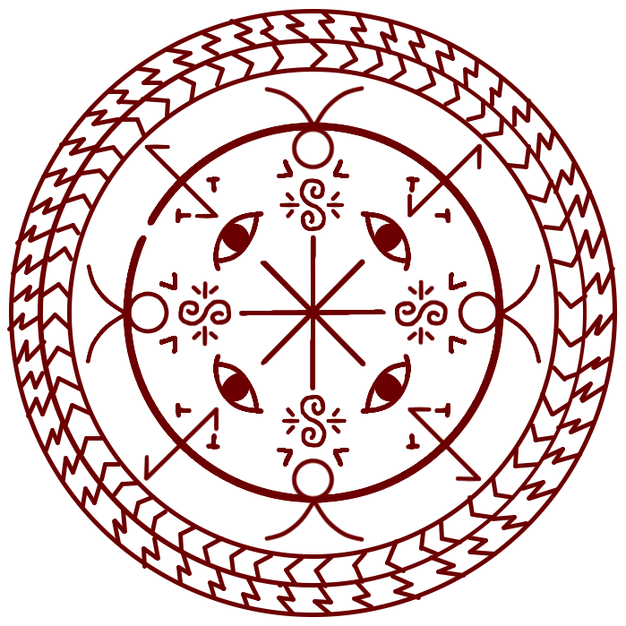

# Cloak Spell

_Source: [https://witchhatatelier.telepedia.net/wiki/Cloak_Spell](https://witchhatatelier.telepedia.net/wiki/Cloak_Spell)_
_Category: Mixed Spells_

| Field       | Value             |
| ----------- | ----------------- |
| Type        | Spell             |
| User(s)     | Sasaran , Witches |
| Manga Debut | Chapter 27        |

The **cloak spell** is a mixed wind/vision/space-type spell [spell](/wiki/Spells 'Spells') that allows the user to perform magic remotely through the cloak, and control the cloak's movment from afar.

## Description

The cloak spell contains a central body and a windowway ring that loops around the spell. The spell's main body contains a central vision sigil with eye signs placed on 4 of the eight ends of the vision sigil, with wind sigils on the other 4. Along the ring of the seal, 4 bend and 4 puppet signs are placed.

This spell was used by Sasaran on his cloak, and it functioned to allow him to control the cloak remotely while performing spells through it, hiding his main body elsewhere. The cloak spell is a fusion of the [gathering shadows](/wiki/Gathering_Shadows 'Gathering Shadows') spell, which drapes the object in shadow, the [flying puppet of diversion](/wiki/Flying_Puppet_of_Diversion 'Flying Puppet of Diversion') spell, which makes the object fly through the air, and the [windowway spell](/wiki/Windowway_Spell 'Windowway Spell'), which allows objects to pass through it from one location to another.

## Usage

The spell is used by [Sasaran](/wiki/Sasaran 'Sasaran'), who has it written on the inside of his cloak. He was seen using the cloak while in the [Serpentback Cave](/wiki/Serpentback_Cave 'Serpentback Cave') while [Qifrey's](/wiki/Qifrey 'Qifrey') [students](/wiki/Qifrey%27s_Atelier "Qifrey's Atelier") were taking [The Sincerity of the Shield](/wiki/The_Sincerity_of_the_Shield 'The Sincerity of the Shield') test, and was employed heavily during his fight with Qifrey.

## References

1. Witch Hat Atelier Manga: Chapter 27 , Page 22
2. Witch Hat Atelier Manga: Chapter 17 , Page 33
