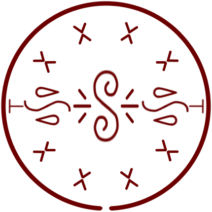
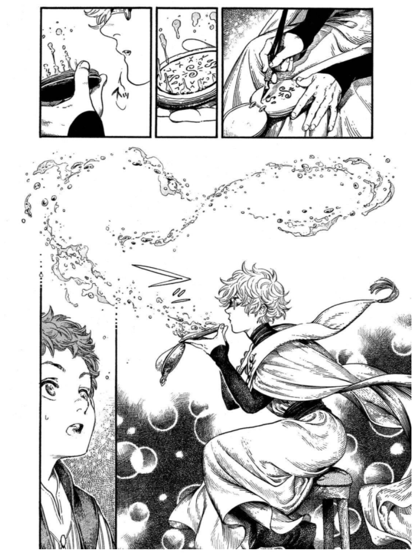

# Floating Drops

_Source: [https://witchhatatelier.telepedia.net/wiki/Floating_Drops](https://witchhatatelier.telepedia.net/wiki/Floating_Drops)_
_Category: Mixed Spells_

| Field       | Value      |
| ----------- | ---------- |
| Type        | Spell      |
| User(s)     | Witches    |
| Manga Debut | Chapter 16 |

**Floating drops** is a mixed water/air-type spell that creates floating drops of water which form along the ring of the spell.

## Description

This spell consists of a central air sigil with two water sigils to the side. On the outside edge of the spell are directional keystones situated in pairs, each pair consisting of one normal and one inverted sign, pointing towards one another. The spell creates water droplets that float in the air. Due to the counteracting pairs of directional keystones, the drops are only generated along the seal's outer ring.

## Usage

The spell was used by [Qifrey](/wiki/Qifrey 'Qifrey') to help ease a fever [Coco](/wiki/Coco 'Coco') was suffering from due to overwork.

Qifrey using the floating drops spell

## References

1. Witch Hat Atelier Manga: Chapter 16 , Page 5
