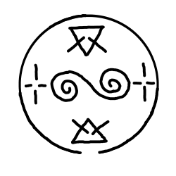
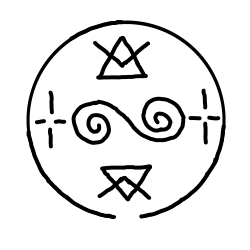

# Rainflinger

_Source: [https://witchhatatelier.telepedia.net/wiki/Rainflinger](https://witchhatatelier.telepedia.net/wiki/Rainflinger)_
_Category: Mixed Spells_

| Field       | Value           |
| ----------- | --------------- |
| Japanese    | 雨飛ばし        |
| Rōmaji      | Ametobashi      |
| Type        | Spell           |
| User(s)     | Olruggio , Coco |
| Manga Debut | Chapter 9       |
| Anime Debut | Episode 6       |

**Rainflinger** is a mixed wind-type and fire-type [spell](/wiki/Spells 'Spells') that evaporates moisture.

## Description

Rainflinger contains a central wind sigil, with two smaller fire sigils on either side. It also includes two crosshair signs located above and below the wind sigil. The crosshair signs likely target the air with heat, resulting in the warm winds that dry objects within its radius.

## Usage

The effect of Rainflinger has been shown to differ visually, but has consistently been described as a spell that dries and keeps things dry.

It is first seen on [Olruggio's](/wiki/Olruggio 'Olruggio') [Link Rings](/wiki/Link_Rings 'Link Rings'), which he uses to dry off both [Brushbuddy](</wiki/Brushbuddy_(Character)> 'Brushbuddy (Character)') and [Coco](/wiki/Coco 'Coco') after getting caught in the rain. The same [contraption](/wiki/Contraption 'Contraption') is used by [Qifrey’s](/wiki/Qifrey 'Qifrey') [apprentices](/wiki/Qifrey%27s_Atelier "Qifrey's Atelier") to help the victims of the [Staircase River](/wiki/Staircase_River 'Staircase River') incident dry off. Coco also uses them to dry off her [components](/wiki/Components 'Components') in particular when they’re rendered unusable due to being soaked from the river.

Coco draws this spell on a piece of paper and offers it to some [hallowhares](/wiki/Hallowhare 'Hallowhare'), instructing them to stay atop it to stay warm and dry from the rain. Coco’s version of the spell bears visual similarities with the spell Qifrey uses to shield the girls from the rain in order to have a picnic. Both spells visually appear as a bubble devoid of water.

Olruggio used this spell to save Qifrey after he nearly drowns in the ocean just outside the [Great Hall](/wiki/Great_Hall 'Great Hall'), leading to him coughing up the water in his lungs.

## Trivia

- The Rainflinger spell’s name and seal bear similarity to [Waterflinger](/wiki/Waterflinger 'Waterflinger').
- The fire sigils used in Rainflinger are modified. Instead of the typical triangle with three tines on each side, Rainflinger’s variants only have two tines, with the innermost tine being absent.
  - An older version of Rainflinger had the fire sigils inverted and the two tines connected to create a ‘V’ shape.

Old Rainflinger

- Rainflinger is shown on a piece of official merch (a coaster) with [Brushbuddy](</wiki/Brushbuddy_(Character)> 'Brushbuddy (Character)') lying on top of it.

## References

1. Witch Hat Atelier Manga: Chapter 10 , Page 8
2. Witch Hat Atelier Manga: Chapter 23.5
3. Witch Hat Atelier Manga: Chapter 89 , Page 17
4. Witch Hat Atelier Manga: Chapter 9 , Page 17-18
5. Witch Hat Atelier Manga: Chapter 10 , Page 18
6. Witch Hat Atelier Manga: Chapter 11 , Page 3
7. Witch Hat Atelier Anime: Episode 6
8. Witch Hat Atelier Manga: Chapter 8 , Page 19
9. Witch Hat Atelier Manga: Chapter 89 , Page 16-17
10. https://web.archive.org/web/20220930184445/https://store.re-shazam.com/items/29529439
