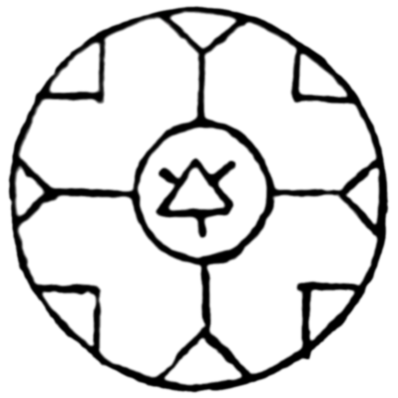

# Warmth-Retention Seal

_Source: [https://witchhatatelier.telepedia.net/wiki/Warmth-Retention_Seal](https://witchhatatelier.telepedia.net/wiki/Warmth-Retention_Seal)_
_Category: Mixed Spells_

| Field       | Value                                  |
| ----------- | -------------------------------------- |
| Japanese    | 保温の魔法陣                           |
| Rōmaji      | Ho'on no mahoujin                      |
| Type        | Spell                                  |
| User(s)     | Witches                                |
| Manga Debut | Chapter 25 (Witch Hat Atelier Kitchen) |

**Warmth-Retention Seal** is a mixed [spell](/wiki/Spells 'Spells') that maintains a low, steady heat.

## Description

The warmth-retention seal has a fire sigil in the center, and a yet-unknown sign surrounding it that is identical to the [Time Stop](/wiki/Time_Stop 'Time Stop') spell. When in use, the effect is that it will maintain a steady, low heat to whatever it is used on.

## Usage

The warmth-retention seal was first used in [Chapter 25 (Witch Hat Atelier Kitchen)](</wiki/Chapter_25_(Witch_Hat_Atelier_Kitchen)> 'Chapter 25 (Witch Hat Atelier Kitchen)') when the [Dragon Egg Crock](/wiki/Dragon_Egg_Crock 'Dragon Egg Crock') was introduced. Used exclusively with this magical crock pot contraption, this spell allows for food to continue cooking at a slow pace without the need for supervision.

## Gallery

- [![The seal as seen on the Dragon Egg Crock[1]](../../images/Dragon_Egg_Crock_Seal.jpg)](/wiki/File:Dragon_Egg_Crock_Seal.jpg 'The seal as seen on the Dragon Egg Crock[1]')

  The seal as seen on the [Dragon Egg Crock](/wiki/Dragon_Egg_Crock 'Dragon Egg Crock')

## References

1. Witch Hat Atelier Kitchen Spinoff: Chapter 25 , Page 8
2. Witch Hat Atelier Kitchen Spinoff: Chapter 25 , Page 9
