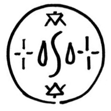

# Waterflinger

_Source: [https://witchhatatelier.telepedia.net/wiki/Waterflinger](https://witchhatatelier.telepedia.net/wiki/Waterflinger)_
_Category: Mixed Spells_

| Field       | Value       |
| ----------- | ----------- |
| Japanese    | 水飛ばし    |
| Rōmaji      | Mizutobashi |
| Type        | Spell       |
| Manga Debut | Chapter 28  |

**Waterflinger** is a mixed water-type and fire-type [spell](/wiki/Spells 'Spells').

## Description

Waterflinger contains a central water sigil, with two smaller fire sigils located above and below it. It also includes two crosshair signs on either side of the water sigil. The spell’s effect had not been shown in the manga. It’s possible that the crosshair signs target water with heat to evaporate it.

## Usage

The Waterflinger spell has made multiple appearances in the form of its seal, but not in regards to its effect. It is first shown when [Agott](/wiki/Agott 'Agott'), [Tetia](/wiki/Tetia 'Tetia') and [Coco](/wiki/Coco 'Coco') are brainstorming ways to save [Euini](/wiki/Euini 'Euini'), identified as a spell that they are familiar with and one with the potential to help them reach their goal.

## Trivia

- The Waterflinger spell’s name and seal bear similarity to [Rainflinger](/wiki/Rainflinger 'Rainflinger').

## References

1. Signs_Explained#Crosshair
2. Witch Hat Atelier Manga: Chapter 28 , Page 10
3. Witch Hat Atelier Manga: Chapter 83 , Page 1
4. Witch Hat Atelier Manga: Chapter 28 , Page 10-11
