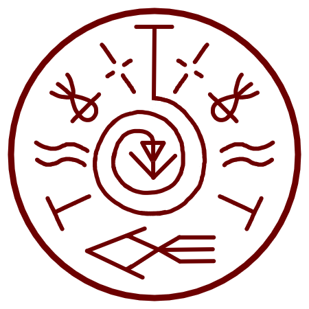

# Fish Guidance

_Source: [https://witchhatatelier.telepedia.net/wiki/Fish_Guidance](https://witchhatatelier.telepedia.net/wiki/Fish_Guidance)_
_Category: Niche Spells_

| Field       | Value      |
| ----------- | ---------- |
| Type        | Spell      |
| Creator     | Coco       |
| User(s)     | Coco       |
| Manga Debut | Chapter 63 |

The **fish guidance spell**[*unofficial name*] makes fish formed with magic using a decorative sigil move towards the seal through the air.

## Description

The spell consists of a central guidance sigil, surrounded by (from top to bottom) crosshair signs, fish-like decorative sigils, flotation signs, column signs, and finally a different, bigger fish-like decorative sigil right below it.
It is currently unknown what the difference between the two kinds if fish sigils is, but since we know from the [**owlcat head**](/wiki/Sigils_Explained#Owlcat_Head 'Sigils Explained') decorative sigil that decorative sigils can have simplified or modified versions, we can assume it's also the case there.
The purpose of the spell is to make flying fish created with magic fly to this sigil and be dispelled.

## Usage

This spell is used during the [Golden Eve Procession](/wiki/Golden_Eve_Procession 'Golden Eve Procession') by [Jujy](/wiki/Jujy 'Jujy') to help [Coco](/wiki/Coco 'Coco') and [Agott](/wiki/Agott 'Agott') showcase Coco's [Portable Waste Purification Pot](/wiki/Portable_Waste_Purification_Pot 'Portable Waste Purification Pot').

## References

1. Witch Hat Atelier Manga: Chapter 64 , Page 2
