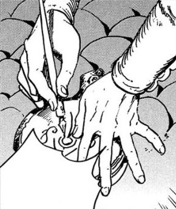
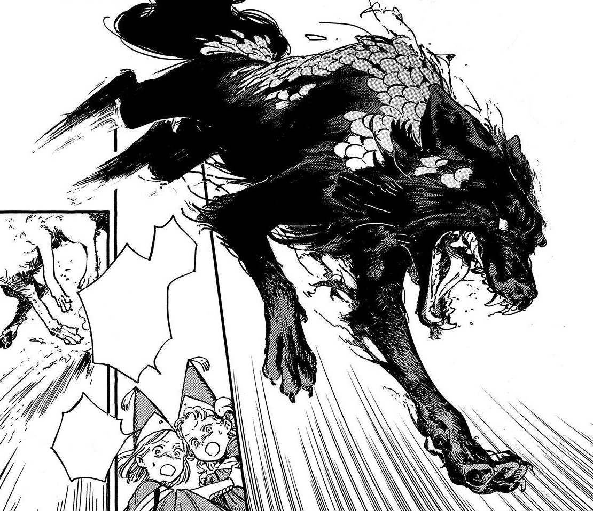

# Inverted Scalewolf Curse

_Source: [https://witchhatatelier.telepedia.net/wiki/Inverted_Scalewolf_Curse](https://witchhatatelier.telepedia.net/wiki/Inverted_Scalewolf_Curse)_
_Category: Niche Spells_

| Field       | Value                |
| ----------- | -------------------- |
| Type        | Spell                |
| Creator     | Agott , Coco , Tetia |
| User(s)     | Witches              |
| Manga Debut | Chapter 28           |

The **inverted scalewolf curse** is a niche-type [spell](/wiki/Spells 'Spells') which counteracts the mental effects of the [scalewolf curse](/wiki/Scalewolf_Curse 'Scalewolf Curse').

## Description

The spell supposedly contains the same signs as the [scalewolf curse](/wiki/Scalewolf_Curse 'Scalewolf Curse'), just inverted. When signs are inverted, the effect of a spell is reversed, allowing it to cancel out the normal version. This is the principle this spell was built off of. However, the spell was only partially able to reverse the effects of the scalewolf curse, only able to heal the mind of those afflicted.

## Usage

The concept for the spell was invented in a joint discussion between [Agott](/wiki/Agott 'Agott'), [Coco](/wiki/Coco 'Coco'), and [Tetia](/wiki/Tetia 'Tetia') while they were in the [Serpentback Cave](/wiki/Serpentback_Cave 'Serpentback Cave'). Coco proposed that by inverting the seal used on [Euini](/wiki/Euini 'Euini'), they would be able to undo the spell which turned him into a [scaled wolf](/wiki/Scaled_Wolf 'Scaled Wolf'). After immobilizing Euini, Agott drew the spell and applied it to the site of the seal, which failed to revert him back to a human, but did successfully heal his mind.

Euini before having his mind restored

## Trivia

- As stated by Tetia and Agott, the spell is technically not forbidden, as it only undo's the effects of the spell, which has not been stated to be forbidden as of the time of the spell's creation
- Interestingly, despite the spell supposedly being an inverted version of the [scalewolf curse](/wiki/Scalewolf_Curse 'Scalewolf Curse'), the inverted scalewolf curse does not share many visual similarities with it's complimentary spell

## References

1. Witch Hat Atelier Manga: Chapter 28 , Page 13-14
2. Witch Hat Atelier Manga: Chapter 28 , Page 23
3. Witch Hat Atelier Manga: Chapter 28 , Page 15-16
