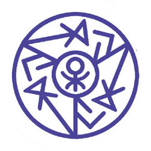

# Lockwax

_Source: [https://witchhatatelier.telepedia.net/wiki/Lockwax](https://witchhatatelier.telepedia.net/wiki/Lockwax)_
_Category: Niche Spells_

| Field       | Value      |
| ----------- | ---------- |
| Type        | Spell      |
| User(s)     | Witches    |
| Manga Debut | Chapter 50 |

**Lockwax** is a niche spell that is used to bind scrolls.

## Description

Contains an unknown sigil in an inner circle with three lines dividing the outer circle into equal sections. Each section is identical with an arrow like sign with a triangle on the end pointing towards the center of each section. To the right of each arrow are two short lines with one bending at a right angle over the other.

From [Qifrey's](/wiki/Qifrey 'Qifrey') reaction, it can be assumed that lockwax is not commonly used, or is only used for protecting powerful or important scrolls. However, it's not clear on how lockwax works and what level of protection it offers or how to open a scroll bound with it.

## Usage

The scroll that [Easthies](/wiki/Easthies 'Easthies') gives to Qifrey that he ends up using in his battle against [Engendale](/wiki/Engendale 'Engendale') was bound with lockwax.

## Trivia

- The [French volume 10](/wiki/Limited_Editions#Volume_10_2 'Limited Editions'), and the [Japanese volume 9](/wiki/Limited_Editions#Volume_9 'Limited Editions') limited editions both came with a wax sealing kit containing a stamp with the lockwax seal.

## References

1. Witch Hat Atelier Manga: Chapter 50 , Page 2
2. Witch Hat Atelier Manga: Chapter 69 , Page 4
