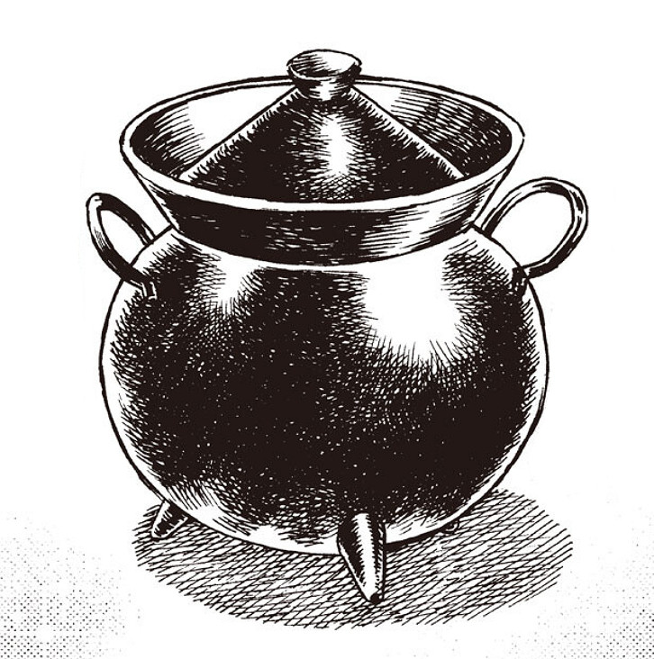
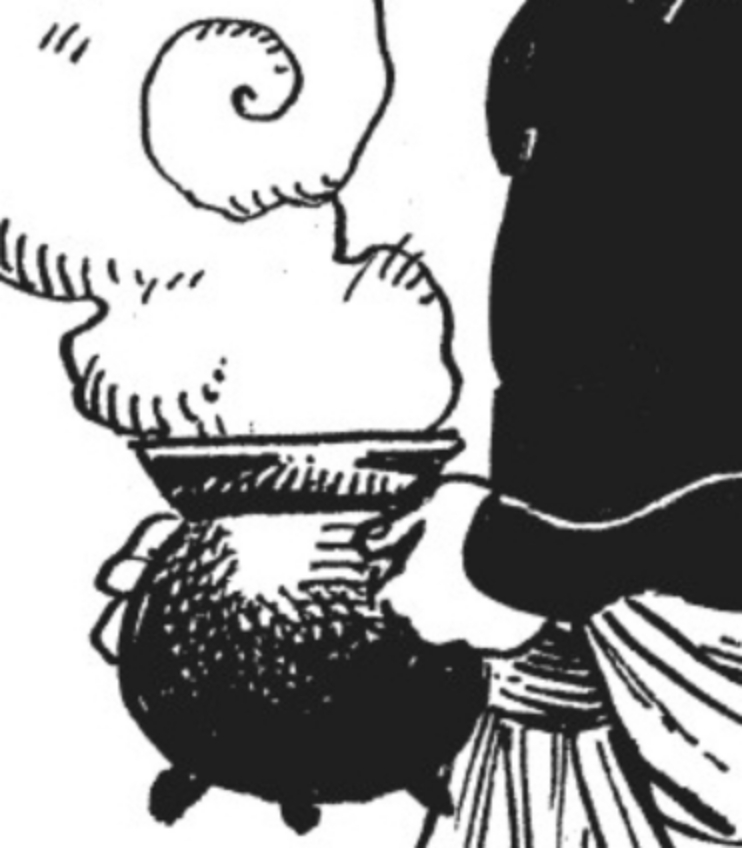
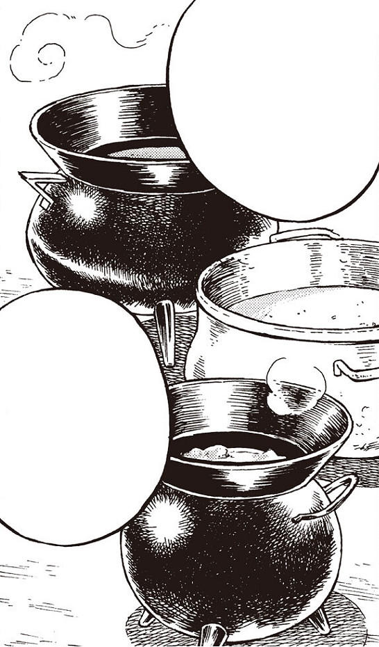

# Magic Cookpot

_Source: [https://witchhatatelier.telepedia.net/wiki/Magic_Cookpot](https://witchhatatelier.telepedia.net/wiki/Magic_Cookpot)_
_Category: Niche Spells_

| Field       | Value            |
| ----------- | ---------------- |
| Japanese    | 魔法鍋           |
| Rōmaji      | Mahō nabe        |
| Type        | Contraption      |
| User(s)     | Witches , Qifrey |
| Manga Debut | Chapter 8        |

**Magic Cookpots** are a type of contraption used in cooking, utilizing a [Repetition Seal](/wiki/Repetition_Seal 'Repetition Seal') to keep the food contained within as fresh as the day it was made.

## Description

A magic cookpot is a pot with a repetition seal drawn on the inside of the lid. This magic acts on anything placed inside the pot (or anything one might point the lid towards), effectively rewinding the state of its target to when it was freshest.) Food will not spoil so long as the seal is maintained, meaning food can be stored for use even years later.

- 

  The repetition seal drawn on the lid.

- [![A clear image of the repetition seal on the lid.[5]](../../images/Magic_Cookpot_Repetition_Seal.jpg)](/wiki/File:Magic_Cookpot_Repetition_Seal.jpg 'A clear image of the repetition seal on the lid.[5]')

  A clear image of the repetition seal on the lid.

- 

  The magic cookpot is easy to carry.

- 

  Qifrey's Atelier has a number of magic cookpots in a variety of sizes.

## History

[Qifrey](/wiki/Qifrey 'Qifrey') used a magic cookpot to keep a stew fresh for two years before finally eating it with his apprentices.
The magic cookpot is also used often in [Witch Hat Atelier Kitchen](/wiki/Witch_Hat_Atelier_Kitchen 'Witch Hat Atelier Kitchen').

## References

1. Witch Hat Atelier Manga: Chapter 8 , Page 7 - 8
2. Witch Hat Atelier Manga: Chapter 8 , Page 8
3. Witch Hat Atelier Manga: Chapter 8 , Page 7
4. Witch Hat Atelier Kitchen Spinoff: Chapter 7 , Page 1
5. Witch Hat Atelier Kitchen Spinoff: Chapter 25 , Page 8
