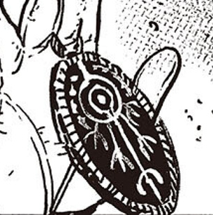
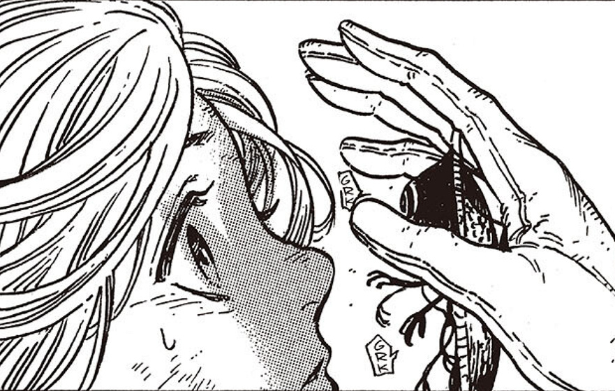
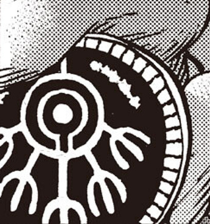
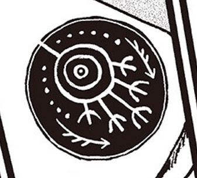

# Memory Erasure

_Source: [https://witchhatatelier.telepedia.net/wiki/Memory_Erasure](https://witchhatatelier.telepedia.net/wiki/Memory_Erasure)_
_Category: Niche Spells_

| Field       | Value                               |
| ----------- | ----------------------------------- |
| Type        | Spell                               |
| User(s)     | Knights Moralis Brimmed Caps Qifrey |
| Manga Debut | Chapter 11                          |

**Memory Erasure** is a type of [spell](/wiki/Spells 'Spells') mostly used by the [Knights Moralis](/wiki/Knights_Moralis 'Knights Moralis') to wipe the knowledge of [forbidden magic](/wiki/Forbidden_Magic 'Forbidden Magic') from their targets.

## Description

Unlike most spells, the memory erasure seals are white on a black background instead of drawn with ink on a regular surface. Several variants of the spell have been seen, though all are incredibly similar with only minor additions such as additional signs that set them apart. The sigil at the center is made of concentric circles with a dot in the middle. Several [glaives](/wiki/Magic#Glaives 'Magic') also protrude from the bottom of the spell, and the circle also contains dot-shaped signs along the outer edge and top.

Regarding the spell variants, these effects have been seen and/or suggested:

- Total erasure of magic from the mind, and any memories connected to it.
- Erasure from a specific period of time.
- Erasure of specific topics or people, regardless of time.

The spell used by Easthies, almost erasing Coco's memory

During the [River Rescue Arc](/wiki/River_Rescue_Arc 'River Rescue Arc'), [Easthies'](/wiki/Easthies 'Easthies') spell can be seen growing short protrusions and reaching for [Coco's](/wiki/Coco%27s "Coco's") face, almost as if it were alive.

Additional Images:

- 

  Knights Moralis spell from ch 56

- 

  Knights Moralis spell from ch 56

- 

  A variant of the spell from ch 40

## Usage

Memory erasure spells are the only type of magic allowed to be used on the body. They are not qualified as forbidden magic as their use helps protect the secret of magic. This spell is mostly used by the [Knights Moralis](/wiki/Knights_Moralis 'Knights Moralis'). It is highly likely that the Knights are the only people permitted to use the spell, which they utilize to wipe the memory of the witches they catch practicing [forbidden](/wiki/Forbidden_Magic 'Forbidden Magic') or illegal magic, or who have committed serious crimes. It is also used on outsiders who discover the secret truth of how magic works. There are also instances of when the spell has been used by the [Brimmed Caps](/wiki/Brimmed_Caps 'Brimmed Caps') on other witches.

When the full memory erasure spell is used, all memories relating to magic are wiped away. For witches who have lived their entire life surrounded by magic, this will result in memory gaps for even the most ordinary facets of life, including their own name and loved ones.

**SPOILER WARNING**  
_This section contains spoilers for [Chapter 36](/wiki/Chapter_36 'Chapter 36')._

[Qifrey](/wiki/Qifrey 'Qifrey') is one such victim. As a child, he was found buried alive in the [Forest of Thristas](/wiki/Forest_of_Thristas 'Forest of Thristas') by [Beldaruit](/wiki/Beldaruit 'Beldaruit') and some members of the [Knights Moralis](/wiki/Knights_Moralis 'Knights Moralis'), after he had been used in an experiment by the Brimmed Caps and then had his memory wiped. Although the Knights wanted to wipe Qifrey's memories again and return him to the [Outsiders](/wiki/Outsiders 'Outsiders') way of life, Beldaruit instead took him in as an apprentice. In a comic that [Kamome Shirahama](/wiki/Kamome_Shirahama 'Kamome Shirahama') drew to celebrate Beldaruit's birthday, one of the childhood panels of Qifrey revealed that he didn't know what a birthday was.

**END OF SPOILERS**

**SPOILER WARNING**  
_This section contains spoilers for [Chapter 56](/wiki/Chapter_56 'Chapter 56')._

[Galga](/wiki/Galga 'Galga') of the Knights Moralis is another victim of this spell, which happens during the Silver Eve celebrations. After discovering forbidden magic in the form of a spell drawn on [Dagda](/wiki/Dagda 'Dagda')'s chest, he mistakes him for a Brimmed Cap and attacks without warning. After [Custas](/wiki/Custas 'Custas') intervenes with an attack of his own that injuries and traps Galga, they make their escape and leave Galga behind. [Ininia](/wiki/Ininia 'Ininia'), another Brimmed Cap, finds him and erases his full memory with his own spell quire so he cannot report what he's seen to the other Knights. When he is found hours later, he remembers nothing of his life, including his own name and the faces of his lover and coworkers.

**END OF SPOILERS**

There are also more selective memory erasure spells, that can target specific types of memories, or a certain time period.

**SPOILER WARNING**  
_This section contains spoilers for [Chapter 40](/wiki/Chapter_40 'Chapter 40')._

Qifrey's version of the memory erasure spell that targets knowledge of his secrets

When [Olruggio](/wiki/Olruggio 'Olruggio') discovers the secret of [Qifrey's Glasses](/wiki/Qifrey%27s_Glasses "Qifrey's Glasses") and confronts him about it later, Qifrey vaguely explains the truth to him, and then wipes his memory of it. Qifrey's spell is a modified version of the full erasure spell, with arrows along the side, lack of a ring of squares, a disconnected inner circle and more spaced out dots along the top half. The spell is hidden under the flap of his cap, and when activated he places the cap on Olruggio's head to erase his memories. The spell only targets Qifrey's secrets, and Olruggio falls asleep shortly after. When he wakes up some minutes later, he remembered that they were talking about something important, but not what.

Qifrey also previously used this spell on [Mr. Nolona](/wiki/Nolnoa 'Nolnoa'), to avoid him contacting the authorities after discovering the properties of Iguin's [Twin Bottle's Spell](/wiki/Twin_Bottle%27s_Spell "Twin Bottle's Spell").

**END OF SPOILERS**

**SPOILER WARNING**  
_This section contains spoilers for [Chapter 49](/wiki/Chapter_49 'Chapter 49')._

Before [Luluci](/wiki/Luluci 'Luluci') was a Knight, as a young witch she and a [fellow apprentice](/wiki/Eryenne 'Eryenne') were sent to a noble's castle to cast magic and while there were subject to sexual assault. In order to save her friend and escape, she unleashed a powerful spell which injured the lord and his castle. Her master, unwilling to see her side of it and demanding she apologize--which she vehemently refused--then took her to the Knights Moralis for the authority to have her memory of the latest incident wiped. Instead, the Knights sided with her and punished the master.

**END OF SPOILERS**

## Placement

The Knights Moralis keep their memory erasure spells in a [Palm Quire](/wiki/Palm_Quire 'Palm Quire') that they keep on their person, but can also attach any of their seals to their [Silver-White Capture Pennant](/wiki/Silver-White_Capture_Pennant 'Silver-White Capture Pennant') and turn it into the [Sinsinger's Talons](/wiki/Sinsinger%27s_Talons "Sinsinger's Talons"). By combing the flexibility and reach of the now-black capture pennants with the power of Memory Erasure, they can activate the effect of whatever memory erasure seal was used to erase the memories of anyone whose head they latch onto. This is not one time use. There are few people who know of this ability of the capture pennants because those who learn are soon to forget.

## Trivia

- In Japanese, the extending arms of Easthies' memory erasure spell make a キチ sound, which can be squeezing, grinding noise, or a light, metallic clinking noise, like something being set properly in place or the sound of a dagger being slowly unsheathed...

## References

1. Witch Hat Atelier Manga: Chapter 63 , Page 3
2. Witch Hat Atelier Manga: Chapter 80 , Page 7
3. Witch Hat Atelier Manga: Chapter 56 , Page 22
4. Witch Hat Atelier Manga: Chapter 57 , Page 7
5. Witch Hat Atelier Manga: Chapter 49 , Page 26
6. Witch Hat Atelier Manga: Chapter 40 , Page 19
7. Witch Hat Atelier Manga: Chapter 54 , Page 13
8. Witch Hat Atelier Manga: Chapter 11 , Page 26
9. Witch Hat Atelier Manga: Chapter 48 , Page 18-20
10. Witch Hat Atelier Manga: Chapter 12 , Page 20
11. Witch Hat Atelier Manga: Chapter 36 , Page 20
12. Witch Hat Atelier Manga: Chapter 56 , Page 22-23
13. https://x.com/shirahamakamome/status/1355482213526110211
14. Witch Hat Atelier Manga: Chapter 57
15. Witch Hat Atelier Manga: Chapter 40 , Page 16-21
16. Witch Hat Atelier Manga: Chapter 13 , Page 23
17. Witch Hat Atelier Manga: Chapter 49 , Page 26-27
18. Witch Hat Atelier Manga: Chapter 56 , Page 21-22
19. Witch Hat Atelier Manga: Chapter 79 , Page 13-14
20. Witch Hat Atelier Manga: Chapter 80 , Page 5
