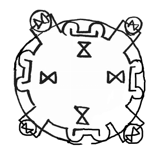

# Mirror Spell

_Source: [https://witchhatatelier.telepedia.net/wiki/Mirror_Spell](https://witchhatatelier.telepedia.net/wiki/Mirror_Spell)_
_Category: Niche Spells_

| Field       | Value      |
| ----------- | ---------- |
| Type        | Spell      |
| User(s)     | Witches    |
| Manga Debut | Chapter 21 |

**Mirror** is a niche [spell](/wiki/Spells 'Spells') that causes something looking at it to be reflected.

## Description

The spell contains a main circle with 4 satellite circles. Each satellite circle contains only a single hourglass-shaped sign, and an additional four of these signs are placed in the main circle. Also within this circle are several signs composed of partial circles and lines, with each one linking to two satellite circles. Lastly, 4 square bracket shaped signs are nestled between the aforementioned circular signs. One or potentially all of these signs are called "signs of reflection," by [Euini](/wiki/Euini 'Euini'). When linked with gathering shadows, this spell lets the user "borrow" the appearance of any animal that gazes upon them, this combined spell being used in the [mirror cloak of borrowshade](/wiki/Mirror_Cloak_of_Borrowshade 'Mirror Cloak of Borrowshade'). It isn't known, however, the effect that this spell has on it's own.

## Usage

All the aprentices taking [The Sincerity of the Shield](/wiki/The_Sincerity_of_the_Shield 'The Sincerity of the Shield') are given a mirror cloak of borrowshade, which contains the mirror spell, for the test. The cloak is used to allow the apprentices to escort the [myrphons](/wiki/Myrphon 'Myrphon') they are tasked with overseeing through the [Serpentback Cave](/wiki/Serpentback_Cave 'Serpentback Cave'). During his test, Euini crossed out the mirror spell within his cloak, leaving only the [gathering shadows](/wiki/Gathering_Shadows 'Gathering Shadows'). This made the cloak conceal him, allowing him to draw without being seen, boosting his confidence as he has difficulty drawing in front of others.

## References

1. Witch Hat Atelier Manga: Chapter 21 , Page 19
2. Witch Hat Atelier Manga: Chapter 21 , Page 22
