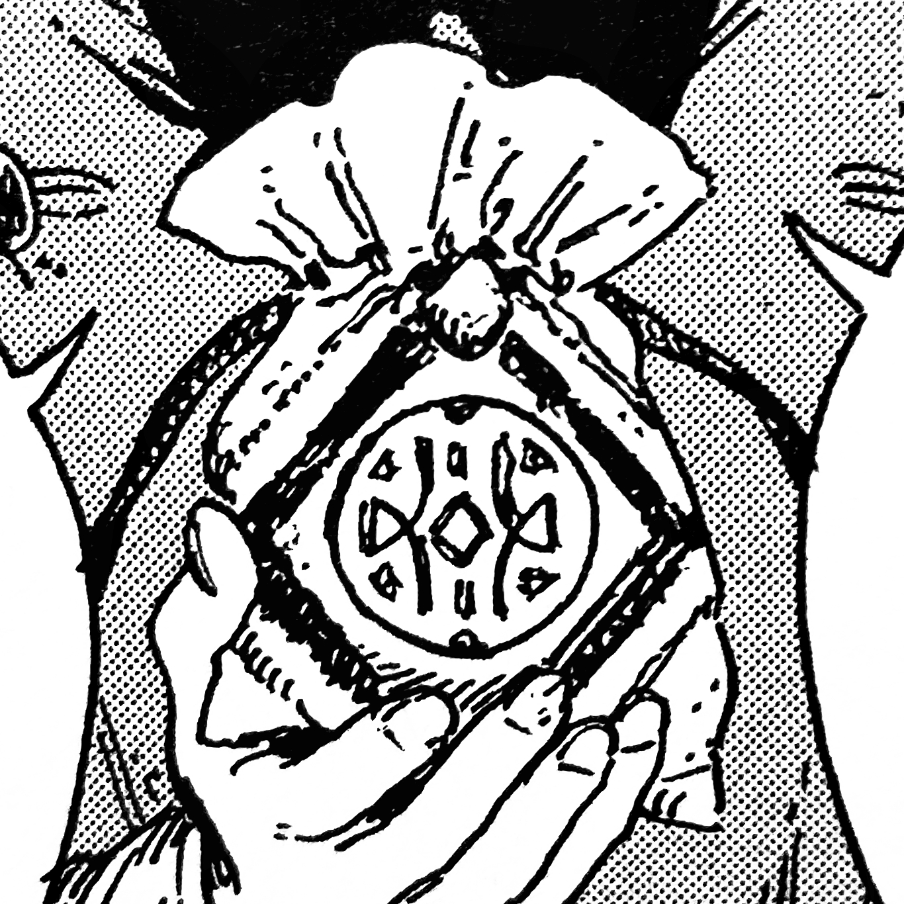

# Pouch of Calling

_Source: [https://witchhatatelier.telepedia.net/wiki/Pouch_of_Calling](https://witchhatatelier.telepedia.net/wiki/Pouch_of_Calling)_
_Category: Niche Spells_

| Field       | Value               |
| ----------- | ------------------- |
| Type        | Contraption         |
| Creator     | Agott Arklaum [ 1 ] |
| User(s)     | Witches             |
| Manga Debut | Chapter 34          |

**Pouch of Calling**, also referred to as an **Echopouch**, is a contraption that echoes recorded speech in order to lure people or creatures, or to just deliver a message.

## Description

The Pouch of Calling is comprised of a pouch or a piece of cloth with two seals drawn on it: a seal of pursuit on the outside, and a seal of recorded sound on the inside. Words or phrases are then spoken into the fabric and the pouch will echo them back. The seal of pursuit allows the pouch to be somewhat autonomous, being able to move in a hopping motion in order to go to the receiver of the message and then lure them elsewhere.

It is also possible to put items inside the pouch such as a [snugstone](/wiki/Snugstone 'Snugstone') or smoke. This lets the pouch have additional effects or be used to deliver items to the recipient.

## History

The Pouch of Calling was invented by [Agott](/wiki/Agott 'Agott') as her contribution to the [Sincerity of the Shield](/wiki/The_Sincerity_of_the_Shield 'The Sincerity of the Shield') make-up test. It was used to get [Beldaruit's](/wiki/Beldaruit 'Beldaruit') attention and then lure him to the final surprise. After passing the girls on their test, Beldaruit repurposed the pouch to tell [Coco](/wiki/Coco 'Coco') to follow the smoke he put inside it, leading her to his quarters so he could talk to her in private.

During the [valance leech](</wiki/Valance_Leech_(Monster)> 'Valance Leech (Monster)') attack at [Silver Eve](/wiki/Silver_Eve 'Silver Eve'), numerous pouches of calling were made with snugstones inside to make them lifelike enough to lure the leech away from the town.

## References

1. Witch Hat Atelier Manga: Chapter 34 , Page 23
2. Witch Hat Atelier Manga: Chapter 81 , Page 7
3. Witch Hat Atelier Manga: Chapter 35 , Page 7
4. Witch Hat Atelier Manga: Chapter 34 , Page 32
5. Witch Hat Atelier Manga: Chapter 34 , Page 18-20
6. Witch Hat Atelier Manga: Chapter 34 , Page 31-32
7. Witch Hat Atelier Manga: Chapter 81 , Page 8-9
