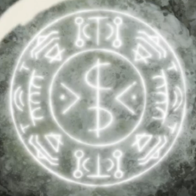
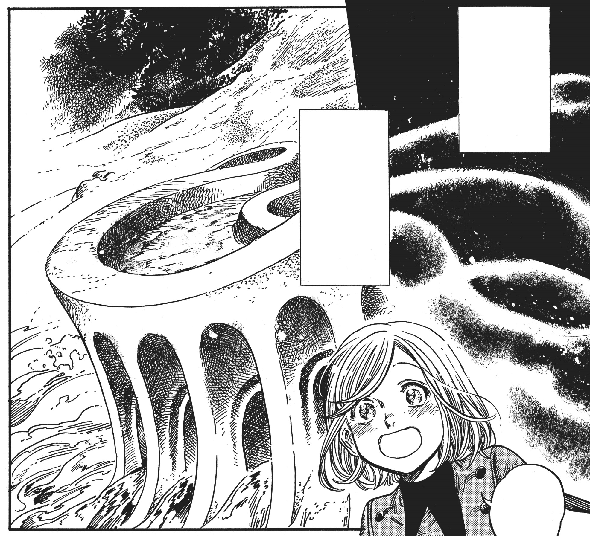
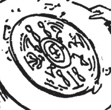

# Sand Bridge

_Source: [https://witchhatatelier.telepedia.net/wiki/Sand_Bridge](https://witchhatatelier.telepedia.net/wiki/Sand_Bridge)_
_Category: Niche Spells_

| Field       | Value              |
| ----------- | ------------------ |
| Type        | Spell              |
| User(s)     | Witches , Olruggio |
| Manga Debut | Chapter 12         |
| Anime Debut | Episode 8          |

The **sand bridge** is a niche [spell](/wiki/Spells 'Spells') used to construct a bridge out of sand, one pillar at a time.

## Description

The spell is composed of several unrecognizable signs, the only ones known being column, strengthen, and inverted radial. Additionally, there is a sign that strongly resembles and may also be regions, but it is not known if the two dots next to these signs are part of them or not. Assuming they are, it could be a modification of region. The spell functions by creating a temporary bridge out of the sand, the spell producing just a single column of said bridge, requiring the use of multiple spells to build a full bridge. At the top of each column, an arch is formed which has the deck on which people can walk atop it.

Coco looking at the constructed sand bridge

The seal in the manga

## Usage

The spell was used by [Olruggio](/wiki/Olruggio 'Olruggio') after the [Staircase River](/wiki/Staircase_River 'Staircase River') disaster had subsided. As the original bridge had collapsed, crossing the river became impossible. To solve this, he created a sand bridge as a temporary fix. Since he was drawing the glyphs on rocks, a normal wand would have been unusable, so he utilized [searneedle wand](/wiki/Searneedle_Wand 'Searneedle Wand') to etch the glyph into the stone.

## Trivia

The design for this spell was tweaked between the anime and the manga. However, even with the modification, it is not possible to fully solve the spell's effect.

## References

1. Witch Hat Atelier Manga: Chapter 12 , Page 26-27
2. Witch Hat Atelier Anime: Episode 8
3. Witch Hat Atelier Manga: Chapter 12 , Page 27
