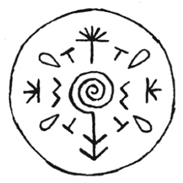
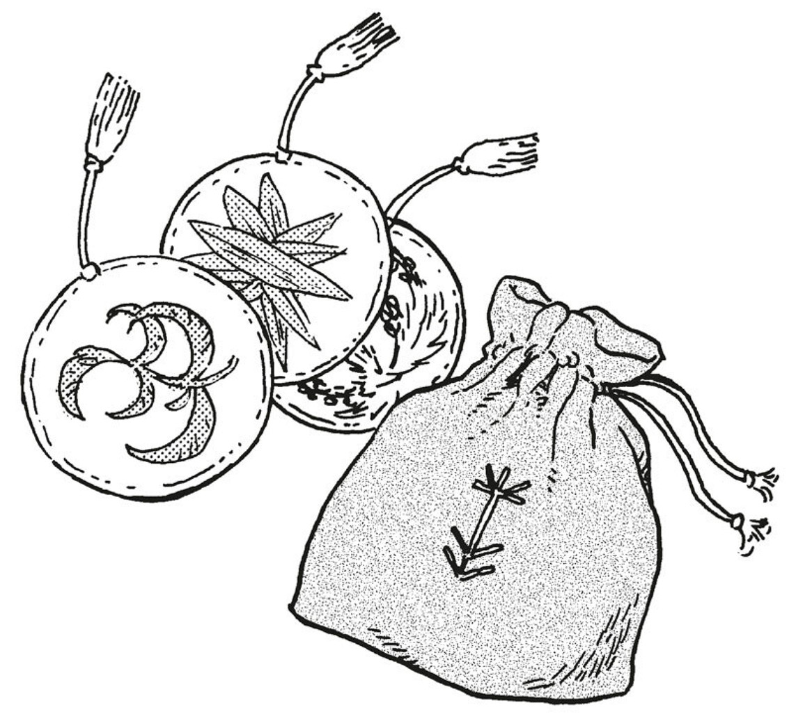

# Smokesculpting Seal

_Source: [https://witchhatatelier.telepedia.net/wiki/Smokesculpting_Seal](https://witchhatatelier.telepedia.net/wiki/Smokesculpting_Seal)_
_Category: Niche Spells_

| Field       | Value                                  |
| ----------- | -------------------------------------- |
| Japanese    | 煙結の陣                               |
| Rōmaji      | Kemurimusubi no jin                    |
| Type        | Spell                                  |
| User(s)     | Witches                                |
| Manga Debut | Chapter 11 (Witch Hat Atelier Kitchen) |

The **Smokesculpting Seal** is a niche [spell](/wiki/Spells 'Spells') that creates a smoke (or possibly steam) sculpture of the ingredients added to tea.

## Description

Has an unknown sign or sigil that looks like a spiral with an arrow through it vertically in the center. It is surrounded by inverted crush signs and column signs, as well as signs similar to the raindrop from the water sigil. In the outer portions of the spell are several signs which look like an asterisk mixed with a column sign.

Similar to [integration](/wiki/Integration 'Integration'), this spell will reform the original shape of the ingredients put into it. However, rather than doing this with the ingredients themselves, the smokesculpture recreates the shape of nearby ingredients using smoke instead.

## Usage

Used on tea saucers owned by [Qifrey](/wiki/Qifrey 'Qifrey'), the spell was first demonstrated on [Coco](/wiki/Coco 'Coco')'s [marktea](/wiki/Marktea 'Marktea'), and then later used with the other [apprentices](/wiki/Qifrey%27s_Atelier "Qifrey's Atelier") for a game of Hushtea. [Coco](/wiki/Coco 'Coco') specifically was mesmerized by this spell.

## Gallery

- [![Qifrey showcasing a saucer with a smokesculpting seal on it.[3]](../../images/Smokesculpting_plate.png)](/wiki/File:Smokesculpting_plate.png 'Qifrey showcasing a saucer with a smokesculpting seal on it.[3]')

  Qifrey showcasing a saucer with a smokesculpting seal on it.

- [![The smokesculpting seal in effect on Coco's cup of Marktea.[4]](../../images/Smokeflower_Marktea.png)](/wiki/File:Smokeflower_Marktea.png "The smokesculpting seal in effect on Coco's cup of Marktea.[4]")

  The smokesculpting seal in effect on Coco's cup of Marktea.

- 

  Qifrey's bag for holding [Marktea](/wiki/Marktea 'Marktea') is embroidered with some of the unique signs included in the Smokesculpting Seal

## References

1. Witch Hat Atelier Kitchen Spinoff: Chapter 11 , Page 9
2. Witch Hat Atelier Kitchen Spinoff: Chapter 12
3. Witch Hat Atelier Kitchen Spinoff: Chapter 11 , Page 10
4. Witch Hat Atelier Kitchen Spinoff: Chapter 11 , Page 11
