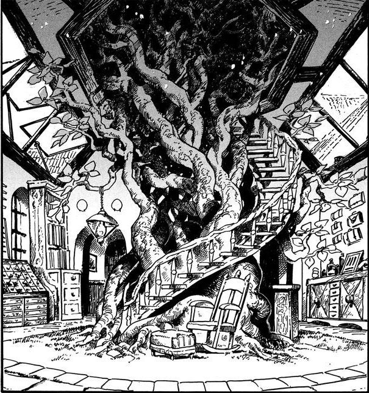

# The Starry Sword

_Source: [https://witchhatatelier.telepedia.net/wiki/The_Starry_Sword](https://witchhatatelier.telepedia.net/wiki/The_Starry_Sword)_
_Category: Niche Spells_

| Field       | Value                                 |
| ----------- | ------------------------------------- |
| Japanese    | 星の剣                                |
| Located In  | Kalhn                                 |
| Inhabitants | Mr. Nolnoa (Owner) Tartah (Assistant) |
| Manga       | Chapter 5                             |

**The Starry Sword** is a magic stationer's shop located in the town of [Kalhn](/wiki/Kalhn 'Kalhn') run by [Mr. Nolnoa](/wiki/Mr._Nolnoa 'Mr. Nolnoa') and his grandson, [Tartah](/wiki/Tartah 'Tartah').

The shop sells various magical [Components](/wiki/Components 'Components') such as inks, dyes, writing utensils, and accessories. The branches of a [Silverwood Tree](/wiki/Silverwood_Tree 'Silverwood Tree') at the center of the shop serve as a source for [Conjuring Ink](/wiki/Conjuring_Ink 'Conjuring Ink').

The door to the shop is magical and blends into the wall when closed. To open it, you need a special doorknob to enter. There are multiple door knobs that lead to different rooms, as explained by Tartah.

## References

1. Witch Hat Atelier Manga: Chapter 13
