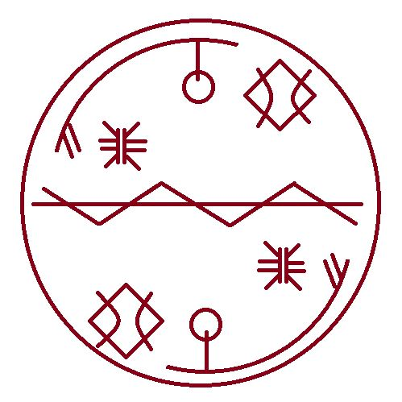

# Tracking Spell

_Source: [https://witchhatatelier.telepedia.net/wiki/Tracking_Spell](https://witchhatatelier.telepedia.net/wiki/Tracking_Spell)_
_Category: Niche Spells_

| Field       | Value                   |
| ----------- | ----------------------- |
| Japanese    | 追跡の魔法              |
| Rōmaji      | Tsuiseki no mahou       |
| Type        | Spell                   |
| User(s)     | Witches Knights Moralis |
| Manga Debut | Chapter 46              |

The **Tracking Spell** is a particular spell normally used by the [Pointed Hat Witches](/wiki/Pointed_Hat_Witches 'Pointed Hat Witches') to mark and track magical items.

## Description

Nothing is know about the signs and keystones that make the Tracking spell up. More spells with the same signs and sigils are needed to speculate an effect for them.

## Usage

The [Pointed Hat Witches](/wiki/Pointed_Hat_Witches 'Pointed Hat Witches') use this tracking spell on items that are given or sold to [Outsiders](/wiki/Outsiders 'Outsiders') so the [Knights Moralis](/wiki/Knights_Moralis 'Knights Moralis') can locate those items that are sold in the black market, since most magical items are very expensive. [Luluci](/wiki/Luluci 'Luluci') explains this when she goes visit [Custas](/wiki/Custas 'Custas') at [Kalhn Medical Facility](/wiki/Kalhn_Medical_Facility 'Kalhn Medical Facility') and he is no longer there.

## References

1. Witch Hat Atelier Manga: Chapter 46 , Page 3
