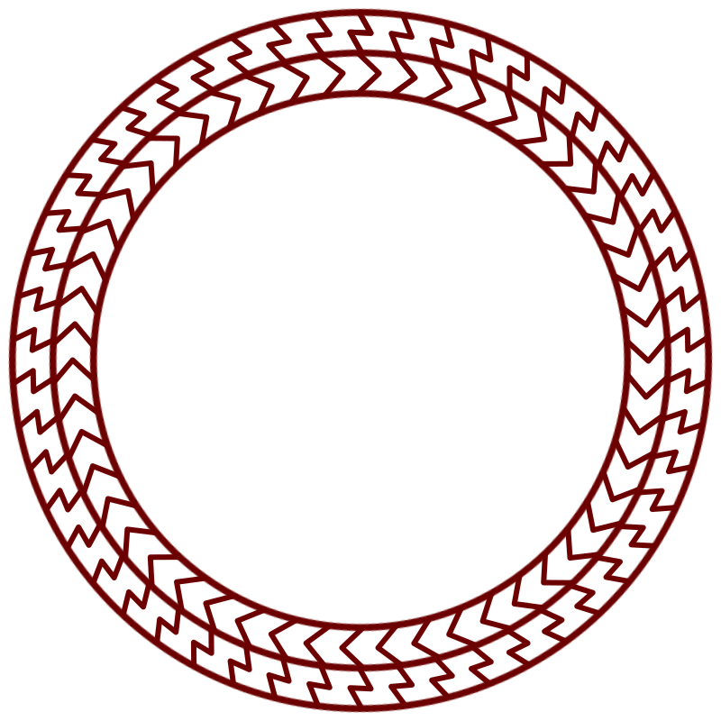

# Windowway Spell

_Source: [https://witchhatatelier.telepedia.net/wiki/Windowway_Spell](https://witchhatatelier.telepedia.net/wiki/Windowway_Spell)_
_Category: Niche Spells_

| Field       | Value              |
| ----------- | ------------------ |
| Japanese    | 扉窓の魔法         |
| Rōmaji      | Tobiramado no mahō |
| Type        | Spell              |
| User(s)     | Witches            |
| Manga Debut | Chapter 2          |

The **windowway spell** is a space-type [spell](/wiki/Spells 'Spells') used in the [windowway](/wiki/Windowway 'Windowway') that opens a gateway between two distant locations.

## Description

The base windowway spell contains an outter ring of lightning bolt-shaped signs, and an inner ring of signs which appear similar to directonal, pointing in the opposite direction. Oftentimes, windowways will contain a symbol which seams to corespond to the location the windowway links up with, but it is unknown whether this symbol is simply an indicator or actually part of the spell. The spell is subject to a high degree of variability, as each windowway is unique as to avoid linking to the same place. The spells can't be used unless there is a pair.

## Usage

The spell was first seen when [Qifrey](/wiki/Qifrey 'Qifrey') was showing a windowway to [Coco](/wiki/Coco 'Coco'), and later that day for Qifrey to visit the [Great Hall](/wiki/Great_Hall 'Great Hall'), and Coco to visit the [Dadah Range](/wiki/Dadah_Range 'Dadah Range') for [The Consent of the Crown](/wiki/Consent_of_the_Crown 'Consent of the Crown'). They are later used to transport the members of [Qifrey's atelier](/wiki/Qifrey%27s_Atelier "Qifrey's Atelier") to the site of a [bridge collapse](/wiki/Staircase_River 'Staircase River'), to take [The Sincerity of the Shield](/wiki/The_Sincerity_of_the_Shield 'The Sincerity of the Shield'), send [Euini](/wiki/Euini 'Euini') and [Alaira](/wiki/Alaira 'Alaira') to safety, visit the Great Hall again, and other uses.
