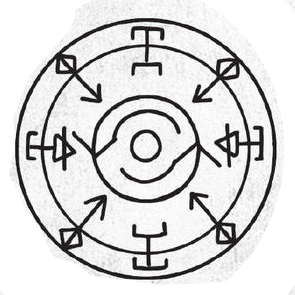
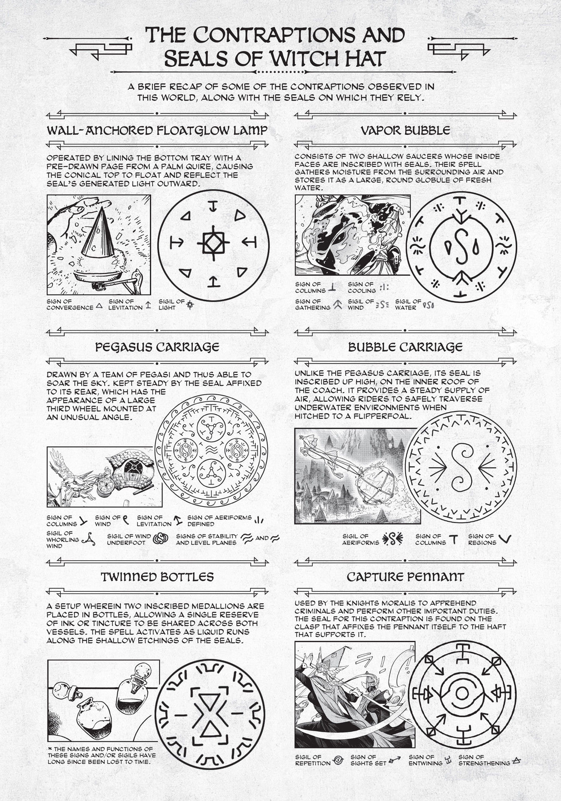
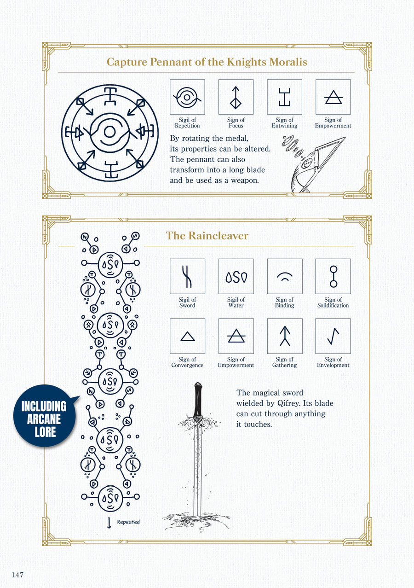

# Capture Pennant Spell

_Source: [https://witchhatatelier.telepedia.net/wiki/Capture_Pennant_Spell](https://witchhatatelier.telepedia.net/wiki/Capture_Pennant_Spell)_
_Category: Time Spells_

| Field       | Value           |
| ----------- | --------------- |
| Japanese    | 拘束旗          |
| Rōmaji      | Kousokuki       |
| Type        | Spell           |
| User(s)     | Knights Moralis |
| Manga Debut | Chapter 11      |

The **Capture Pennant Spell** is a time spell used in the [Silver-White Capture Pennant](/wiki/Silver-White_Capture_Pennant 'Silver-White Capture Pennant'), which allows a [knight](/wiki/Knights_Moralis 'Knights Moralis') to control their capture pennant and wrap it around objects. It reinforces and strengthens the capture pennant as well.

## Description

The spell contains two rings. At the center of the inner ring is a repetition sign. This likely functions to help the capture pennant resist damage and bending, similar to its function in the [serpent's bed of sand](/wiki/Serpent%27s_Bed_of_Sand "Serpent's Bed of Sand"). Straddling the inner and outer ring are a number of sights set and entwine signs, with some of the entwine signs having strengthening signs on their ends. The sights set signs allow the user of a capture pennant to use their mind to control the spell and chose a target, with the entwine signs allowing the pennant to wrap around said target. Lastly, the strengthen signs reinforce the banner, making it more durable.

Interestingly, although the full spell was first seen in [Volume 12](/wiki/Volume_12 'Volume 12'), a spell similar to a [repetition seal](/wiki/Repetition_Seal 'Repetition Seal') was seen on a capture pennant much earlier on.

## Usage

The spell, while only directly seen on the cover [volume 9](/wiki/Volume_9 'Volume 9'), is one of the many spells contained within the [Knights Moralis'](/wiki/Knights_Moralis 'Knights Moralis') capture pennants. These pennants are used by the knights to hold people (typically criminals), injured persons,) or objects in place by securely wrapping around the person or object.

## Image Gallery

- 

  The Capture Pennant spell from the [Volume 12](/wiki/Volume_12 'Volume 12') extra page

- 

  The Capture Pennant spell from the [Archives of Witch Hat Atelier](/wiki/Archives_of_Witch_Hat_Atelier 'Archives of Witch Hat Atelier')

## References

1. Witch Hat Atelier Manga: Chapter 12
2. Witch Hat Atelier Manga: Chapter 49
