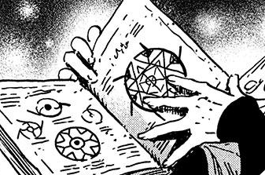
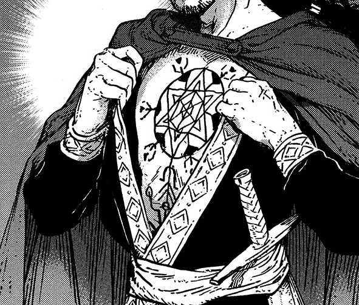

# Counterclock

_Source: [https://witchhatatelier.telepedia.net/wiki/Counterclock](https://witchhatatelier.telepedia.net/wiki/Counterclock)_
_Category: Time Spells_

| Field       | Value                            |
| ----------- | -------------------------------- |
| Type        | Spell                            |
| User(s)     | Pointed Hat Witches Brimmed Caps |
| Manga Debut | Chapter 45 , Chapter 55          |

**Counterclock** is a family of time-type spells. Distinct from [repetition](/wiki/Repetition_Seal 'Repetition Seal') spells, as they do not use the repetition sigil.

## Description

Counterclock spells have no identifiable sigil, but seem to be similar to the [repetition](/wiki/Repetition_Seal 'Repetition Seal') or [time stop](/wiki/Time_Stop 'Time Stop') spells, as there appear to be a number of intermediary spells between the two, such as the ones on [Ininia's gloves](/wiki/Ininia%27s_Gloves "Ininia's Gloves"). They are made of straight lines which form many geometric shapes in a six-sided star shape. Like the name implies, they are used to reverse time on what they are used on, mostly to undo wear and other types of damage.

These spells have effect up to a maximum time of a day and are not permanent. Once the time frame expires, the spell vanishes by itself and time takes effect on the target once more, putting it back in the state it was before the spell was cast. The spell however can be drawn again to repeat the effect. According to [Qifrey](/wiki/Qifrey 'Qifrey'), they are rather difficult spells to learn and, despite the law, their nature leads every witch to think about using them on a human body.

## Usage

[Qifrey](/wiki/Qifrey 'Qifrey') demonstrates the effects of the Counterclock spell on an ink pot Coco accidentally breaks. This not only puts the pot back together, but the spilled ink goes back in it, allowing the pot to be emptied into another one to save the ink before the spell expires.

**SPOILER WARNING**  
_This section contains spoilers for [Chapter 55](/wiki/Chapter_55 'Chapter 55')._

[Ininia](/wiki/Ininia 'Ininia') uses a large Counterclock seal to prevent [Dagda](/wiki/Dagda 'Dagda') from dying from the wounds dealt to him, successfully rewinding him back to before he was wounded. This not only removes his wounds but resets his memories of the time affected, leaving him in a state of confusion. The spell has expired several times and has had to be redrawn quickly after it vanishes so he does not die.

The Counterclock seal on Dagda's chest in chapter 55.

**END OF SPOILERS**

## References

1. Witch Hat Atelier Manga: Chapter 46 , Page 12
2. Witch Hat Atelier Manga: Chapter 55
3. Witch Hat Atelier Manga: Chapter 45
