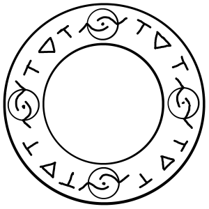
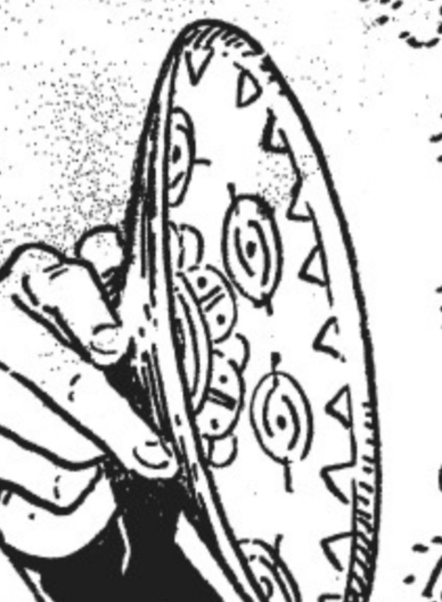

# Repetition Seal

_Source: [https://witchhatatelier.telepedia.net/wiki/Repetition_Seal](https://witchhatatelier.telepedia.net/wiki/Repetition_Seal)_
_Category: Time Spells_

| Field       | Value      |
| ----------- | ---------- |
| Japanese    | くり返し   |
| Rōmaji      | kurikaeshi |
| Type        | Spell      |
| User(s)     | Witches    |
| Manga Debut | Chapter 7  |

The **repetition seal** family are a family of niche-type [spells](/wiki/Spells 'Spells') that reverts objects to their original form.

## Description

Numerous different kinds of repetition seals exist, and each one is different, but they all feature a repetition sigil as their main basis. At their core, repetition spells function by causing the object they are used on to become "like new." For example, if you were to use the spell on rotten food, it would become fresh, such as in the [magic cookpot](/wiki/Magic_Cookpot 'Magic Cookpot'). Dirty clothes would become brand new (and as a result, clean), the principle behind the [washing barrels](/wiki/Washing_Barrels 'Washing Barrels'), and a handkerchief that was embroidered would lose it's embroidery if the spell was used on it.

## Usage

The repetition seal was first seen during the [Draconic Labyrinth Arc](/wiki/Draconic_Labyrinth_Arc 'Draconic Labyrinth Arc'), where [Qifrey's apprentices](/wiki/Qifrey%27s_Atelier "Qifrey's Atelier") used the spell as a component of [serpent's bed of sand](/wiki/Serpent%27s_Bed_of_Sand "Serpent's Bed of Sand"). The spell functioned to hold together the cloud that the dragon would sit on by forcing it to return to it's original form, preventing it from being crushed. The spell was seeing again shortly thereafter being used by [Qifrey](/wiki/Qifrey 'Qifrey') it the magic cookpot, which kept even extremely old food fresh, and also made a rotten potato brand new again. The spell was seen again one more time by Qifrey's apprentices during [their stay in the Great Hall](/wiki/Great_Hall_Arc 'Great Hall Arc'), where [Tetia](/wiki/Tetia 'Tetia') explained to [Coco](/wiki/Coco 'Coco') that the washing barrel reverted clothes to being new and fresh.

## Gallery

- 

  The repetition seal on Qifrey's [Magic Cookpot](/wiki/Magic_Cookpot 'Magic Cookpot') lid

## References

1. Sinocia Birthday Comic
2. Witch Hat Atelier Manga: Chapter 7 , Page 2o
3. Witch Hat Atelier Manga: Chapter 8 , Page 8-9
4. Witch Hat Atelier Manga: Chapter 32 , Page 7
